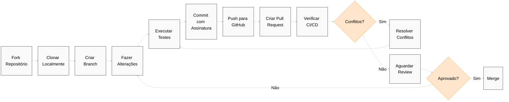

# Contribuindo com o Guardia

Ficamos felizes em receber contribuições da comunidade em nosso projeto. Seja com código, sugestões, documentação ou testes, toda ajuda é bem-vinda — e faz diferença.

Este documento reúne tudo o que você precisa para começar: boas práticas, diretrizes e o fluxo que seguimos para manter a qualidade e a consistência do que construímos juntos.

Se você quer se envolver, este é o melhor lugar para começar.

## Por que você deve contribuir?

* **Impacto**: Seu trabalho impactará diretamente e melhorará um projeto usado por organizações ao redor do mundo, tornando suas operações mais suaves e eficientes.
* **Aprender e Crescer**: Contribuir para o Guardia oferece uma oportunidade única de aprender com uma comunidade de desenvolvedores talentosos, aprimorando suas habilidades e conhecimentos em design de arquitetura, CQRS, Ports & Adapters, e mais.
* **Comunidade**: Junte-se a uma comunidade acolhedora e solidária de desenvolvedores que compartilham sua paixão por criar software de código aberto de alta qualidade.

## Como você pode contribuir?

* **Contribuições de Código**: De pequenas correções a grandes funcionalidades, suas contribuições de código são sempre bem-vindas. Nossa arquitetura e dependências mínimas facilitam o entendimento e aprimoramento do Guardia.
* **Documentação**: Ajude-nos a melhorar nossa documentação para tornar o Guardia mais acessível e compreensível para todos.
* **Feedback e Ideias**: Compartilhe seus insights, sugestões e ideias inovadoras para nos ajudar a moldar o futuro do Guardia.
* **Testes**: Auxilie nos testes de novos lançamentos ou funcionalidades, fornecendo feedback valioso para garantir estabilidade e usabilidade.

## Fluxo de Trabalho

Antes de contribuir, recomendamos abrir uma [discussão](https://github.com/orgs/guardiafinance/discussions/new?category=ideas) descrevendo sua proposta. Sempre que possível, siga o princípio do Golden Circle: explique com clareza **o que** você pretende fazer, **por que** isso é relevante e **como** pretende executar — com foco na objetividade. Deixe o código para a hora de codar.

**Nosso fluxo recomendado é:**

1. Abra uma discussão com sua proposta.
2. Se ela for aceita, será convertida em uma issue.
3. Com a issue aberta, avance com a implementação e envie seu pull request.

<br />

> **IMPORTANTE:** Todos os contribuidores devem assinar o [Contributor License Agreement (CLA)](./governance/CLA.md), conforme descrito no documento oficial.

<br />

Essa abordagem ajuda a alinhar expectativas, promove discussões construtivas e garante que cada contribuição esteja conectada com as prioridades do projeto.

Queremos manter um bom histórico de decisões — por isso, mesmo mudanças menores devem estar associadas a uma issue. A única exceção são correções triviais, como ajustes de digitação, que podem ser enviadas diretamente como pull request.

Considere participar de nossa comunidade no [Whatsapp](#) para compartilhar ideias, esclarecer dúvidas e acompanhar discussões em andamento.

**Com a issue aprovada, voce pode avancar com:**

- Faça um fork do repositório no GitHub, clone-o no seu computador.
- Crie um branch com suas alterações.
- Você está trabalhando com a última versão do branch `main`.
- Modifique o código fonte; **Por favor, concentre-se apenas na alteração específica que você está contribuindo**.
- Certifique-se de que os testes locais passem.
- Faça commit no seu fork usando mensagens de commit **pequenas e claras**.
- Envie-nos um pull request, respondendo a quaisquer perguntas padrão na interface do pull request.
- Preste atenção a quaisquer falhas de CI automatizadas relatadas no pull request e mantenha-se envolvido na conversa.
- Depois de enviar seus commits para o GitHub, certifique-se de que seu branch pode ser mesclado automaticamente (não há conflitos de merge). Se não, no seu computador, mescle o branch main no seu branch, resolva quaisquer conflitos de merge, certifique-se de que tudo ainda funciona corretamente e passe em todos os testes, e então envie essas alterações.
- Uma vez que a alteração tenha sido aprovada e mesclada, nós o informaremos em um comentário.



Caso esteja trabalhando em um fluxo de pair programming, veja também o [Fluxo de Trabalho para Pair Programming com Forks Individuais](./PAIR_PROGRAM_WORKFLOW.md) para mais informações.

## Diretrizes para Mensagens de Commit

### Utilize "Small Commits"

Ao contribuir com o Guardia, recomendamos fortemente a adoção da prática de *Small Commits* (Commits Pequenos). Essa abordagem traz diversos benefícios para o desenvolvimento e revisão de código, garantindo um processo mais eficiente e colaborativo.

#### Benefícios de Small Commits

1. **Facilidade de Revisão**: Commits menores são mais fáceis de entender e revisar, reduzindo o tempo necessário para aprovação e integração do código.
2. **Menor Risco de Erros**: Pequenos commits tornam mais simples a identificação e correção de bugs, caso algo dê errado.

3. **Histórico Claro e Organizado**: Um histórico de commits granular e bem descrito facilita a depuração e compreensão da evolução do código.
4. **Facilidade na Resolução de Conflitos**: Alterações menores são menos propensas a gerar conflitos complexos de merge.
5. **Reversão Segura**: Se um problema for identificado, pequenos commits permitem reverter mudanças sem impactar partes significativas do código.

#### Boas Práticas

- **Um commit por mudança lógica**: Evite commits que misturam múltiplas alterações não relacionadas.

- **Mensagens de commit descritivas**: Utilize mensagens claras e objetivas que expliquem a mudança realizada.

- **Evite commits gigantescos**: Se perceber que seu commit está muito grande, divida-o em partes menores.

- **Commits atômicos**: Cada commit deve representar uma unidade de trabalho que pode ser integrada sem depender de futuras alterações.

- **Testes e validações**: Sempre que possível, garanta que o código em cada commit está funcional e não quebra a aplicação.

### Formatos de Mensagens de Commit

Utilize o formato [Conventional Commit](https://www.conventionalcommits.org/en/v1.0.0/) para garantir que nosso histórico de commits seja legível e fácil de seguir. Este formato faz parte de um conjunto mais amplo de diretrizes projetadas para facilitar o versionamento automático e a geração de changelogs:

```
<tipo>[escopo opcional]: <descrição>

[corpo opcional]

[rodapé(s) opcional(is)]
```

O commit contém os seguintes elementos estruturais, para comunicar a intenção aos
consumidores da sua biblioteca:

1. **fix:** um commit do _tipo_ `fix` corrige um bug no seu código (isso correlaciona-se com [`PATCH`](http://semver.org/#summary) no Versionamento Semântico).

2. **feat:** um commit do _tipo_ `feat` introduz uma nova funcionalidade no código (isso correlaciona-se com [`MINOR`](http://semver.org/#summary) no Versionamento Semântico).

3. **BREAKING CHANGE:** um commit que tem um rodapé `BREAKING CHANGE:`, ou adiciona um `!` após o tipo/escopo, introduz uma mudança de API que quebra a compatibilidade (correlacionando-se com [`MAJOR`](http://semver.org/#summary) no Versionamento Semântico).
   Uma BREAKING CHANGE pode fazer parte de commits de qualquer _tipo_.

4. _tipos_ além de `fix:` e `feat:` são permitidos, por exemplo [@commitlint/config-conventional](https://github.com/conventional-changelog/commitlint/tree/master/%40commitlint/config-conventional) (baseado na [convenção Angular](https://github.com/angular/angular/blob/22b96b9/CONTRIBUTING.md#-commit-message-guidelines)) recomenda `build:`, `chore:`,
   `ci:`, `docs:`, `style:`, `refactor:`, `perf:`, `test:`, e outros.

5. _rodapés_ além de `BREAKING CHANGE: <descrição>` podem ser fornecidos e seguem uma convenção semelhante ao
   [formato de trailer do git](https://git-scm.com/docs/git-interpret-trailers).

Tipos adicionais não são exigidos pela especificação de Commits Convencionais e não têm efeito implícito no Versionamento Semântico (a menos que incluam uma BREAKING CHANGE).

Um escopo pode ser fornecido ao tipo de um commit, para fornecer informações contextuais adicionais e é contido entre parênteses, por exemplo, `feat(parser): adicionar capacidade de analisar arrays`.

### Commits Assinados

Você deve assinar commits e tags localmente para dar a outras pessoas confiança sobre a origem de uma alteração que você fez. Você deve utilizar uma chave GPG para assinar commits e tags.

Quando um commit ou uma tag contém uma assinatura GPG que possa ser verificada criptograficamente, ele será marcado como "Verificado" ao enviar um Pull Request.

| Aceito | Status                | Descrição                                                                                                                                                                                                 |
|--------|-----------------------|-----------------------------------------------------------------------------------------------------------------------------------------------------------------------------------------------------------|
| Sim    | Verificado            | O commit foi assinado, a assinatura foi verificada com sucesso e o committer é o único autor que habilitou o modo vigilante.                                                                              |
| Não    | Parcialmente verificado | O commit foi assinado e a assinatura foi verificada com sucesso, mas o commit tem um autor que: a) não é o committer e b) habilitou o modo vigilante. Neste caso, a assinatura de commit não garante o consentimento do autor. Portanto o commit é verificado apenas parcialmente. |
| Não    | Não verificado        | Qualquer uma das seguintes opções é verdadeira: <br /> – O commit foi assinado, mas não foi possível verificar a assinatura. <br /> – O commit não foi assinado, e o usuário que o fez habilitou o modo vigilante. <br /> – O commit não foi assinado, e um autor habilitou o modo vigilante. |
| Não    | Sem status de verificação | O commit não foi assinado.                                                                                                                                                                                  |
<br />

>**IMPORTANTE:** Serão aceitos apenas Pull Requests com todos os commits assinados e marcados como "Verificado". Veja como configurar o Git para assinar commits automaticamente em [Assinando commits](../../tutorials/pt-BR/signing-commits.md).

## Idiomas

Estamos comprometidos em manter nossas comunicações em português, inglês e espanhol. Todavia, aceitamos que issues sejam postadas em qualquer idioma. Porém, optamos por manter nossa comunicação oficial em inglês por algumas razões:

- O português brasileiro é uma língua muito rica - e nos orgulhamos disso - mas também é uma língua muito complexa, o que dificulta a compreensão de issues e pull requests por parte da comunidade.
- O inglês já faz parte da cultura da Engenharia de Software, e é uma língua mais simples e fácil de entender, o que facilita a compreensão de issues e pull requests por parte da comunidade.

### Commits

A mensagem principal do commit deve ser escrita em inglês. Se você sentir necessidade de descrever em seu idioma local, você pode utilizá-lo incluindo a tag `[idioma]` na descrição do commit. Atualmente, com o auxílio de ferramentas como o [DeepL](https://www.deepl.com/) e o [Google Tradutor](https://translate.google.com/), qualquer pessoa pode ter seu texto traduzido para o inglês ou outros idiomas. No entanto, ter o texto original _junto com_ a tradução pode ajudar a mitigar erros de tradução.

Você pode abrir issues e pull requests em qualquer idioma. Se a issue ou pull request for postada em um idioma diferente do inglês, encorajamos a incluir uma cópia em inglês no corpo da issue ou pull request ou como resposta contendo a tag `[en]`.

> **IMPORTANTE:** **Por favor, note** que o uso de qualquer idioma com a intenção de contornar o [Código de Conduta](#) resultará em banimento imediato — e possivelmente indefinido — do projeto.

**Exemplo:**

```
feat(auth): implementar autenticação via OAuth2

[en]
Implement OAuth2 authentication flow with support for multiple providers:
- Add OAuth2 client configuration
- Create authentication handlers for Google and GitHub
- Implement token validation and refresh logic
- Add unit tests for auth flow

[pt-BR]
Implementa fluxo de autenticação OAuth2 com suporte para múltiplos provedores:
- Adiciona configuração do cliente OAuth2
- Cria handlers de autenticação para Google e GitHub
- Implementa lógica de validação e refresh de tokens
- Adiciona testes unitários para o fluxo de auth

Closes #123
```

## Código de Conduta

Este projeto adota o [Código de Conduta](#) para garantir que a comunidade seja acolhedora e respeitosa para todos os participantes.

## Licença

O Guardia adota o modelo de negócios **Open Core**, que combina o melhor do open source com a sustentabilidade de um negócio. Essa abordagem permite que o projeto evolua com o apoio da comunidade, ao mesmo tempo em que viabiliza a oferta de recursos e serviços adicionais para empresas que desejam escalar com segurança e eficiência.

O Guardia adota o modelo de negócios Open Core, que combina o melhor do open source com a sustentabilidade de um negócio. Essa abordagem permite que o projeto cresça com o apoio da comunidade, enquanto oferece recursos avançados para empresas que precisam de escala, suporte e governança.

Para isso, os Core Modules são desenvolvidos e distribuídos sob a licença [Apache 2.0](#), permitindo liberdade de uso, modificação e distribuição com segurança jurídica e compatibilidade comercial.

Você pode entender melhor como funciona o [licenciamento do projeto](#).

## Guia do Desenvolvedor

Consulte o [Guia do Desenvolvedor](#) para mais informações sobre o projeto — incluindo especificações, diretrizes de contribuição, arquitetura, padrões adotados e outros detalhes técnicos relevantes.
