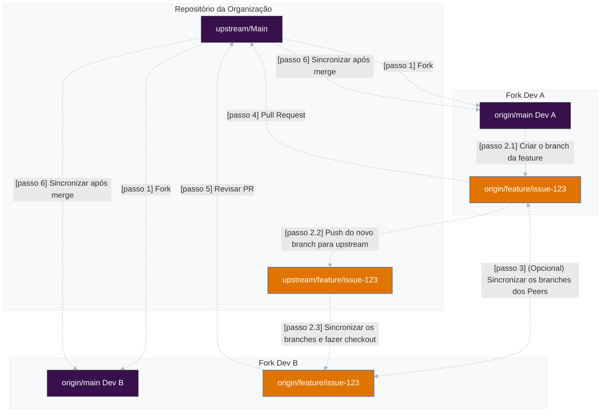

# Pair Programming

Trabalhando em pair programming é uma excelente maneira de aprender e melhorar suas habilidades de desenvolvimento. Sabemos que nem sempre é possível trabalhar em pair programming, mas sempre que possível, incentivamos a todos os desenvolvedores a se envolverem em pair programming.


## **Recomendações**

- Cada dev tem seu próprio fork.
- Um branch compartilhado é criado e sincronizado entre os forks.
- Ambos trabalham em seu próprio branch, sincronizando mudanças com o branch compartilhado.
- Opcionalmente, ambos podem sincronizar seus branches entre si.
- Puxam e mesclam mudanças frequentemente para evitar conflitos.
- O PR final é enviado para o repositório da organização (`upstream`).

---

## Fluxo de Trabalho

### Configuração Inicial
Cada desenvolvedor precisa configurar seu ambiente corretamente.

#### Dev A e Dev B fazem o fork do repositório da organização (`upstream`)

Cada dev cria seu próprio fork no GitHub.

Ambos clonam **seu próprio fork** para suas máquinas:

```bash
git clone https://github.com/dev-a/forked-repo.git
cd forked-repo
```

#### Adicionar os remotes corretamente

O repositório da organização é adicionado como `upstream`:

```bash
git remote add upstream https://github.com/org/repo.git
```
(opcional) O fork do outro desenvolvedor pode ser adicionado como um terceiro remote (`peer`), facilitando a sincronização direta:

```bash
git remote add peer https://github.com/dev-b/forked-repo.git
```

O seu próprio fork é automaticamente configurado como origin ao clonar:

```bash
git clone https://github.com/dev-a/forked-repo.git
```

Agora, os remotes devem estar assim:

```bash
git remote -v
origin   https://github.com/dev-a/forked-repo.git (fetch)
origin   https://github.com/dev-a/forked-repo.git (push)
upstream https://github.com/org/repo.git (fetch)
upstream https://github.com/org/repo.git (push)

// opcional
peer     https://github.com/dev-b/forked-repo.git (fetch)
peer     https://github.com/dev-b/forked-repo.git (push)
```

---

### Criar um Branch Compartilhado para a Issue

Dev A cria o branch a partir do `main` do upstream e faz push para o upstream:

```bash
git fetch upstream
git checkout -b feature/issue-123 upstream/main
git push upstream feature/issue-123
```

Dev B sincroniza o branch diretamente do upstream:

```bash
git fetch upstream
git checkout -b feature/issue-123 upstream/feature/issue-123
```

Agora, ambos estão no mesmo branch e podem trabalhar juntos.

---

### Desenvolvimento Colaborativo

Para evitar conflitos:

Sempre puxe as mudanças do outro antes de começar a codar:

```bash
git pull peer feature/issue-123
```

Comite mudanças regularmente:

```bash
git add .
git commit -m "Implementação inicial da feature X"
```

Envie para seu próprio fork:

```bash
git push origin feature/issue-123
```

---

### Sincronização com o Repositório da Organização
Como cada dev tem seu próprio fork, é essencial sincronizar com o upstream regularmente:
```bash
git fetch upstream
git rebase upstream/main
git push origin feature/issue-123 --force-with-lease
```

> **Importante**: Evite o uso do `--force` pois ele reescreve o histórico do upstream a partir do branch local. Certifique-se de comunicar a equipe quando fizer um force push. O `--force-with-lease` é uma opção mais segura que não sobrescreverá nenhum trabalho no branch remoto se mais commits foram adicionados ao branch remoto (por outro membro da equipe ou colega de trabalho ou algo assim). Ele garante que você não sobrescreva o trabalho de outra pessoa ao fazer um force push.

---

### Revisão e Pull Request
Quando a feature estiver pronta:
1. Dev A (ou Dev B) abre um **Pull Request (PR) para o repositório da organização (`upstream`)**.
2. O outro dev revisa o PR antes do merge.
3. O PR e revisado por mais dois membros da organização.
4. Se necessário, novas mudanças são feitas antes do merge.
5. O PR é mesclado.
---

### Atualização do Branch Local
Depois que o PR é mesclado, o branch local deve ser atualizado:
```bash
git fetch upstream
git rebase upstream/main
```



