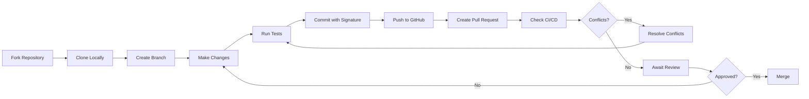

# Contributing to Guardia

Guardia values the open source community and is committed to contributing to the development of open source software. We believe that open source is the best way to create high-quality software efficiently, safely, and collaboratively, promoting innovation and continuous evolution.

Whether fixing a bug, proposing a new feature, improving documentation, or offering your unique perspective, every contribution is welcome!

Your contributions are essential to the quality and evolution of Guardia. We want everyone to feel welcome and for participation to be accessible, overcoming language barriers. Therefore, our main documentation is available in Portuguese, English, and Spanish.

## Why should you contribute?

* **Impact**: Your work will directly impact and improve a project used by organizations worldwide, making their operations smoother and more efficient.
* **Learn and Grow**: Contributing to Guardia offers a unique opportunity to learn from a community of talented developers, enhancing your skills and knowledge in architecture design, CQRS, Ports & Adapters, and more.
* **Community**: Join a welcoming and supportive community of developers who share your passion for creating high-quality open source software.

## How can you contribute?

* **Code Contributions**: From small fixes to major features, your code contributions are always welcome. Our architecture and minimal dependencies make it easy to understand and enhance Guardia.
* **Documentation**: Help us improve our documentation to make Guardia more accessible and understandable for everyone.
* **Feedback and Ideas**: Share your insights, suggestions, and innovative ideas to help us shape the future of Guardia.
* **Testing**: Assist in testing new releases or features, providing valuable feedback to ensure stability and usability.

## Our Workflow

For most changes, it is recommended to create an issue to discuss your proposals. Consider joining our [Discord](https://discord.gg/N2EyGuqY) and sharing your ideas. This facilitates tracking discussions and feedback. However, for small fixes like typos, you can submit a pull request directly.

- Fork the repository on GitHub, clone it to your computer.
- Create a branch with your changes.
- You are working with the latest version of the `main` branch.
- Modify the source code; **Please focus only on the specific change you are contributing**.
- Ensure that local tests pass.
- Commit to your fork using **small and clear** commit messages.
- Send us a pull request, answering any standard questions in the pull request interface.
- Pay attention to any automated CI failures reported in the pull request and stay engaged in the conversation.
- After pushing your commits to GitHub, ensure your branch can be automatically merged (no merge conflicts). If not, on your computer, merge the main branch into your branch, resolve any merge conflicts, ensure everything still works correctly and passes all tests, and then push those changes.
- Once the change has been approved and merged, we will notify you in a comment.

<br />



If you are working in a pair programming flow, see also the [Pair Programming Workflow with Individual Forks](./PAIR_PROGRAM_WORKFLOW.md) for more information.

## Commit Message Guidelines

### Use "Small Commits"

When contributing to Guardia, we strongly recommend adopting the practice of *Small Commits*. This approach brings several benefits to code development and review, ensuring a more efficient and collaborative process.

#### Benefits of Small Commits

1. **Ease of Review**: Smaller commits are easier to understand and review, reducing the time needed for code approval and integration.
2. **Lower Risk of Errors**: Small commits make it simpler to identify and fix bugs if something goes wrong.
3. **Clear and Organized History**: A granular and well-described commit history facilitates debugging and understanding the code's evolution.
4. **Ease of Conflict Resolution**: Smaller changes are less likely to generate complex merge conflicts.
5. **Safe Reversion**: If a problem is identified, small commits allow changes to be reverted without impacting significant parts of the code.

#### Best Practices

- **One commit per logical change**: Avoid commits that mix multiple unrelated changes.
- **Descriptive commit messages**: Use clear and objective messages that explain the change made.
- **Avoid gigantic commits**: If you notice your commit is too large, break it into smaller parts.
- **Atomic commits**: Each commit should represent a unit of work that can be integrated without relying on future changes.
- **Tests and validations**: Whenever possible, ensure that the code in each commit is functional and does not break the application.

### Commit Message Formats

Use the [Conventional Commit](https://www.conventionalcommits.org/en/v1.0.0/) format to ensure our commit history is readable and easy to follow. This format is part of a broader set of guidelines designed to facilitate automatic versioning and changelog generation:

```
<type>[optional scope]: <description>

[optional body]

[optional footer(s)]
```

The commit contains the following structural elements to communicate intent to
consumers of your library:

1. **fix:** a `fix` type commit fixes a bug in your code (this correlates with [`PATCH`](http://semver.org/#summary) in Semantic Versioning).

2. **feat:** a `feat` type commit introduces a new feature to the code (this correlates with [`MINOR`](http://semver.org/#summary) in Semantic Versioning).

3. **BREAKING CHANGE:** a commit that has a `BREAKING CHANGE:` footer, or adds a `!` after the type/scope, introduces an API-breaking change (correlating with [`MAJOR`](http://semver.org/#summary) in Semantic Versioning).
   A BREAKING CHANGE can be part of commits of any _type_.

4. _types_ other than `fix:` and `feat:` are allowed, for example [@commitlint/config-conventional](https://github.com/conventional-changelog/commitlint/tree/master/%40commitlint/config-conventional) (based on the [Angular convention](https://github.com/angular/angular/blob/22b96b9/CONTRIBUTING.md#-commit-message-guidelines)) recommends `build:`, `chore:`,
   `ci:`, `docs:`, `style:`, `refactor:`, `perf:`, `test:`, and others.

5. _footers_ other than `BREAKING CHANGE: <description>` can be provided and follow a convention similar to the
   [git trailer format](https://git-scm.com/docs/git-interpret-trailers).

Additional types are not required by the Conventional Commits specification and have no implicit effect on Semantic Versioning (unless they include a BREAKING CHANGE).

A scope may be provided to a commit's type to provide additional contextual information and is contained within parentheses, for example, `feat(parser): add ability to parse arrays`.

### Signed Commits

You should sign commits and tags locally to give others confidence about the origin of a change you made. You should use a GPG key to sign commits and tags.

When a commit or tag contains a cryptographically verifiable GPG signature, it will be marked as "Verified" when submitting a Pull Request.

| Accepted | Status                | Description                                                                                                                                                                                                 |
|----------|-----------------------|-------------------------------------------------------------------------------------------------------------------------------------------------------------------------------------------------------------|
| Yes      | Verified              | The commit was signed, the signature was successfully verified, and the committer is the only author who enabled vigilant mode.                                                                              |
| No       | Partially verified    | The commit was signed and the signature was successfully verified, but the commit has an author who: a) is not the committer and b) enabled vigilant mode. In this case, the commit signature does not guarantee the author's consent. Therefore, the commit is only partially verified. |
| No       | Not verified          | Any of the following is true: <br /> – The commit was signed, but the signature could not be verified. <br /> – The commit was not signed, and the user who made it enabled vigilant mode. <br /> – The commit was not signed, and an author enabled vigilant mode. |
| No       | No verification status | The commit was not signed.                                                                                                                                                                                  |
<br />

>**IMPORTANT:** Only Pull Requests with all commits signed and marked as "Verified" will be accepted. See how to configure Git to sign commits automatically in [Signing commits](../../tutorials/en/signing-commits.md).

## Languages

We are committed to keeping our communications in Portuguese, English, and Spanish. However, we accept issues to be posted in any language. However, we choose to keep our official communication in English for several reasons:

- Brazilian Portuguese is a very rich language - and we are proud of it - but it is also a very complex language, which makes it difficult for the community to understand issues and pull requests.
- English is already part of the Software Engineering culture, and it is a simpler and easier language to understand, which facilitates the community's understanding of issues and pull requests.

### Commits

The main commit message should be written in English. If you feel the need to describe it in your local language, you can use it by including the `[language]` tag in the commit description. Currently, with the help of tools like [DeepL](https://www.deepl.com/) and [Google Translate](https://translate.google.com/), anyone can have their text translated into English or other languages. However, having the original text _along with_ the translation can help mitigate translation errors.

### Issues and Pull Requests

You can open issues and pull requests in any language. If the issue or pull request is posted in a language other than English, we encourage including an English copy in the body of the issue or pull request or as a response containing the `[en]` tag.

> **IMPORTANT:** **Please note** that using any language other than English as an attempt to circumvent the [Code of Conduct](https://github.com/guardiafinancas/hub/blob/main/CODE_OF_CONDUCT.md) will result in immediate and possibly indefinite ban from the project.

**Example:**

```
feat(auth): implement OAuth2 authentication

[en]
Implement OAuth2 authentication flow with support for multiple providers:
- Add OAuth2 client configuration
- Create authentication handlers for Google and GitHub
- Implement token validation and refresh logic
- Add unit tests for auth flow

[pt-BR]
Implementa fluxo de autenticação OAuth2 com suporte para múltiplos provedores:
- Adiciona configuração do cliente OAuth2
- Cria handlers de autenticação para Google e GitHub
- Implementa lógica de validação e refresh de tokens
- Adiciona testes unitários para o fluxo de auth

Closes #123
```

## Code of Conduct

This project adopts the [Code of Conduct](https://github.com/guardiafinancas/hub/blob/main/CODE_OF_CONDUCT.md) to ensure the community is welcoming and respectful to all participants.

## License

This project is licensed under [TO BE DEFINED](https://github.com/guardiafinancas/hub/blob/main/LICENSE).

## Developer's Guide

Refer to the [Developer's Guide](https://github.com/guardiafinancas/hub/blob/main/DEVELOPMENT_GUIDE.md) for more information.