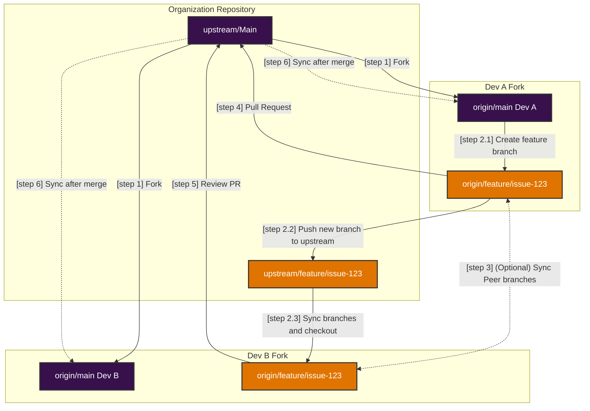

# Working in Pair Programming at Guardia

## **Summary**

✔ **Each dev has their own fork.**  
✔ **A shared branch is created and synchronized between forks.**  
✔ **Both work on their own branch, synchronizing changes with the shared branch.**  
✔ **Optionally, both can synchronize their branches with each other.**  
✔ **Pull and merge changes frequently to avoid conflicts.**  
✔ **Final PR is sent to the organization's repository (`upstream`).**  

---

## **Pair Programming Workflow with Individual Forks**
### **1. Initial Setup**
Each developer needs to set up their environment correctly.

#### **Dev A and Dev B fork the organization's repository (`upstream`)**
- Each dev creates their own fork on GitHub.
- Both clone **their own fork** to their machines:
  ```bash
  git clone https://github.com/dev-a/forked-repo.git
  cd forked-repo
  ```

#### **Add the remotes correctly**
- The organization's repository is added as `upstream`:
  ```bash
  git remote add upstream https://github.com/org/repo.git
  ```
- (optional) The other developer's fork can be added as a third remote (`peer`), facilitating direct synchronization:
  ```bash
  git remote add peer https://github.com/dev-b/forked-repo.git
  ```
- Your own fork is automatically configured as origin when cloning:
  ```bash
  git clone https://github.com/dev-a/forked-repo.git
  ```

Now, the remotes should look like this:
```bash
git remote -v
origin   https://github.com/dev-a/forked-repo.git (fetch)
origin   https://github.com/dev-a/forked-repo.git (push)
upstream https://github.com/org/repo.git (fetch)
upstream https://github.com/org/repo.git (push)

// optional
peer     https://github.com/dev-b/forked-repo.git (fetch)
peer     https://github.com/dev-b/forked-repo.git (push)
```

---

### **2. Create a Shared Branch for the Issue**
- Dev A creates the branch from upstream's `main` and pushes to upstream:
  ```bash
  git fetch upstream
  git checkout -b feature/issue-123 upstream/main
  git push upstream feature/issue-123
  ```

- Dev B synchronizes the branch directly from upstream:
  ```bash
  git fetch upstream
  git checkout -b feature/issue-123 upstream/feature/issue-123
  ```

Now, both are on the same branch and can work together.

---

### **3. Collaborative Development**
To avoid conflicts:
1. **Always pull changes from the other before starting to code**:
   ```bash
   git pull peer feature/issue-123
   ```
2. **Commit changes regularly**:
   ```bash
   git add .
   git commit -m "Initial implementation of feature X"
   ```
3. **Push to your own fork**:
   ```bash
   git push origin feature/issue-123
   ```

---

### **4. Synchronization with Organization Repository**
Since each dev has their own fork, it's essential to sync with upstream regularly:
```bash
git fetch upstream
git rebase upstream/main
git push origin feature/issue-123 --force-with-lease
```

> **Important**: Avoid using `--force` as it rewrites upstream history from the local branch. Make sure to communicate with the team when doing a force push. The `--force-with-lease` is a safer option that won't overwrite any work on the remote branch if more commits have been added to the remote branch (by another team member or colleague or such). It ensures you don't overwrite someone else's work when force pushing.

---

### **5. Review and Pull Request**
When the feature is ready:
1. Dev A (or Dev B) opens a **Pull Request (PR) to the organization's repository (`upstream`)**.
2. The other dev reviews the PR before merge.
3. The PR is reviewed by two more organization members.
4. If needed, new changes are made before merging.
5. The PR is merged.

---

### **6. Local Branch Update**
After the PR is merged, the local branch should be updated:
```bash
git fetch upstream
git rebase upstream/main
```

