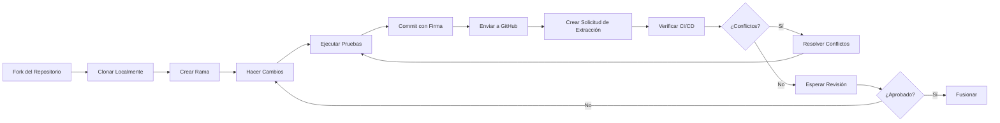

# Contribuir a Guardia

Guardia valora la comunidad de código abierto y está comprometida a contribuir al desarrollo de software de código abierto. Creemos que el código abierto es la mejor manera de crear software de alta calidad de manera eficiente, segura y colaborativa, promoviendo la innovación y la evolución continua.

Ya sea corrigiendo un error, proponiendo una nueva característica, mejorando la documentación o ofreciendo tu perspectiva única, ¡toda contribución es bienvenida!

Tus contribuciones son esenciales para la calidad y evolución de Guardia. Queremos que todos se sientan bienvenidos y que la participación sea accesible, superando las barreras del idioma. Por lo tanto, nuestra documentación principal está disponible en portugués, inglés y español.

## ¿Por qué deberías contribuir?

* **Impacto**: Tu trabajo impactará directamente y mejorará un proyecto utilizado por organizaciones en todo el mundo, haciendo que sus operaciones sean más fluidas y eficientes.
* **Aprender y Crecer**: Contribuir a Guardia ofrece una oportunidad única para aprender de una comunidad de desarrolladores talentosos, mejorando tus habilidades y conocimientos en diseño de arquitectura, CQRS, Puertos y Adaptadores, y más.
* **Comunidad**: Únete a una comunidad acogedora y solidaria de desarrolladores que comparten tu pasión por crear software de código abierto de alta calidad.

## ¿Cómo puedes contribuir?

* **Contribuciones de Código**: Desde pequeñas correcciones hasta grandes características, tus contribuciones de código siempre son bienvenidas. Nuestra arquitectura y dependencias mínimas facilitan la comprensión y mejora de Guardia.
* **Documentación**: Ayúdanos a mejorar nuestra documentación para hacer que Guardia sea más accesible y comprensible para todos.
* **Comentarios e Ideas**: Comparte tus ideas, sugerencias e ideas innovadoras para ayudarnos a dar forma al futuro de Guardia.
* **Pruebas**: Ayuda en la prueba de nuevas versiones o características, proporcionando comentarios valiosos para garantizar la estabilidad y usabilidad.

## Nuestro Flujo de Trabajo

Para la mayoría de los cambios, se recomienda crear un problema para discutir tus propuestas. Considera unirte a nuestro [Discord](https://discord.gg/N2EyGuqY) y compartir tus ideas. Esto facilita el seguimiento de discusiones y comentarios. Sin embargo, para pequeñas correcciones como errores tipográficos, puedes enviar una solicitud de extracción directamente.

- Haz un fork del repositorio en GitHub, clónalo en tu computadora.
- Crea una rama con tus cambios.
- Estás trabajando con la última versión de la rama `main`.
- Modifica el código fuente; **Por favor, concéntrate solo en el cambio específico que estás contribuyendo**.
- Asegúrate de que las pruebas locales pasen.
- Haz un commit en tu fork usando mensajes de commit **pequeños y claros**.
- Envíanos una solicitud de extracción, respondiendo cualquier pregunta estándar en la interfaz de la solicitud de extracción.
- Presta atención a cualquier fallo de CI automatizado reportado en la solicitud de extracción y mantente involucrado en la conversación.
- Después de enviar tus commits a GitHub, asegúrate de que tu rama pueda fusionarse automáticamente (sin conflictos de fusión). Si no, en tu computadora, fusiona la rama principal en tu rama, resuelve cualquier conflicto de fusión, asegúrate de que todo siga funcionando correctamente y pase todas las pruebas, y luego envía esos cambios.
- Una vez que el cambio haya sido aprobado y fusionado, te notificaremos en un comentario.

<br />



Caso esteja trabajando en un flujo de pair programming, vea también el [Fluxo de Trabajo para Pair Programming con Forks Individuales](./PAIR_PROGRAM_WORKFLOW.md) para más información.

## Directrices para Mensajes de Commit

### Usa "Commits Pequeños"

Al contribuir a Guardia, recomendamos encarecidamente adoptar la práctica de *Commits Pequeños*. Este enfoque aporta varios beneficios al desarrollo y revisión de código, asegurando un proceso más eficiente y colaborativo.

#### Beneficios de los Commits Pequeños

1. **Facilidad de Revisión**: Los commits más pequeños son más fáciles de entender y revisar, reduciendo el tiempo necesario para la aprobación e integración del código.
2. **Menor Riesgo de Errores**: Los commits pequeños facilitan la identificación y corrección de errores si algo sale mal.
3. **Historia Clara y Organizada**: Una historia de commits granular y bien descrita facilita la depuración y comprensión de la evolución del código.
4. **Facilidad de Resolución de Conflictos**: Los cambios más pequeños tienen menos probabilidades de generar conflictos de fusión complejos.
5. **Reversión Segura**: Si se identifica un problema, los commits pequeños permiten revertir cambios sin afectar partes significativas del código.

#### Mejores Prácticas

- **Un commit por cambio lógico**: Evita commits que mezclen múltiples cambios no relacionados.
- **Mensajes de commit descriptivos**: Usa mensajes claros y objetivos que expliquen el cambio realizado.
- **Evita commits gigantes**: Si notas que tu commit es demasiado grande, divídelo en partes más pequeñas.
- **Commits atómicos**: Cada commit debe representar una unidad de trabajo que pueda integrarse sin depender de cambios futuros.
- **Pruebas y validaciones**: Siempre que sea posible, asegúrate de que el código en cada commit sea funcional y no rompa la aplicación.

### Formatos de Mensajes de Commit

Usa el formato [Conventional Commit](https://www.conventionalcommits.org/en/v1.0.0/) para asegurar que nuestra historia de commits sea legible y fácil de seguir. Este formato es parte de un conjunto más amplio de directrices diseñadas para facilitar la versión automática y la generación de changelogs:

```
<tipo>[alcance opcional]: <descripción>

[cuerpo opcional]

[pie(s) opcional(es)]
```

El commit contiene los siguientes elementos estructurales para comunicar la intención a
los consumidores de tu biblioteca:

1. **fix:** un commit de tipo `fix` corrige un error en tu código (esto se correlaciona con [`PATCH`](http://semver.org/#summary) en Versionado Semántico).

2. **feat:** un commit de tipo `feat` introduce una nueva característica al código (esto se correlaciona con [`MINOR`](http://semver.org/#summary) en Versionado Semántico).

3. **BREAKING CHANGE:** un commit que tiene un pie de página `BREAKING CHANGE:`, o agrega un `!` después del tipo/alcance, introduce un cambio que rompe la API (correlacionando con [`MAJOR`](http://semver.org/#summary) en Versionado Semántico).
   Un BREAKING CHANGE puede ser parte de commits de cualquier _tipo_.

4. _tipos_ distintos de `fix:` y `feat:` están permitidos, por ejemplo [@commitlint/config-conventional](https://github.com/conventional-changelog/commitlint/tree/master/%40commitlint/config-conventional) (basado en la [convención Angular](https://github.com/angular/angular/blob/22b96b9/CONTRIBUTING.md#-commit-message-guidelines)) recomienda `build:`, `chore:`,
   `ci:`, `docs:`, `style:`, `refactor:`, `perf:`, `test:`, y otros.

5. _pies de página_ distintos de `BREAKING CHANGE: <descripción>` pueden proporcionarse y seguir una convención similar al
   [formato de remolque de git](https://git-scm.com/docs/git-interpret-trailers).

Los tipos adicionales no son requeridos por la especificación de Commits Convencionales y no tienen un efecto implícito en el Versionado Semántico (a menos que incluyan un BREAKING CHANGE).

Se puede proporcionar un alcance al tipo de un commit para proporcionar información contextual adicional y se contiene dentro de paréntesis, por ejemplo, `feat(parser): add ability to parse arrays`.

### Commits Firmados

Debes firmar commits y etiquetas localmente para dar a otros confianza sobre el origen de un cambio que realizaste. Debes usar una clave GPG para firmar commits y etiquetas.

Cuando un commit o etiqueta contiene una firma GPG criptográficamente verificable, se marcará como "Verificado" al enviar una Solicitud de Extracción.

| Aceptado | Estado                | Descripción                                                                                                                                                                                                 |
|----------|-----------------------|-------------------------------------------------------------------------------------------------------------------------------------------------------------------------------------------------------------|
| Sí       | Verificado            | El commit fue firmado, la firma se verificó con éxito, y el autor es el único que habilitó el modo vigilante.                                                                              |
| No       | Parcialmente verificado| El commit fue firmado y la firma se verificó con éxito, pero el commit tiene un autor que: a) no es el autor del commit y b) habilitó el modo vigilante. En este caso, la firma del commit no garantiza el consentimiento del autor. Por lo tanto, el commit solo está parcialmente verificado. |
| No       | No verificado         | Cualquiera de las siguientes es verdadera: <br /> – El commit fue firmado, pero la firma no pudo ser verificada. <br /> – El commit no fue firmado, y el usuario que lo hizo habilitó el modo vigilante. <br /> – El commit no fue firmado, y un autor habilitó el modo vigilante. |
| No       | Sin estado de verificación | El commit no fue firmado.                                                                                                                                                                                  |
<br />

>**IMPORTANTE:** Solo se aceptarán Pull Requests con todos los commits firmados y marcados como "Verificado". Vea cómo configurar Git para firmar commits automáticamente en [Firmando commits](../../../tutorials/pt-BR/signing-commits.md).

## Idiomas

Estamos comprometidos a mantener nuestras comunicaciones en portugués, inglés y español. Sin embargo, aceptamos que los problemas se publiquen en cualquier idioma. Sin embargo, elegimos mantener nuestra comunicación oficial en inglés por varias razones:

- El portugués brasileño es un idioma muy rico - y estamos orgullosos de ello - pero también es un idioma muy complejo, lo que dificulta que la comunidad entienda los problemas y solicitudes de extracción.
- El inglés ya es parte de la cultura de la Ingeniería de Software, y es un idioma más simple y fácil de entender, lo que facilita la comprensión de la comunidad de problemas y solicitudes de extracción.

### Commits

El mensaje principal del commit debe escribirse en inglés. Si sientes la necesidad de describirlo en tu idioma local, puedes usarlo incluyendo la etiqueta `[language]` en la descripción del commit. Actualmente, con la ayuda de herramientas como [DeepL](https://www.deepl.com/) y [Google Translate](https://translate.google.com/), cualquiera puede traducir su texto al inglés u otros idiomas. Sin embargo, tener el texto original _junto con_ la traducción puede ayudar a mitigar errores de traducción.

### Problemas y Solicitudes de Extracción

Puedes abrir problemas y solicitudes de extracción en cualquier idioma. Si el problema o la solicitud de extracción se publica en un idioma distinto del inglés, alentamos a incluir una copia en inglés en el cuerpo del problema o solicitud de extracción o como una respuesta que contenga la etiqueta `[en]`.

> **IMPORTANTE:** **Tenga en cuenta** que usar cualquier idioma distinto del inglés como un intento de eludir el [Código de Conducta](https://github.com/guardiafinancas/hub/blob/main/CODE_OF_CONDUCT.md) resultará en una prohibición inmediata y posiblemente indefinida del proyecto.

**Ejemplo:**

```
feat(auth): implement OAuth2 authentication

[en]
Implement OAuth2 authentication flow with support for multiple providers:
- Add OAuth2 client configuration
- Create authentication handlers for Google and GitHub
- Implement token validation and refresh logic
- Add unit tests for auth flow

[pt-BR]
Implementa fluxo de autenticação OAuth2 com suporte para múltiplos provedores:
- Adiciona configuração do cliente OAuth2
- Cria handlers de autenticação para Google e GitHub
- Implementa lógica de validação e refresh de tokens
- Adiciona testes unitários para o fluxo de auth

Closes #123
```

## Código de Conducta

Este proyecto adopta el [Código de Conducta](https://github.com/guardiafinancas/hub/blob/main/CODE_OF_CONDUCT.md) para asegurar que la comunidad sea acogedora y respetuosa con todos los participantes.

## Licencia

Este proyecto está licenciado bajo [POR DEFINIR](https://github.com/guardiafinancas/hub/blob/main/LICENSE).

## Guía del Desarrollador

Consulta la [Guía del Desarrollador](https://github.com/guardiafinancas/hub/blob/main/DEVELOPMENT_GUIDE.md) para más información.