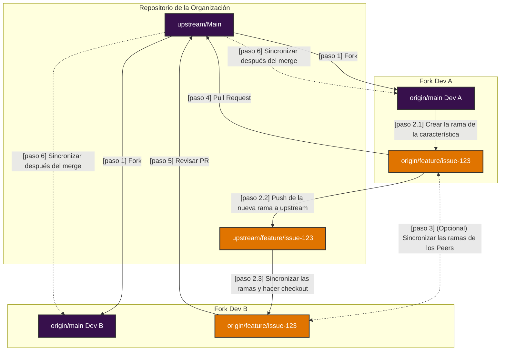

# Trabajando en Programación en Parejas en Guardia

## **Resumen**

✔ **Cada desarrollador tiene su propio fork.**  
✔ **Se crea y sincroniza una rama compartida entre los forks.**  
✔ **Ambos trabajan en su propio branch, sincronizando cambios con el branch compartido.**  
✔ **Opcionalmente, ambos pueden sincronizar sus branches entre si.**  
✔ **Extraen y fusionan cambios frecuentemente para evitar conflictos.**  
✔ **El PR final se envía al repositorio de la organización (`upstream`).**  

---

## **Flujo de Trabajo para Programación en Parejas con Forks Individuales**
### **1. Configuración Inicial**
Cada desarrollador necesita configurar su entorno correctamente.

#### **Dev A y Dev B hacen fork del repositorio de la organización (`upstream`)**
- Cada desarrollador crea su propio fork en GitHub.
- Ambos clonan **su propio fork** en sus máquinas:
  ```bash
  git clone https://github.com/dev-a/forked-repo.git
  cd forked-repo
  ```

#### **Agregar los remotes correctamente**
- El repositorio de la organización se agrega como `upstream`:
  ```bash
  git remote add upstream https://github.com/org/repo.git
  ```
- (opcional) El fork del otro desarrollador puede agregarse como un tercer remote (`peer`), facilitando la sincronización directa:
  ```bash
  git remote add peer https://github.com/dev-b/forked-repo.git
  ```
- Tu propio fork se configura automáticamente como origin al clonar:
  ```bash
  git clone https://github.com/dev-a/forked-repo.git
  ```

Ahora, los remotes deberían verse así:
```bash
git remote -v
origin   https://github.com/dev-a/forked-repo.git (fetch)
origin   https://github.com/dev-a/forked-repo.git (push)
upstream https://github.com/org/repo.git (fetch)
upstream https://github.com/org/repo.git (push)

// opcional
peer     https://github.com/dev-b/forked-repo.git (fetch)
peer     https://github.com/dev-b/forked-repo.git (push)
```

---

### **2. Crear una Rama Compartida para el Issue**
- Dev A crea la rama desde el `main` del upstream y hace push al upstream:
  ```bash
  git fetch upstream
  git checkout -b feature/issue-123 upstream/main
  git push upstream feature/issue-123
  ```

- Dev B sincroniza la rama directamente desde upstream:
  ```bash
  git fetch upstream
  git checkout -b feature/issue-123 upstream/feature/issue-123
  ```

Ahora, ambos están en la misma rama y pueden trabajar juntos.

---

### **3. Desarrollo Colaborativo**
Para evitar conflictos:
1. **Siempre extrae los cambios del otro antes de empezar a programar**:
   ```bash
   git pull peer feature/issue-123
   ```
2. **Realiza commits regularmente**:
   ```bash
   git add .
   git commit -m "Implementación inicial de la característica X"
   ```
3. **Envía a tu propio fork**:
   ```bash
   git push origin feature/issue-123
   ```

---

### **4. Sincronización con el Repositorio de la Organización**
Como cada desarrollador tiene su propio fork, es esencial sincronizar con el upstream regularmente:
```bash
git fetch upstream
git rebase upstream/main
git push origin feature/issue-123 --force-with-lease
```

> **Importante**: Evita usar `--force` ya que reescribe el historial del upstream desde la rama local. Asegúrate de comunicar al equipo cuando hagas un force push. El `--force-with-lease` es una opción más segura que no sobrescribirá ningún trabajo en la rama remota si se han agregado más commits (por otro miembro del equipo o compañero). Garantiza que no sobrescribas el trabajo de otra persona al hacer un force push.

---

### **5. Revisión y Pull Request**
Cuando la característica esté lista:
1. Dev A (o Dev B) abre un **Pull Request (PR) al repositorio de la organización (`upstream`)**.
2. El otro desarrollador revisa el PR antes de la fusión.
3. El PR es revisado por dos miembros más de la organización.
4. Si es necesario, se realizan nuevos cambios antes de la fusión.
5. El PR se fusiona.

---

### **6. Actualización de la Rama Local**
Después de que el PR se fusiona, la rama local debe actualizarse:
```bash
git fetch upstream
git rebase upstream/main
```

