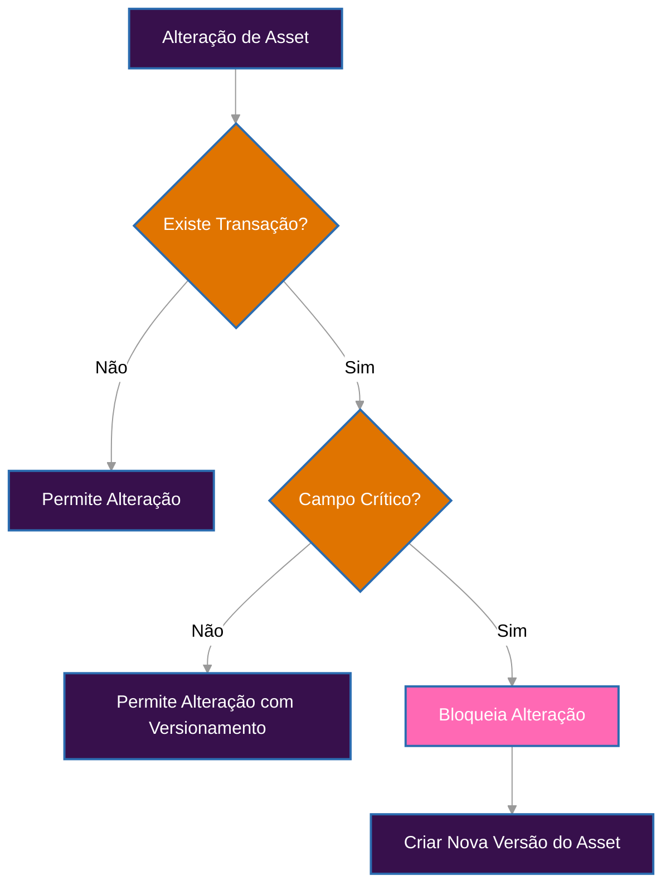

# Atualização de Assets

Gerenciar Assets em um sistema contábil exige equilíbrio entre flexibilidade operacional e integridade histórica. Este documento define as regras aplicáveis às atualizações de Assets, considerando as exigências contábeis (IAS/IFRS), os impactos técnicos e a rastreabilidade regulatória.

## Atualizações e Integridade Contábil

No contexto da Guardia, um Asset representa uma unidade monetária ou não monetária utilizada em lançamentos contábeis dentro de um Ledger. Por esse motivo, algumas de suas propriedades assumem papel estrutural no significado dos lançamentos registrados. Alterá-las, após o uso, comprometeria a confiabilidade do sistema. As atualizações são, portanto, classificadas entre:

- **Campos críticos (imutáveis após uso)**
- **Campos não críticos (editáveis com controle histórico)**

---

## Campos Críticos

São campos cuja alteração pode distorcer o valor contábil, desalinhar relatórios e quebrar integrações:

- `code`: Código do Asset (ex: "USD", "BTC")
- `number`: Número de referência (ex: "840" para USD segundo ISO 4217)
- `exponent`: Define a escala decimal (ex: 2 para centavos)
- `is_fiat`: Define se é fiduciário ou não

### Regra
Após qualquer uso do Asset em transações comitadas, esses campos se tornam imutáveis.

#### Comportamento esperado
- **Status HTTP**: `422 Unprocessable Entity`
- **Código de erro**: `ERR422_BUSINESS_ERROR`
- **Razão**: `ASSET_HAS_TRANSACTIONS`

**Exemplo de bloqueio**
```json
PATCH /v1/assets/{entity_id}
{
  "exponent": 6
}
```

#### Como tratar mudanças legítimas
Se houver necessidade de alterar um campo crítico:
1. Crie um novo Asset com novo `entity_id`
2. Marque a versão antiga como `deprecated`
3. Utilize o novo asset em lançamentos futuros

---

## Campos Não Críticos

São campos que não afetam diretamente a integridade dos valores lançados, mas podem influenciar interpretações analíticas ou regras de negócio:

- `metadata`: Informações adicionais
- `locations`: Lista de países em que o Asset é aceito

### Regra
Estes campos podem ser atualizados mesmo após o uso em transações.

#### Controle adicional
- Toda alteração é registrada no histórico da entidade (`ASSET_HISTORY`)
- Podem acionar revalidações em pipelines que dependam desses dados

**Exemplo permitido**
```json
PATCH /v1/assets/{entity_id}
{
  "metadata": {
    "category": "reserves",
    "risk_level": "low"
  }
}
```

---

## Vínculo com Ledgers

O relacionamento entre Assets e Ledgers também é controlado para manter rastreabilidade contábil.

### Permissões

- **Adicionar novos ledgers**: permitido a qualquer momento
- **Remover ledgers**: proibido se houver transações associadas

**Comportamento em tentativas inválidas**
- **Status HTTP**: `422 Unprocessable Entity`
- **Código de erro**: `ERR422_BUSINESS_ERROR`
- **Razão**: `LEDGER_HAS_TRANSACTIONS`

**Exemplo de restrição**
```json
PATCH /v1/assets/{entity_id}
{
  "ledgers": ["ledger-2"]  // Remoção bloqueada se ledger-1 já tiver transações
}
```

## Descarte de Assets (`discard`)

Descarte de um Asset significa torná-lo inativo para novos lançamentos. Essa ação não deve apagar ou modificar dados históricos, mas sim evitar uso futuro.

### Comportamento esperado

* **Pode ser descartado**: se o asset **não tiver sido utilizado** em transações.
* **Não pode ser descartado**: se o asset **já estiver associado** a qualquer transação.

#### Restrições

* **Status HTTP**: `422 Unprocessable Entity`
* **Código de erro**: `ERR422_BUSINESS_ERROR`
* **Razão**: `ASSET_HAS_TRANSACTIONS`

#### Justificativa

A tentativa de descartar um asset já utilizado comprometeria a rastreabilidade contábil e o histórico temporal de lançamentos. Além disso, em conformidade com os princípios da **IAS 10** e **IAS 1**, ativos utilizados em demonstrações passadas devem continuar acessíveis e auditáveis.

#### Exemplo de tentativa inválida

```json
DELETE /v1/assets/{entity_id}
// Resultado: 422 Unprocessable Entity
// Erro: ASSET_HAS_TRANSACTIONS
```

## Estratégia de Implementação

Para garantir que o sistema permaneça auditável e íntegro:

- **Imutabilidade Estrutural**: toda tentativa de alteração em campos sensíveis verifica histórico de uso, isto é, se o asset já foi utilizado em transações.
- **Audit Trail**: cada mudança é registrada com timestamp, autor e valores anteriores
- **Versionamento**: alterações críticas devem ser tratadas como novas entidades, gerando um novo `entity_id` e mantendo referência à versão anterior.
- **Referência Temporal**: relatórios e análises utilizam o Asset vigente no momento de cada lançamento

## Conformidade com Normas Contábeis

A modelagem implementada segue as diretrizes da IAS/IFRS:

- **IAS 1 – Apresentação das Demonstrações Contábeis**: requer consistência e representação fidedigna das informações
- **IAS 8 – Políticas Contábeis, Mudanças de Estimativas e Erros**: trata alterações de critérios contábeis como mudanças estruturais, exigindo nova versão e não alteração retroativa

Permitir alteração de campos como `exponent`, `code` ou `number` comprometeria relatórios financeiros, reconciliações regulatórias e a confiança em auditorias. O modelo de versionamento aplicado evita esses riscos e garante rastreabilidade jurídica, técnica e fiscal.


## Fluxo de Decisão



## Exemplos Práticos

### Alterar código (campo crítico)
```json
PATCH /v1/assets/{entity_id}
{
  "code": "USDT"
}
// Resultado: 422 Unprocessable Entity se já houver transações
```

#### Atualizar metadados (campo não crítico)
```json
PATCH /v1/assets/{entity_id}
{
  "metadata": {
    "category": "stablecoin"
  }
}
// Resultado: 200 OK, alteração registrada no histórico
```

#### Adicionar novo ledger
```json
PATCH /v1/assets/{entity_id}
{
  "ledgers": ["ledger-a", "ledger-b"]
}
// Resultado: 200 OK
```

#### Remover ledger com transações
```json
PATCH /v1/assets/{entity_id}
{
  "ledgers": ["ledger-b"]
}
// Resultado: 422 Unprocessable Entity se "ledger-a" tiver transações
```

## Referencias

- [IAS 1 – Apresentação das Demonstrações Contábeis](https://www.ifrs.org/content/dam/ifrs/publications/pdf-standards/english/2024/issued/part-a/ias-1-presentation-of-financial-statements.pdf?bypass=on)
- [IAS 8 – Políticas Contábeis, Mudanças de Estimativas e Erros](https://www.ifrs.org/content/dam/ifrs/publications/pdf-standards/english/2024/issued/part-a/ias-8-accounting-policies-changes-in-accounting-estimates-and-errors.pdf?bypass=on)