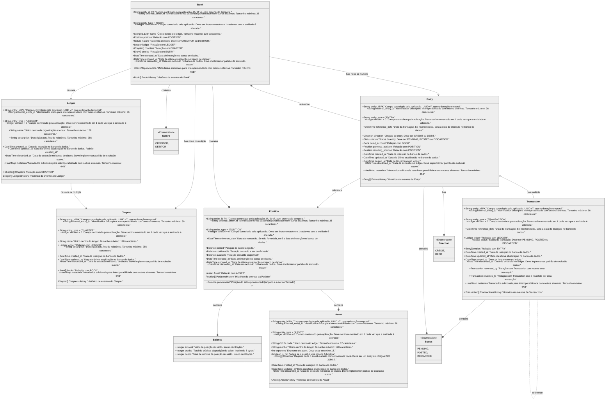

import MermaidDiagram from '@site/src/components/MermaidDiagram';

# Diagrama de Classes

<MermaidDiagram>

```mermaid
classDiagram

%%{init: {'theme': 'neutral'}}%%
classDef default fill:#e9ecef,stroke:#dee2e6,stroke-width:2px,color:#212529;
classDef special fill:#f8f9fa,stroke:#dee2e6,stroke-width:2px,color:#212529;

    class Ledger {
        +String<uuid> entity_id PK "Campo controlado pela aplicação. UUID v7, com ordenação temporal."
        +String<uuid> external_entity_id "Identificador único para interoperabilidade com outros sistemas. Tamanho máximo: 36 caracteres."
        +String entity_type = "LEDGER"
        +Integer version = 0 "Campo controlado pela aplicação. Deve ser incrementado em 1 cada vez que a entidade é alterada."
        +String name "Único dentro da organização e tenant. Tamanho máximo: 128 caracteres."
        +String description "Descrição para fins de relatórios. Tamanho máximo: 256 caracteres."
        +DateTime created_at "Data de inserção no banco de dados."
        +DateTime updated_at "Data da última atualização no banco de dados. Padrão: created_at"
        +DateTime discarded_at "Data de exclusão no banco de dados. Deve implementar padrão de exclusão suave."
        +HashMap<String, String> metadata "Metadados adicionais para interoperabilidade com outros sistemas. Tamanho máximo: 4KB"
        +Chapter[] Chapters "Relação com CHAPTER"
        Ledger[] LedgersHistory "Histórico de eventos do Ledger"
    }

    class Chapter {
        +String<uuid> entity_id PK "Campo controlado pela aplicação. UUID v7, com ordenação temporal."
        +String<uuid> external_entity_id "Identificador único para interoperabilidade com outros sistemas. Tamanho máximo: 36 caracteres."
        +String entity_type = "CHAPTER"
        +Integer version = 0 "Campo controlado pela aplicação. Deve ser incrementado em 1 cada vez que a entidade é alterada."
        +String name "Único dentro do ledger. Tamanho máximo: 128 caracteres."
        +Ledger ledger "Relação com LEDGER"
        +String description "Descrição para fins de relatórios. Tamanho máximo: 256 caracteres."
        +DateTime created_at "Data de inserção no banco de dados."
        +DateTime updated_at "Data da última atualização no banco de dados."
        +DateTime discarded_at "Data de exclusão no banco de dados. Deve implementar padrão de exclusão suave."
        +Book[] books "Relação com BOOK"
        +HashMap<String, String> metadata "Metadados adicionais para interoperabilidade com outros sistemas. Tamanho máximo: 4KB"
        Chapter[] ChaptersHistory "Histórico de eventos do Chapter"
    }

    class Position {
        +String<uuid> entity_id PK "Campo controlado pela aplicação. UUID v7, com ordenação temporal."
        +String<uuid> external_entity_id "Identificador único para interoperabilidade com outros sistemas. Tamanho máximo: 36 caracteres."
        +String entity_type = "POSITION"
        +Integer version = 0 "Campo controlado pela aplicação. Deve ser incrementado em 1 cada vez que a entidade é alterada."
        +DateTime reference_date "Data da transação. Se não fornecida, será a data de inserção no banco de dados."
        +Balance posted "Posição do saldo lançado."
        +Balance confirmable "Posição do saldo a ser confirmado."
        +Balance provisioned "Posição do saldo provisionado (lançado e a ser confirmado)."
        +Balance available "Posição do saldo disponível."
        +DateTime created_at "Data de inserção no banco de dados."
        +DateTime updated_at "Data da última atualização no banco de dados."
        +DateTime discarded_at "Data de exclusão no banco de dados. Deve implementar padrão de exclusão suave."
        +Asset Asset "Relação com ASSET"
        Position[] PositionsHistory "Histórico de eventos da Position"
    }

    class Balance {
        +Integer amount "Valor da posição de saldo. Inteiro de 8 bytes."
        +Integer credits "Total de créditos da posição de saldo. Inteiro de 8 bytes."
        +Integer debits "Total de débitos da posição de saldo. Inteiro de 8 bytes."
    }

    class Asset {
        +String<uuid> entity_id PK "Campo controlado pela aplicação. UUID v7, com ordenação temporal."
        +String<uuid> external_entity_id "Identificador único para interoperabilidade com outros sistemas. Tamanho máximo: 36 caracteres."
        +String entity_type = "ASSET"
        +Integer version = 0 "Campo controlado pela aplicação. Deve ser incrementado em 1 cada vez que a entidade é alterada."
        +String<3,12> code "Único dentro do ledger. Tamanho máximo: 12 caracteres."
        +String number "Único dentro do ledger. Tamanho máximo: 128 caracteres."
        +int exponent "Expoente do asset. Deve estar entre 0 e 18."
        +boolean is_fiat "Indica se o asset é uma moeda fiduciária."
        +String[] locations "Regiões onde o asset é aceito como moeda de troca. Deve ser um array de códigos ISO 3166-2."
        +DateTime created_at "Data de inserção no banco de dados."
        +DateTime updated_at "Data da última atualização no banco de dados."
        +DateTime discarded_at "Data de exclusão no banco de dados. Deve implementar padrão de exclusão suave."
        +Asset[] AssetsHistory "Histórico de eventos do Asset"
    }

    class Book {
        +String<uuid> entity_id PK "Campo controlado pela aplicação. UUID v7, com ordenação temporal."
        +String<uuid> external_entity_id "Identificador único para interoperabilidade com outros sistemas. Tamanho máximo: 36 caracteres."
        +String entity_type = "BOOK"
        +Integer version = 0 "Campo controlado pela aplicação. Deve ser incrementado em 1 cada vez que a entidade é alterada."
        +String<3,128> name "Único dentro do ledger. Tamanho máximo: 128 caracteres."
        +Position position "Relação com POSITION"
        +Nature nature "Natureza do book. Deve ser CREDITOR ou DEBITOR."
        +Ledger ledger "Relação com LEDGER"
        +Chapter[] chapters "Relação com CHAPTER"
        +Entry[] entries "Relação com ENTRY"
        +DateTime created_at "Data de inserção no banco de dados."
        +DateTime updated_at "Data da última atualização no banco de dados."
        +DateTime discarded_at "Data de exclusão no banco de dados. Deve implementar padrão de exclusão suave."
        +HashMap<String, String> metadata "Metadados adicionais para interoperabilidade com outros sistemas. Tamanho máximo: 4KB"
        +Book[] BooksHistory "Histórico de eventos do Book"
    }

    class Nature {
        <<Enumeration>>
        CREDITOR,
        DEBITOR
    }

    class Entry {
        +String<uuid> entity_id PK "Campo controlado pela aplicação. UUID v7, com ordenação temporal."
        +String<uuid> external_entity_id "Identificador único para interoperabilidade com outros sistemas. Tamanho máximo: 36 caracteres."
        +String entity_type = "ENTRY"
        +Integer version = 0 "Campo controlado pela aplicação. Deve ser incrementado em 1 cada vez que a entidade é alterada."
        +DateTime reference_date "Data da transação. Se não fornecida, será a data de inserção no banco de dados."
        +Direction direction "Direção do entry. Deve ser CREDIT ou DEBIT."
        +Status status "Status do entry. Deve ser PENDING, POSTED ou DISCARDED."
        +Book detail_account "Relação com BOOK"
        +Position previous_position "Relação com POSITION"
        +Position resulting_position "Relação com POSITION"
        +DateTime created_at "Data de inserção no banco de dados."
        +DateTime updated_at "Data da última atualização no banco de dados."
        +DateTime posted_at "Data de lançamento no ledger."
        +DateTime discarded_at "Data de exclusão no ledger. Deve implementar padrão de exclusão suave."
        +HashMap<String, String> metadata "Metadados adicionais para interoperabilidade com outros sistemas. Tamanho máximo: 4KB"
        +Entry[] EntriesHistory "Histórico de eventos da Entry"
    }

    class Transaction {
        +String<uuid> entity_id PK "Campo controlado pela aplicação. UUID v7, com ordenação temporal."
        +String<uuid> external_entity_id "Identificador único para interoperabilidade com outros sistemas. Tamanho máximo: 36 caracteres."
        +String entity_type = "TRANSACTION"
        +Integer version = 0 "Campo controlado pela aplicação. Deve ser incrementado em 1 cada vez que a entidade é alterada."
        +DateTime reference_date "Data da transação. Se não fornecida, será a data de inserção no banco de dados."
        +Ledger ledger "Relação com LEDGER"
        +Status status "Status da transação. Deve ser PENDING, POSTED ou DISCARDED."
        +Entry[] entries "Relação com ENTRY"
        +DateTime created_at "Data de inserção no banco de dados."
        +DateTime updated_at "Data da última atualização no banco de dados."
        +DateTime posted_at "Data de lançamento no ledger."
        +DateTime discarded_at "Data de exclusão no ledger. Deve implementar padrão de exclusão suave."
        +Transaction reversed_by "Relação com Transaction que reverte esta transação"
        +Transaction reverses_to "Relação com Transaction que é revertida por esta transação"
        +HashMap<String, String> metadata "Metadados adicionais para interoperabilidade com outros sistemas. Tamanho máximo: 4KB"
        +Transaction[] TransactionsHistory "Histórico de eventos da Transaction"
    }

    class Direction {
        <<Enumeration>>
        CREDIT,
        DEBIT
    }

    class Status {
        <<Enumeration>>
        PENDING,
        POSTED,
        DISCARDED
    }

    Position --* Balance : contains
    Position --* Asset : contains

    Book --* Nature: contains
    Book --> Entry: has none or multiple
    Book --> Chapter: has none or multiple
    Book --> Ledger: has one
    Ledger --> Chapter: has one or multiple

    Entry --* Direction: has
    Entry --* Book: reference
    Entry o-- Transaction: has multiple

    Entry --> Position: reference
    Book --* Position : contains

    Transaction --* Status: contains
    Entry --* Status: contains

    Transaction .. Transaction: reference
```
</MermaidDiagram>
