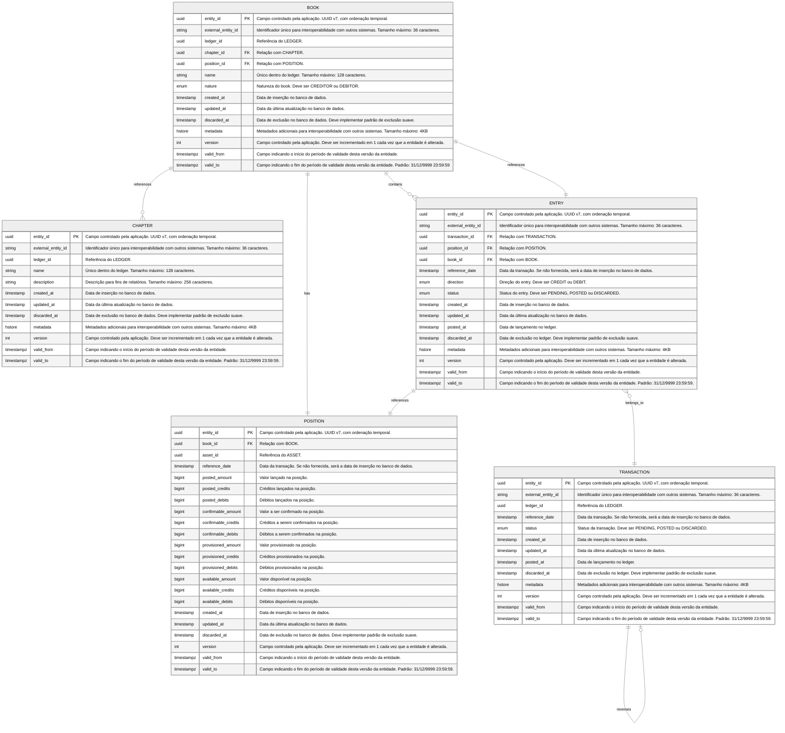

import MermaidDiagram from '@site/src/components/MermaidDiagram';

# Entidades e Relacionamentos

## Schema Control

O schema control é o schema que contém as referencias de todos os outros schemas.

```mermaid
erDiagram
    %%{init: {'theme': 'neutral'}}%%

    LEDGER ||--o{ LEDGER_HISTORY : tracks

    LEDGER {
        uuid entity_id PK "Campo controlado pela aplicação. UUID v7, com ordenação temporal."
        string external_entity_id "Identificador único para interoperabilidade com outros sistemas. Tamanho máximo: 36 caracteres."
        string name "Único dentro da organização e tenant. Tamanho máximo: 128 caracteres."
        string description "Descrição para fins de relatórios. Tamanho máximo: 256 caracteres."
        timestamp created_at "Data de inserção no banco de dados."
        timestamp updated_at "Data da última atualização no banco de dados."
        timestamp discarded_at "Data de exclusão no banco de dados. Deve implementar padrão de exclusão suave."
        hstore metadata "Metadados adicionais para interoperabilidade com outros sistemas. Tamanho máximo: 4KB"
        int version "Campo controlado pela aplicação. Deve ser incrementado em 1 cada vez que a entidade é alterada."
        timestampz valid_from "Campo indicando o início do período de validade desta versão da entidade."
        timestampz valid_to "Campo indicando o fim do período de validade desta versão da entidade. Padrão: 31/12/9999 23:59:59."
    }

    LEDGER_HISTORY {
        uuid entity_id PK "Campo controlado pela aplicação. UUID v7, com ordenação temporal."
        string external_entity_id "Identificador único para interoperabilidade com outros sistemas. Tamanho máximo: 36 caracteres."
        string name "Único dentro da organização e tenant. Tamanho máximo: 128 caracteres."
        string description "Descrição para fins de relatórios. Tamanho máximo: 256 caracteres."
        timestamp created_at "Data de inserção no banco de dados."
        timestamp updated_at "Data da última atualização no banco de dados."
        timestamp discarded_at "Data de exclusão no banco de dados. Deve implementar padrão de exclusão suave."
        hstore metadata "Metadados adicionais para interoperabilidade com outros sistemas. Tamanho máximo: 4KB"
        int version "Campo controlado pela aplicação. Deve ser incrementado em 1 cada vez que a entidade é alterada."
        timestampz valid_from "Campo indicando o início do período de validade desta versão da entidade."
        timestampz valid_to "Campo indicando o fim do período de validade desta versão da entidade."
    }

    ASSET ||--o{ ASSET_HISTORY : tracks
    ASSET {
        uuid entity_id PK "Campo controlado pela aplicação. UUID v7, com ordenação temporal."
        string external_entity_id "Identificador único para interoperabilidade com outros sistemas. Tamanho máximo: 36 caracteres."
        string code "Único dentro do ledger. Tamanho máximo: 12 caracteres."
        string number "Único dentro do ledger. Tamanho máximo: 128 caracteres."
        int exponent "Expoente do asset. Deve estar entre 0 e 18."
        boolean is_fiat "Indica se o asset é uma moeda fiduciária."
        array locations "Regiões onde o asset é aceito como moeda de troca. Deve ser um array de códigos ISO 3166-2."
        timestamp created_at "Data de inserção no banco de dados."
        timestamp updated_at "Data da última atualização no banco de dados."
        timestamp discarded_at "Data de exclusão no banco de dados. Deve implementar padrão de exclusão suave."
        int version "Campo controlado pela aplicação. Deve ser incrementado em 1 cada vez que a entidade é alterada."
        timestampz valid_from "Campo indicando o início do período de validade desta versão da entidade."
        timestampz valid_to "Campo indicando o fim do período de validade desta versão da entidade. Padrão: 31/12/9999 23:59:59."
    }

    ASSET_HISTORY {
        uuid entity_id PK "Campo controlado pela aplicação. UUID v7, com ordenação temporal."
        string external_entity_id "Identificador único para interoperabilidade com outros sistemas. Tamanho máximo: 36 caracteres."
        uuid ledger_id "Referência do LEDGER."
        string code "Único dentro do ledger. Tamanho máximo: 12 caracteres."
        string number "Único dentro do ledger. Tamanho máximo: 128 caracteres."
        int exponent "Expoente do asset. Deve estar entre 0 e 18."
        boolean is_fiat "Indica se o asset é uma moeda fiduciária."
        array locations "Regiões onde o asset é aceito como moeda de troca. Deve ser um array de códigos ISO 3166-2."
        timestamp created_at "Data de inserção no banco de dados."
        timestamp updated_at "Data da última atualização no banco de dados."
        timestamp discarded_at "Data de exclusão no banco de dados. Deve implementar padrão de exclusão suave."
        int version "Campo controlado pela aplicação. Deve ser incrementado em 1 cada vez que a entidade é alterada."
        timestampz valid_from "Campo indicando o início do período de validade desta versão da entidade."
        timestampz valid_to "Campo indicando o fim do período de validade desta versão da entidade."
    }

    LEDGER ||--o{ LEDGER_ASSET : has
    ASSET ||--o{ LEDGER_ASSET : has
    LEDGER_ASSET {
        uuid ledger_id FK "Referência do LEDGER."
        uuid asset_id FK "Relação com ASSET."
        timestamp created_at "Data de inserção no banco de dados."
        timestamp updated_at "Data da última atualização no banco de dados."
    }

```

<MermaidDiagram>

</MermaidDiagram>

## Schema General

O schema general é o schema do ledger central usado no sistema de partidas triplas. Neste schema são registrados, formato de partida tripla, o registro temporal das transações, entradas e posições.

<MermaidDiagram>

</MermaidDiagram>

## Schema Transactional

Cada ledger esta associado a um schema transactional. Alem do registro temporal de cada entidade, o schema transactional registra o historico de cada entidade.

```mermaid
erDiagram
    %%{init: {'theme': 'neutral'}}%%

    CHAPTER ||--o{ CHAPTER_HISTORY : tracks
    CHAPTER {
        uuid entity_id PK "Campo controlado pela aplicação. UUID v7, com ordenação temporal."
        string external_entity_id "Identificador único para interoperabilidade com outros sistemas. Tamanho máximo: 36 caracteres."
        uuid ledger_id "Referência do LEDGER."
        string name "Único dentro do ledger. Tamanho máximo: 128 caracteres."
        string description "Descrição para fins de relatórios. Tamanho máximo: 256 caracteres."
        timestamp created_at "Data de inserção no banco de dados."
        timestamp updated_at "Data da última atualização no banco de dados."
        timestamp discarded_at "Data de exclusão no banco de dados. Deve implementar padrão de exclusão suave."
        hstore metadata "Metadados adicionais para interoperabilidade com outros sistemas. Tamanho máximo: 4KB"
        int version "Campo controlado pela aplicação. Deve ser incrementado em 1 cada vez que a entidade é alterada."
        timestampz valid_from "Campo indicando o início do período de validade desta versão da entidade."
        timestampz valid_to "Campo indicando o fim do período de validade desta versão da entidade. Padrão: 31/12/9999 23:59:59."
    }

    CHAPTER_HISTORY {
        uuid entity_id PK "Campo controlado pela aplicação. UUID v7, com ordenação temporal."
        string external_entity_id "Identificador único para interoperabilidade com outros sistemas. Tamanho máximo: 36 caracteres."
        uuid ledger_id "Referência do LEDGER."
        string name "Único dentro do ledger. Tamanho máximo: 128 caracteres."
        string description "Descrição para fins de relatórios. Tamanho máximo: 256 caracteres."
        timestamp created_at "Data de inserção no banco de dados."
        timestamp updated_at "Data da última atualização no banco de dados."
        timestamp discarded_at "Data de exclusão no banco de dados. Deve implementar padrão de exclusão suave."
        hstore metadata "Metadados adicionais para interoperabilidade com outros sistemas. Tamanho máximo: 4KB"
        int version "Campo controlado pela aplicação. Deve ser incrementado em 1 cada vez que a entidade é alterada."
        timestampz valid_from "Campo indicando o início do período de validade desta versão da entidade."
        timestampz valid_to "Campo indicando o fim do período de validade desta versão da entidade."
    }

    BOOK ||--o{ ENTRY : contains
    BOOK ||--|| POSITION : has
    BOOK ||--o{ CHAPTER : references
    BOOK ||--o{ BOOK_HISTORY : tracks
    BOOK {
        uuid entity_id PK "Campo controlado pela aplicação. UUID v7, com ordenação temporal."
        string external_entity_id "Identificador único para interoperabilidade com outros sistemas. Tamanho máximo: 36 caracteres."
        uuid ledger_id "Referência do LEDGER."
        uuid chapter_id FK "Relação com CHAPTER."
        uuid position_id FK "Relação com POSITION."
        string name "Único dentro do ledger. Tamanho máximo: 128 caracteres."
        enum nature "Natureza do book. Deve ser CREDITOR ou DEBITOR."
        timestamp created_at "Data de inserção no banco de dados."
        timestamp updated_at "Data da última atualização no banco de dados."
        timestamp discarded_at "Data de exclusão no banco de dados. Deve implementar padrão de exclusão suave."
        hstore metadata "Metadados adicionais para interoperabilidade com outros sistemas. Tamanho máximo: 4KB"
        int version "Campo controlado pela aplicação. Deve ser incrementado em 1 cada vez que a entidade é alterada."
        timestampz valid_from "Campo indicando o início do período de validade desta versão da entidade."
        timestampz valid_to "Campo indicando o fim do período de validade desta versão da entidade. Padrão: 31/12/9999 23:59:59"
    }

    BOOK_HISTORY {
        uuid entity_id PK "Campo controlado pela aplicação. UUID v7, com ordenação temporal."
        string external_entity_id "Identificador único para interoperabilidade com outros sistemas. Tamanho máximo: 36 caracteres."
        uuid ledger_id "Referência do LEDGER."
        uuid chapter_id FK "Relação com CHAPTER."
        uuid position_id FK "Relação com POSITION."
        string name "Único dentro do ledger. Tamanho máximo: 128 caracteres."
        enum nature "Natureza do book. Deve ser CREDITOR ou DEBITOR."
        timestamp created_at "Data de inserção no banco de dados."
        timestamp updated_at "Data da última atualização no banco de dados."
        timestamp discarded_at "Data de exclusão no banco de dados. Deve implementar padrão de exclusão suave."
        hstore metadata "Metadados adicionais para interoperabilidade com outros sistemas. Tamanho máximo: 4KB"
        int version "Campo controlado pela aplicação. Deve ser incrementado em 1 cada vez que a entidade é alterada."
        timestampz valid_from "Campo indicando o início do período de validade desta versão da entidade."
        timestampz valid_to "Campo indicando o fim do período de validade desta versão da entidade."
    }

    POSITION ||--o{ POSITION_HISTORY : tracks
    POSITION {
        uuid entity_id PK "Campo controlado pela aplicação. UUID v7, com ordenação temporal."
        uuid book_id FK "Relação com BOOK."
        uuid asset_id "Referência do ASSET."
        timestamp reference_date "Data da transação. Se não fornecida, será a data de inserção no banco de dados."
        bigint posted_amount "Valor lançado na posição."
        bigint posted_credits "Créditos lançados na posição."
        bigint posted_debits "Débitos lançados na posição."
        bigint confirmable_amount "Valor a ser confirmado na posição."
        bigint confirmable_credits "Créditos a serem confirmados na posição."
        bigint confirmable_debits "Débitos a serem confirmados na posição."
        bigint provisioned_amount "Valor provisionado na posição."
        bigint provisioned_credits "Créditos provisionados na posição."
        bigint provisioned_debits "Débitos provisionados na posição."
        bigint available_amount "Valor disponível na posição."
        bigint available_credits "Créditos disponíveis na posição."
        bigint available_debits "Débitos disponíveis na posição."
        timestamp created_at "Data de inserção no banco de dados."
        timestamp updated_at "Data da última atualização no banco de dados."
        timestamp discarded_at "Data de exclusão no banco de dados. Deve implementar padrão de exclusão suave."
        int version "Campo controlado pela aplicação. Deve ser incrementado em 1 cada vez que a entidade é alterada."
        timestampz valid_from "Campo indicando o início do período de validade desta versão da entidade."
        timestampz valid_to "Campo indicando o fim do período de validade desta versão da entidade. Padrão: 31/12/9999 23:59:59."
    }

    POSITION_HISTORY {
        uuid entity_id PK "Campo controlado pela aplicação. UUID v7, com ordenação temporal."
        string external_entity_id "Identificador único para interoperabilidade com outros sistemas. Tamanho máximo: 36 caracteres."
        uuid book_id FK "Relação com BOOK."
        uuid asset_id FK "Relação com ASSET."
        timestamp reference_date "Data da transação. Se não fornecida, será a data de inserção no banco de dados."
        bigint posted_amount "Valor total lançado na posição."
        bigint posted_credits "Créditos total lançados na posição."
        bigint posted_debits "Débitos total lançados na posição."
        bigint confirmable_amount "Valor total a ser confirmado na posição."
        bigint confirmable_credits "Total de créditos a serem confirmados na posição."
        bigint confirmable_debits "Total de débitos a serem confirmados na posição."
        bigint provisioned_amount "Valor total provisionado (lançado e confirmado) na posição."
        bigint provisioned_credits "Total de créditos provisionados (lançado e confirmado) na posição."
        bigint provisioned_debits "Total de débitos provisionados na posição."
        bigint available_amount "Valor total disponível na posição."
        bigint available_credits "Total de créditos disponíveis na posição."
        bigint available_debits "Total de débitos disponíveis na posição."
        timestamp created_at "Data de inserção no banco de dados."
        timestamp updated_at "Data da última atualização no banco de dados."
        timestamp discarded_at "Data de exclusão no banco de dados. Deve implementar padrão de exclusão suave."
        int version "Campo controlado pela aplicação. Deve ser incrementado em 1 cada vez que a entidade é alterada."
        timestampz valid_from "Campo indicando o início do período de validade desta versão da entidade."
        timestampz valid_to "Campo indicando o fim do período de validade desta versão da entidade."
    }

    ENTRY }o--|| TRANSACTION : belongs_to
    ENTRY ||--|| POSITION : references
    ENTRY ||--|| BOOK : references
    ENTRY ||--o{ ENTRY_HISTORY : tracks
    ENTRY {
        uuid entity_id PK "Campo controlado pela aplicação. UUID v7, com ordenação temporal."
        string external_entity_id "Identificador único para interoperabilidade com outros sistemas. Tamanho máximo: 36 caracteres."
        uuid transaction_id FK "Relação com TRANSACTION."
        uuid position_id FK "Relação com POSITION."
        uuid book_id FK "Relação com BOOK."
        timestamp reference_date "Data da transação. Se não fornecida, será a data de inserção no banco de dados."
        enum direction "Direção do entry. Deve ser CREDIT ou DEBIT."
        enum status "Status do entry. Deve ser PENDING, POSTED ou DISCARDED."
        timestamp created_at "Data de inserção no banco de dados."
        timestamp updated_at "Data da última atualização no banco de dados."
        timestamp posted_at "Data de lançamento no ledger."
        timestamp discarded_at "Data de exclusão no ledger. Deve implementar padrão de exclusão suave."
        hstore metadata "Metadados adicionais para interoperabilidade com outros sistemas. Tamanho máximo: 4KB"
        int version "Campo controlado pela aplicação. Deve ser incrementado em 1 cada vez que a entidade é alterada."
        timestampz valid_from "Campo indicando o início do período de validade desta versão da entidade."
        timestampz valid_to "Campo indicando o fim do período de validade desta versão da entidade. Padrão: 31/12/9999 23:59:59."
    }

    ENTRY_HISTORY {
        uuid entity_id PK "Campo controlado pela aplicação. UUID v7, com ordenação temporal."
        string external_entity_id "Identificador único para interoperabilidade com outros sistemas. Tamanho máximo: 36 caracteres."
        uuid transaction_id FK "Relação com TRANSACTION."
        uuid position_id FK "Relação com POSITION."
        uuid book_id FK "Relação com BOOK."
        timestamp reference_date "Data da transação. Se não fornecida, será a data de inserção no banco de dados."
        enum direction "Direção do entry. Deve ser CREDIT ou DEBIT."
        enum status "Status do entry. Deve ser PENDING, POSTED ou DISCARDED."
        timestamp created_at "Data de inserção no banco de dados."
        timestamp updated_at "Data da última atualização no banco de dados."
        timestamp posted_at "Data de lançamento no ledger."
        timestamp discarded_at "Data de exclusão no ledger. Deve implementar padrão de exclusão suave."
        hstore metadata "Metadados adicionais para interoperabilidade com outros sistemas. Tamanho máximo: 4KB"
        int version "Campo controlado pela aplicação. Deve ser incrementado em 1 cada vez que a entidade é alterada."
        timestampz valid_from "Campo indicando o início do período de validade desta versão da entidade."
        timestampz valid_to "Campo indicando o fim do período de validade desta versão da entidade."
    }

    TRANSACTION ||--o| TRANSACTION : reverses
    TRANSACTION ||--o{ TRANSACTION_HISTORY : tracks
    TRANSACTION {
        uuid entity_id PK "Campo controlado pela aplicação. UUID v7, com ordenação temporal."
        string external_entity_id "Identificador único para interoperabilidade com outros sistemas. Tamanho máximo: 36 caracteres."
        uuid ledger_id "Referência do LEDGER."
        timestamp reference_date "Data da transação. Se não fornecida, será a data de inserção no banco de dados."
        enum status "Status da transação. Deve ser PENDING, POSTED ou DISCARDED."
        timestamp created_at "Data de inserção no banco de dados."
        timestamp updated_at "Data da última atualização no banco de dados."
        timestamp posted_at "Data de lançamento no ledger."
        timestamp discarded_at "Data de exclusão no ledger. Deve implementar padrão de exclusão suave."
        hstore metadata "Metadados adicionais para interoperabilidade com outros sistemas. Tamanho máximo: 4KB"
        int version "Campo controlado pela aplicação. Deve ser incrementado em 1 cada vez que a entidade é alterada."
        timestampz valid_from "Campo indicando o início do período de validade desta versão da entidade."
        timestampz valid_to "Campo indicando o fim do período de validade desta versão da entidade. Padrão: 31/12/9999 23:59:59."
    }

    TRANSACTION_HISTORY {
        uuid entity_id PK "Campo controlado pela aplicação. UUID v7, com ordenação temporal."
        string external_entity_id "Identificador único para interoperabilidade com outros sistemas. Tamanho máximo: 36 caracteres."
        uuid ledger_id "Referência do LEDGER."
        timestamp reference_date "Data da transação. Se não fornecida, será a data de inserção no banco de dados."
        enum status "Status da transação. Deve ser PENDING, POSTED ou DISCARDED."
        timestamp created_at "Data de inserção no banco de dados."
        timestamp updated_at "Data da última atualização no banco de dados."
        timestamp posted_at "Data de lançamento no ledger."
        timestamp discarded_at "Data de exclusão no ledger. Deve implementar padrão de exclusão suave."
        hstore metadata "Metadados adicionais para interoperabilidade com outros sistemas. Tamanho máximo: 4KB"
        int version "Campo controlado pela aplicação. Deve ser incrementado em 1 cada vez que a entidade é alterada."
        timestampz valid_from "Campo indicando o início do período de validade desta versão da entidade."
        timestampz valid_to "Campo indicando o fim do período de validade desta versão da entidade."
    }
```

<MermaidDiagram>

</MermaidDiagram>