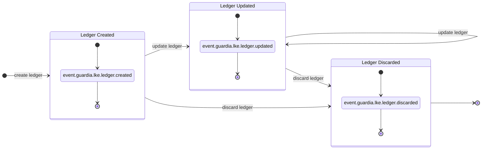
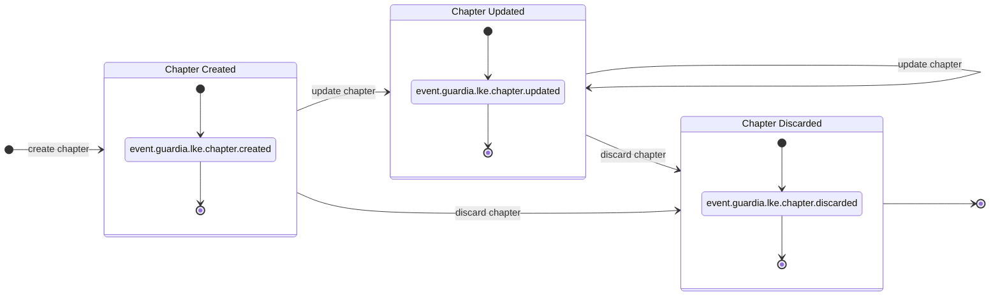
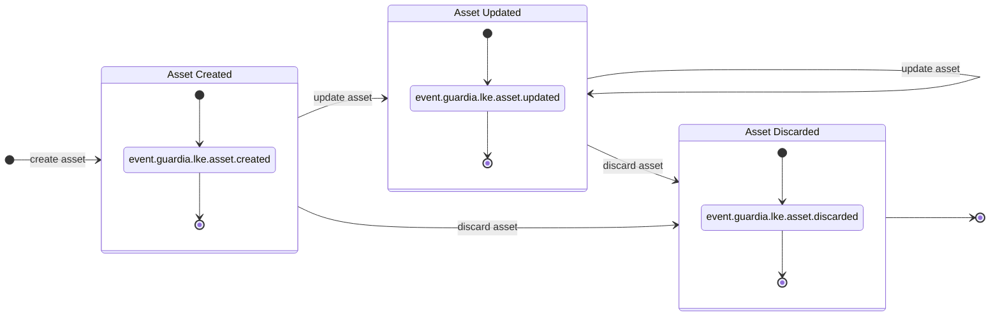
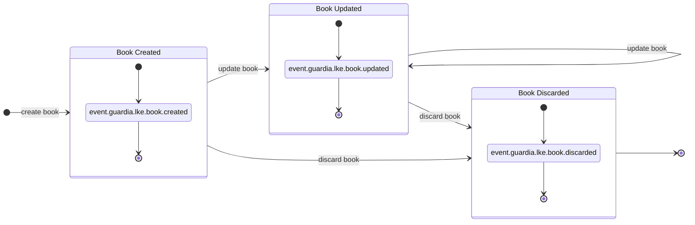
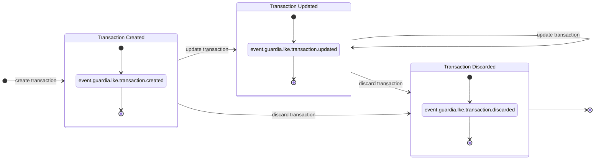

import MermaidDiagram from '@site/src/components/MermaidDiagram';

# Modelo de Domínio

## Entidades

### Ledger

| Atributo | Tipo | Tamanho | Valores | Padrão | Direção | Descrição |
|----------|------|---------|---------|--------|---------|-----------|
| `entity_id` | `UUID v7` | `32` | - | - | Response | Identificador único da entidade, com ordenação temporal. |
| `external_entity_id` | `string` | `até 36 caracteres` | - | - | Request/Response | Identificador externo da entidade para interoperabilidade com outros sistemas. |
| `entity_type` | `string` | - | `LEDGER` | `LEDGER` | Response | Tipo da entidade. |
| `version` | `integer` | `1 byte` | - | `1` | Response | Versão da entidade (incrementada a cada atualização). |
| `name` | `string` | `3 à 128 caracteres` | - | - | Request/Response | Nome do ledger (único dentro da organização e tenant). |
| `description` | `string` | `3 à 256 caracteres` | - | - | Request/Response | Descrição do ledger para uso em relatórios. |
| `created_at` | `datetime` | - | - | - | Response | Data de criação do ledger. |
| `updated_at` | `datetime` | - | - | `created_at` | Response | Data da última atualização do ledger. |
| `discarded_at` | `datetime` | - | - | `null` | Response | Data de descarte. |
| `chapters` | [`Chapter[]`](#chapter) | - | - | - | Response | Relacionamento com CHAPTER. |
| `metadata` | `Json Object` | `4 KB` | - | - | Request/Response | Metadados adicionais para interoperabilidade do ledger com outros sistemas. |

### Chapter

| Atributo | Tipo | Tamanho | Valores | Padrão | Direção | Descrição |
|----------|------|---------|---------|--------|---------|-----------|
| `entity_id` | `UUID v7` | `32` | - | - | Response | Identificador único da entidade, com ordenação temporal. |
| `external_entity_id` | `string` | `até 36 caracteres` | - | - | Request/Response | Identificador externo da entidade para interoperabilidade com outros sistemas. |
| `entity_type` | `string` | `10` | `CHAPTER` | `CHAPTER` | Response | Tipo da entidade. |
| `version` | `integer` | `10` | - | `1` | Response | Versão da entidade (incrementada a cada atualização) |
| `name` | `string` | `3 à 128 caracteres` | - | - | Request/Response | Nome do chapter (único dentro do ledger) |
| `description` | `string` | `3 à 256 caracteres` | - | - | Request/Response | Descrição do chapter para uso em relatórios. |
| `ledger` | [`Ledger`](#ledger) | - | - | - | Response | Relacionamento com o ledger. |
| `created_at` | `datetime` | - | - | - | Response | Data de criação do chapter. |
| `updated_at` | `datetime` | - | - | - | Response | Data da última atualização do chapter. |
| `discarded_at` | `datetime` | - | - | - | Response | Data de descarte do chapter. |
| `books` | [`Book[]`](#book) | - | - | - | Response | Relacionamento com BOOK. |
| `metadata` | `Json Object` | `4 KB` | - | - | Request/Response | Metadados adicionais para interoperabilidade do chapter com outros sistemas. |

### Asset

| Atributo | Tipo | Tamanho | Valores | Padrão | Direção | Descrição |
|----------|------|---------|---------|--------|---------|-----------|
| `entity_id` | `UUID v7` | `32` | - | - | Response | Identificador único da entidade, com ordenação temporal. |
| `external_entity_id` | `string` | `até 36 caracteres` | - | - | Request/Response | Identificador externo da entidade para interoperabilidade com outros sistemas. |
| `entity_type` | `string` | - | `ASSET` | `ASSET` | Response | Tipo da entidade. |
| `version` | `integer` | `1 byte` | - | `1` | Response | Versão da entidade (incrementada a cada atualização). |
| `code` | `string` | `3 à 12 caracteres` | - | - | Request/Response | Código do asset (único dentro do ledger). |
| `number` | `string` | `1 à 128 caracteres` | - | - | Request/Response | Número do asset (único dentro do ledger). |
| `exponent` | `integer` | `1 byte` | `0 à 18` | `0` | Request/Response | Expoente do asset. |
| `is_fiat` | `boolean` | `1 byte` | `true, false` | `false` | Request/Response | Indica se é moeda fiduciária. |
| `locations` | `string[]` | - | - | - | Request/Response | Regiões onde o asset é aceito como moeda de troca em formato [ISO 3166-2](https://en.wikipedia.org/wiki/ISO_3166-2). |
| `ledgers` | [`Ledger[]`](#ledger) | - | - | - | Response | Relacionamento com ledgers. |
| `created_at` | `datetime` | - | - | - | Response | Data de criação do asset. |
| `updated_at` | `datetime` | - | - | - | Response | Data da última atualização do asset. |
| `discarded_at` | `datetime` | - | - | - | Response | Data de descarte do asset. |

### Book

| Atributo | Tipo | Tamanho | Valores | Padrão | Direção | Descrição |
|----------|------|---------|---------|--------|---------|-----------|
| `entity_id` | `UUID v7` | `32` | - | - | Response | Identificador único da entidade, com ordenação temporal. |
| `external_entity_id` | `string` | `até 36 caracteres` | - | - | Request/Response | Identificador externo da entidade para interoperabilidade com outros sistemas. |
| `entity_type` | `string` | - | `BOOK` | `BOOK` | Response | Tipo da entidade. |
| `version` | `integer` | `1 byte` | - | `1` | Response | Versão da entidade (incrementada a cada atualização). |
| `name` | `string` | `3 à 128 caracteres` | - | - | Request/Response | Nome do book (único dentro do ledger). |
| `position` | [`Position`](#position) | - | - | - | Response | Relacionamento com POSITION. |
| `nature` | `string` | - | `CREDITOR, DEBITOR` | - | Request/Response | Natureza do book. |
| `ledger` | [`Ledger`](#ledger) | - | - | - | Response | Relacionamento com o ledger. |
| `chapters` | [`Chapter[]`](#chapter) | - | - | - | Response | Relacionamento com chapters. |
| `entries` | [`Entry[]`](#entry) | - | - | - | Response | Relacionamento com lançamentos. |
| `created_at` | `datetime` | - | - | - | Response | Data de criação. |
| `updated_at` | `datetime` | - | - | - | Response | Data da última atualização. |
| `discarded_at` | `datetime` | - | - | - | Response | Data de descarte. |
| `metadata` | `Json Object` | `4 KB` | - | - | Request/Response | Metadados adicionais para interoperabilidade do book com outros sistemas. |

### Entry

| Atributo | Tipo | Tamanho | Valores | Padrão | Direção | Descrição |
|----------|------|---------|---------|--------|---------|-----------|
| `entity_id` | `UUID v7` | `32` | - | - | Response | Identificador único da entidade, com ordenação temporal. |
| `external_entity_id` | `string` | `até 36 caracteres` | - | - | Request/Response | Identificador externo da entidade para interoperabilidade com outros sistemas. |
| `entity_type` | `string` | - | `ENTRY` | `ENTRY` | Response | Tipo da entidade. |
| `version` | `integer` | `1 byte` | - | `1` | Response | Versão da entidade (incrementada a cada atualização) |
| `reference_date` | `datetime` | - | - | `created_at` | Request/Response | Data de referência (data da transação) |
| `direction` | `string` | - | `CREDIT, DEBIT` | - | Request/Response | Direção da entry. |
| `status` | `string` | - | `PENDING, POSTED, DISCARDED` | `PENDING` | Response | Status da entry. |
| `detail_account` | [`Book`](#book) | - | - | - | Response | Conta detalhada. |
| `previous_position` | [`Position`](#position) | - | - | - | Response | Posição anterior. |
| `resulting_position` | [`Position`](#position) | - | - | - | Response | Posição resultante. |
| `created_at` | `datetime` | - | - | - | Response | Data de criação da entry. |
| `updated_at` | `datetime` | - | - | - | Response | Data da última atualização da entry. |
| `posted_at` | `datetime` | - | - | - | Response | Data de lançamento da entry. |
| `discarded_at` | `datetime` | - | - | - | Response | Data de descarte da entry. |
| `metadata` | `Json Object` | `4 KB` | - | - | Request/Response | Metadados adicionais para interoperabilidade da entry com outros sistemas. |

### Transaction

| Atributo | Tipo | Tamanho | Valores | Padrão | Direção | Descrição |
|----------|------|---------|---------|--------|---------|-----------|
| `entity_id` | `UUID v7` | `32` | - | - | Response | Identificador único da entidade, com ordenação temporal. |
| `external_entity_id` | `string` | `até 36 caracteres` | - | - | Request/Response | Identificador externo da entidade para interoperabilidade com outros sistemas. |
| `entity_type` | `string` | - | `TRANSACTION` | `TRANSACTION` | Response | Tipo da entidade. |
| `version` | `integer` | `1 byte` | - | `1` | Response | Versão da entidade (incrementada a cada atualização). |
| `reference_date` | `datetime` | - | - | `created_at` | Request/Response | Data de referência (data da transação). |
| `ledger` | [`Ledger`](#ledger) | - | - | - | Response | Relacionamento com o ledger. |
| `status` | `string` | - | `PENDING, POSTED, DISCARDED` | `PENDING` | Response | Status da transação. |
| `entries` | [`Entry[]`](#entry) | - | - | - | Request/Response | Relacionamento com lançamentos. |
| `created_at` | `datetime` | - | - | - | Response | Data de criação da transação. |
| `updated_at` | `datetime` | - | - | - | Response | Data da última atualização da transação. |
| `posted_at` | `datetime` | - | - | - | Response | Data de lançamento da transação. |
| `discarded_at` | `datetime` | - | - | - | Response | Data de descarte da transação. |
| `reversed_by` | [`Transaction`](#transaction) | - | - | - | Response | Transação que reverte esta transação. |
| `reverses_to` | [`Transaction`](#transaction) | - | - | - | Response | Transação que é revertida por esta transação. |
| `metadata` | `Json Object` | `4 KB` | - | - | Request/Response | Metadados adicionais para interoperabilidade da transação com outros sistemas. |

### Position

| Atributo | Tipo | Tamanho | Valores | Padrão | Direção | Descrição |
|----------|------|---------|---------|--------|---------|-----------|
| `entity_id` | `UUID v7` | `32` | - | - | Response | Identificador único da entidade, com ordenação temporal. |
| `external_entity_id` | `string` | `até 36 caracteres` | - | - | Request/Response | Identificador externo da entidade para interoperabilidade com outros sistemas. |
| `entity_type` | `string` | - | `POSITION` | `POSITION` | Response | Tipo da entidade. |
| `version` | `integer` | `1 byte` | - | `1` | Response | Versão da entidade (incrementada a cada atualização). |
| `reference_date` | `datetime` | - | - | `created_at` | Request/Response | Data de referência (data da transação). |
| `asset` | [`Asset`](#asset) | - | - | - | Response | Relacionamento com ASSET. |
| `posted` | [`Balance`](#balance) | - | - | - | Response | Posição do saldo lançado. |
| `confirmable` | [`Balance`](#balance) | - | - | - | Response | Posição do saldo confirmável. |
| `provisioned` | [`Balance`](#balance) | - | - | - | Response | Posição do saldo provisionado (lançado e confirmável). |
| `available` | [`Balance`](#balance) | - | - | - | Response | Posição do saldo disponível. |
| `created_at` | `datetime` | - | - | - | Response | Data de criação. |
| `updated_at` | `datetime` | - | - | - | Response | Data de atualização. |
| `discarded_at` | `datetime` | - | - | - | Response | Data de descarte. |

### Balance

| Atributo | Tipo | Tamanho | Valores | Padrão | Direção | Descrição |
|----------|------|---------|---------|--------|---------|-----------|
| `amount` | `integer` | `8 bytes` | - | `0` | Response | Valor atual da posição de saldo. |
| `credits` | `integer` | `8 bytes` | - | `0` | Response | Total de créditos da posição de saldo. |
| `debits` | `integer` | `8 bytes` | - | `0` | Response | Total de débitos da posição de saldo. |

## Eventos

### Eventos de Ledger

| Evento | Tópico | Descrição |
|--------|-----------|-----------|
| `LEDGER_CREATED` | `event.guardia.lke.ledger.created`  | Evento disparado quando um novo ledger é criado |
| `LEDGER_UPDATED` | `event.guardia.lke.ledger.updated` | Evento disparado quando um ledger é atualizado |
| `LEDGER_DISCARDED` | `event.guardia.lke.ledger.discarded` | Evento disparado quando um ledger é descartado |

<MermaidDiagram>

</MermaidDiagram>

---

### Eventos de Chapter

| Evento | Tópico | Descrição |
|--------|-----------|-----------|
| `CHAPTER_CREATED` | `event.guardia.lke.chapter.created`  | Evento disparado quando um novo chapter é criado |
| `CHAPTER_UPDATED` | `event.guardia.lke.chapter.updated` | Evento disparado quando um chapter é atualizado |
| `CHAPTER_DISCARDED` | `event.guardia.lke.chapter.discarded` | Evento disparado quando um chapter é descartado |

<MermaidDiagram>

</MermaidDiagram>

---

### Eventos de Asset

| Evento | Tópico | Descrição |
|--------|-----------|-----------|
| `ASSET_CREATED` | `event.guardia.lke.asset.created`  | Evento disparado quando um novo asset é criado |
| `ASSET_UPDATED` | `event.guardia.lke.asset.updated` | Evento disparado quando um asset é atualizado |
| `ASSET_DISCARDED` | `event.guardia.lke.asset.discarded` | Evento disparado quando um asset é descartado |

<MermaidDiagram>

</MermaidDiagram>

---

### Eventos de Book

| Evento | Tópico | Descrição |
|--------|-----------|-----------|
| `BOOK_CREATED` | `event.guardia.lke.book.created`  | Evento disparado quando um novo book é criado |
| `BOOK_UPDATED` | `event.guardia.lke.book.updated` | Evento disparado quando um book é atualizado |
| `BOOK_DISCARDED` | `event.guardia.lke.book.discarded` | Evento disparado quando um book é descartado |

<MermaidDiagram>

</MermaidDiagram>

---

### Eventos de Entry

| Evento | Tópico | Descrição |
|--------|-----------|-----------|
| `ENTRY_CREATED` | `event.guardia.lke.entry.created`  | Evento disparado quando um novo entry é criado |
| `ENTRY_UPDATED` | `event.guardia.lke.entry.updated` | Evento disparado quando um entry é atualizado |
| `ENTRY_DISCARDED` | `event.guardia.lke.entry.discarded` | Evento disparado quando um entry é descartado |

<MermaidDiagram>

</MermaidDiagram>

---

### Eventos de Transaction

| Evento | Tópico | Descrição |
|--------|-----------|-----------|
| `TRANSACTION_CREATED` | `event.guardia.lke.transaction.created`  | Evento disparado quando uma nova transaction é criada |
| `TRANSACTION_UPDATED` | `event.guardia.lke.transaction.updated` | Evento disparado quando uma transaction é atualizada |
| `TRANSACTION_DISCARDED` | `event.guardia.lke.transaction.discarded` | Evento disparado quando uma transaction é descartada |

<MermaidDiagram>

</MermaidDiagram>

## Referências

- [ISO 3166-2](https://en.wikipedia.org/wiki/ISO_3166-2)
- [std::primitive - Rust](https://doc.rust-lang.org/stable/std/primitive)
- [PostgreSQL - Datatype Numeric](https://www.postgresql.org/docs/current/datatype-numeric.html)
