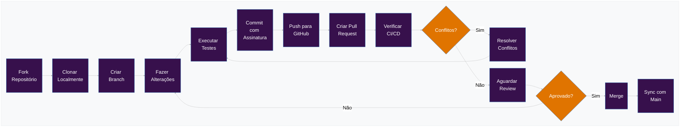

import MermaidDiagram from '@site/src/components/MermaidDiagram';

# Contributing to Guardia

We are pleased to receive contributions from the community to our project. Whether it's code, suggestions, documentation, or testing, all help is welcome — and makes a difference.

This document brings together everything you need to get started: best practices, guidelines, and the workflow we follow to maintain the quality and consistency of what we build together.

If you want to get involved, this is the best place to start.

## Why should you contribute?

* **Impact**: Your work will directly impact and improve a project used by organizations around the world, making their operations smoother and more efficient.
* **Learn and Grow**: Contributing to Guardia offers a unique opportunity to learn from a community of talented developers, enhancing your skills and knowledge in architecture design, CQRS, Ports & Adapters, and more.
* **Community**: Join a welcoming and supportive community of developers who share your passion for creating high-quality open-source software.

## How can you contribute?

* **Code Contributions**: From small fixes to major features, your code contributions are always welcome. Our architecture and minimal dependencies make it easier to understand and improve Guardia.
* **Documentation**: Help us improve our documentation to make Guardia more accessible and understandable for everyone.
* **Feedback and Ideas**: Share your insights, suggestions, and innovative ideas to help us shape Guardia's future.
* **Testing**: Assist in testing new releases or features, providing valuable feedback to ensure stability and usability.

## Workflow

Before contributing, we recommend opening a [discussion](https://github.com/orgs/guardiafinance/discussions/new?category=ideas) describing your proposal. Whenever possible, follow the Golden Circle principle: clearly explain **what** you intend to do, **why** it's relevant, and **how** you plan to execute it — with a focus on objectivity. Leave the code for the coding phase.

**Our recommended workflow is:**

1. Open a discussion with your proposal.
2. If it's accepted, it will be converted into an issue.
3. With the issue open, proceed with implementation and submit your pull request.

<br />

> **IMPORTANT:** All contributors must sign the [Contributor License Agreement (CLA)](./governance/CLA.md), as described in the official document.

<br />

This approach helps align expectations, promotes constructive discussions, and ensures that each contribution is connected to the project's priorities.

We want to maintain a good decision history — that's why even minor changes should be associated with an issue. The only exception is trivial fixes, such as typography adjustments, which can be sent directly as a pull request.

Consider joining our community on [Whatsapp](#) to share ideas, clarify doubts, and follow ongoing discussions.

**With the issue approved, you can proceed with:**

- Fork the repository on GitHub, clone it to your computer.
- Create a branch with your changes.
- Make sure you're working with the latest version of the `main` branch.
- Modify the source code; **Please focus only on the specific change you're contributing**.
- Ensure that local tests pass.
- Commit to your fork using **small and clear** commit messages.
- Send us a pull request, answering any standard questions in the pull request interface.
- Pay attention to any automated CI failures reported in the pull request and stay involved in the conversation.
- After pushing your commits to GitHub, make sure your branch can be automatically merged (no merge conflicts). If not, on your computer, merge the main branch into your branch, resolve any merge conflicts, ensure everything still works correctly and passes all tests, and then push those changes.
- Once the change has been approved and merged, we'll inform you in a comment.

<MermaidDiagram>

</MermaidDiagram>
If you're working in a pair programming flow, also check out the [Pair Programming Workflow with Individual Forks](../tutorials/pair-program-workflow.md) for more information.

## Commit Message Guidelines

### Use "Small Commits"

When contributing to Guardia, we strongly recommend adopting the practice of *Small Commits*. This approach brings various benefits for code development and review, ensuring a more efficient and collaborative process.

#### Benefits of Small Commits

1. **Ease of Review**: Smaller commits are easier to understand and review, reducing the time needed for approval and code integration.
2. **Lower Risk of Errors**: Small commits make it simpler to identify and fix bugs if something goes wrong.
3. **Clear and Organized History**: A granular and well-described commit history facilitates debugging and understanding of code evolution.
4. **Ease in Conflict Resolution**: Smaller changes are less likely to generate complex merge conflicts.
5. **Safe Reversion**: If a problem is identified, small commits allow reverting changes without impacting significant parts of the code.

#### Good Practices

- **One commit per logical change**: Avoid commits that mix multiple unrelated changes.
- **Descriptive commit messages**: Use clear and objective messages that explain the change made.
- **Avoid gigantic commits**: If you notice your commit is too large, break it into smaller parts.
- **Atomic commits**: Each commit should represent a unit of work that can be integrated without depending on future changes.
- **Tests and validations**: Whenever possible, ensure that the code in each commit is functional and doesn't break the application.

### Commit Message Formats

Use the [Conventional Commit](https://www.conventionalcommits.org/en/v1.0.0/) format to ensure our commit history is readable and easy to follow. This format is part of a broader set of guidelines designed to facilitate automatic versioning and changelog generation:

```
<type>[optional scope]: <description>

[optional body]

[optional footer(s)]
```

The commit contains the following structural elements, to communicate intent to consumers of your library:

1. **fix:** a commit of _type_ `fix` fixes a bug in your code (this correlates with [`PATCH`](http://semver.org/#summary) in Semantic Versioning).

2. **feat:** a commit of _type_ `feat` introduces a new feature to the code (this correlates with [`MINOR`](http://semver.org/#summary) in Semantic Versioning).

3. **BREAKING CHANGE:** a commit that has a footer `BREAKING CHANGE:`, or adds a `!` after the type/scope, introduces a breaking API change (correlating with [`MAJOR`](http://semver.org/#summary) in Semantic Versioning).
   A BREAKING CHANGE can be part of commits of any _type_.

4. _types_ other than `fix:` and `feat:` are allowed, for example [@commitlint/config-conventional](https://github.com/conventional-changelog/commitlint/tree/master/%40commitlint/config-conventional) (based on the [Angular convention](https://github.com/angular/angular/blob/22b96b9/CONTRIBUTING.md#-commit-message-guidelines)) recommends `build:`, `chore:`,
   `ci:`, `docs:`, `style:`, `refactor:`, `perf:`, `test:`, and others.

5. _footers_ other than `BREAKING CHANGE: <description>` may be provided and follow a convention similar to
   [git trailer format](https://git-scm.com/docs/git-interpret-trailers).

### Signed Commits

You must sign commits and tags locally to give others confidence about the origin of a change you've made. You must use a GPG key to sign commits and tags.

When a commit or tag contains a GPG signature that can be cryptographically verified, it will be marked as "Verified" when submitting a Pull Request.

| Accepted | Status | Description |
|----------|---------|-------------|
| Yes | Verified | The commit was signed, the signature was successfully verified, and the committer is the only author who enabled vigilant mode. |
| No | Partially verified | The commit was signed and the signature was successfully verified, but the commit has an author who: a) is not the committer and b) enabled vigilant mode. In this case, the commit signature does not guarantee the author's consent. Therefore, the commit is only partially verified. |
| No | Not verified | Any of the following is true: <br /> – The commit was signed, but the signature could not be verified. <br /> – The commit was not signed, and the user who made it enabled vigilant mode. <br /> – The commit was not signed, and an author enabled vigilant mode. |
| No | No verification status | The commit was not signed. |

<br />

>**IMPORTANT:** Only Pull Requests with all commits signed and marked as "Verified" will be accepted. See how to configure Git to automatically sign commits in [Signing commits](../tutorials/signing-commits.md).

## Languages

We are committed to maintaining our communications in Portuguese, English, and Spanish. However, we accept that issues can be posted in any language. Nevertheless, we choose to maintain our official communication in English for several reasons:

- Brazilian Portuguese is a very rich language - and we take pride in that - but it's also a very complex language, which makes it difficult for the community to understand issues and pull requests.
- English is already part of Software Engineering culture, and it's a simpler and easier language to understand, which facilitates the community's understanding of issues and pull requests.

### Commits

The main commit message should be written in English. If you feel the need to describe in your local language, you can use it by including the `[language]` tag in the commit description. Currently, with the help of tools like [DeepL](https://www.deepl.com/) and [Google Translate](https://translate.google.com/), anyone can have their text translated to English or other languages. However, having the original text _along with_ the translation can help mitigate translation errors.

You can open issues and pull requests in any language. If the issue or pull request is posted in a language other than English, we encourage you to include an English copy in the body of the issue or pull request or as a response containing the `[en]` tag.

> **IMPORTANT:** **Please note** that using any language with the intent to bypass the [Code of Conduct](#) will result in immediate — and possibly indefinite — removal from the project.

**Example:**

```
feat(auth): implement OAuth2 authentication

[en]
Implement OAuth2 authentication flow with support for multiple providers:
- Add OAuth2 client configuration
- Create authentication handlers for Google and GitHub
- Implement token validation and refresh logic
- Add unit tests for auth flow

[es]
Implementa flujo de autenticación OAuth2 con soporte para múltiples proveedores:
- Añade configuración del cliente OAuth2
- Crea handlers de autenticación para Google y GitHub
- Implementa lógica de validación y refresh de tokens
- Añade pruebas unitarias para el flujo de auth

Closes #123
```

## Code of Conduct

This project adopts the [Code of Conduct](#) to ensure that the community is welcoming and respectful to all participants.

## License

Guardia adopts the **Open Core** business model, which combines the best of open source with business sustainability. This approach allows the project to evolve with community support, while enabling the offering of additional resources and services for companies that want to scale with security and efficiency.

Guardia adopts the Open Core business model, which combines the best of open source with business sustainability. This approach allows the project to grow with community support, while offering advanced resources for companies that need scale, support, and governance.

For this, the Core Modules are developed and distributed under the [Apache 2.0](#) license, allowing freedom of use, modification, and distribution with legal security and commercial compatibility.

You can better understand how the [project licensing](#) works.

## Developer Guide

Consult the [Developer Guide](#) for more information about the project — including specifications, contribution guidelines, architecture, adopted patterns, and other relevant technical details.
