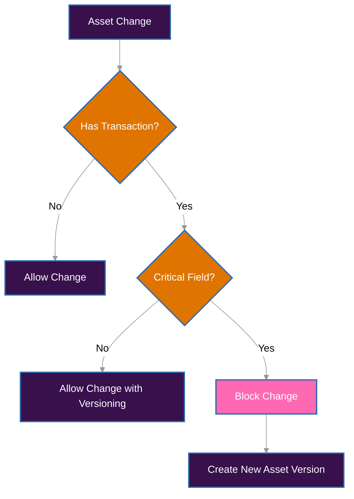

# Asset Updates

Managing Assets in an accounting system requires a balance between operational flexibility and historical integrity. This document defines the rules applicable to Asset updates, considering accounting requirements (IAS/IFRS), technical impacts, and regulatory traceability.

## Updates and Accounting Integrity

In the Guardia context, an Asset represents a monetary or non-monetary unit used in accounting entries within a Ledger. For this reason, some of its properties assume a structural role in the meaning of recorded entries. Changing them after use would compromise the system's reliability. Updates are therefore classified as:

- **Critical fields (immutable after use)**
- **Non-critical fields (editable with historical control)**

---

## Critical Fields

These are fields whose alteration can distort accounting values, misalign reports, and break integrations:

- `code`: Asset code (e.g., "USD", "BTC")
- `number`: Reference number (e.g., "840" for USD according to ISO 4217)
- `exponent`: Defines decimal scale (e.g., 2 for cents)
- `is_fiat`: Defines whether it is fiat or not

### Rule
After any use of the Asset in committed transactions, these fields become immutable.

#### Expected Behavior
- **HTTP Status**: `422 Unprocessable Entity`
- **Error Code**: `ERR422_BUSINESS_ERROR`
- **Reason**: `ASSET_HAS_TRANSACTIONS`

**Blocking Example**
```json
PATCH /v1/assets/{entity_id}
{
  "exponent": 6
}
```

#### How to Handle Legitimate Changes
If there is a need to change a critical field:
1. Create a new Asset with a new `entity_id`
2. Mark the old version as `deprecated`
3. Use the new asset in future entries

---

## Non-Critical Fields

These are fields that do not directly affect the integrity of posted values but may influence analytical interpretations or business rules:

- `metadata`: Additional information
- `locations`: List of countries where the Asset is accepted

### Rule
These fields can be updated even after use in transactions.

#### Additional Control
- Every change is recorded in the entity's history (`ASSET_HISTORY`)
- May trigger revalidations in pipelines that depend on this data

**Allowed Example**
```json
PATCH /v1/assets/{entity_id}
{
  "metadata": {
    "category": "reserves",
    "risk_level": "low"
  }
}
```

---

## Ledger Association

The relationship between Assets and Ledgers is also controlled to maintain accounting traceability.

### Permissions

- **Add new ledgers**: allowed at any time
- **Remove ledgers**: prohibited if there are associated transactions

**Invalid Attempt Behavior**
- **HTTP Status**: `422 Unprocessable Entity`
- **Error Code**: `ERR422_BUSINESS_ERROR`
- **Reason**: `LEDGER_HAS_TRANSACTIONS`

**Restriction Example**
```json
PATCH /v1/assets/{entity_id}
{
  "ledgers": ["ledger-2"]  // Removal blocked if ledger-1 has transactions
}
```

## Asset Disposal (`discard`)

Disposing of an Asset means making it inactive for new entries. This action should not delete or modify historical data but prevent future use.

### Expected Behavior

* **Can be disposed**: if the asset **has not been used** in transactions.
* **Cannot be disposed**: if the asset **is already associated** with any transaction.

#### Restrictions

* **HTTP Status**: `422 Unprocessable Entity`
* **Error Code**: `ERR422_BUSINESS_ERROR`
* **Reason**: `ASSET_HAS_TRANSACTIONS`

#### Justification

Attempting to dispose of an already used asset would compromise accounting traceability and the temporal history of entries. Additionally, in compliance with **IAS 10** and **IAS 1** principles, assets used in past statements must remain accessible and auditable.

#### Invalid Attempt Example

```json
DELETE /v1/assets/{entity_id}
// Result: 422 Unprocessable Entity
// Error: ASSET_HAS_TRANSACTIONS
```

## Implementation Strategy

To ensure the system remains auditable and intact:

- **Structural Immutability**: every attempt to change sensitive fields verifies usage history, that is, if the asset has already been used in transactions.
- **Audit Trail**: each change is recorded with timestamp, author, and previous values
- **Versioning**: critical changes must be treated as new entities, generating a new `entity_id` and maintaining reference to the previous version.
- **Temporal Reference**: reports and analyses use the Asset in effect at the time of each entry

## Compliance with Accounting Standards

The implemented model follows IAS/IFRS guidelines:

- **IAS 1 – Presentation of Financial Statements**: requires consistency and faithful representation of information
- **IAS 8 – Accounting Policies, Changes in Accounting Estimates and Errors**: treats changes in accounting criteria as structural changes, requiring a new version and not retroactive changes

Allowing changes to fields such as `exponent`, `code`, or `number` would compromise financial reports, regulatory reconciliations, and audit confidence. The applied versioning model avoids these risks and ensures legal, technical, and fiscal traceability.

## Decision Flow



## Practical Examples

### Change code (critical field)
```json
PATCH /v1/assets/{entity_id}
{
  "code": "USDT"
}
// Result: 422 Unprocessable Entity if there are transactions
```

#### Update metadata (non-critical field)
```json
PATCH /v1/assets/{entity_id}
{
  "metadata": {
    "category": "stablecoin"
  }
}
// Result: 200 OK, change recorded in history
```

#### Add new ledger
```json
PATCH /v1/assets/{entity_id}
{
  "ledgers": ["ledger-a", "ledger-b"]
}
// Result: 200 OK
```

#### Remove ledger with transactions
```json
PATCH /v1/assets/{entity_id}
{
  "ledgers": ["ledger-b"]
}
// Result: 422 Unprocessable Entity if "ledger-a" has transactions
```

## References

- [IAS 1 – Presentation of Financial Statements](https://www.ifrs.org/content/dam/ifrs/publications/pdf-standards/english/2024/issued/part-a/ias-1-presentation-of-financial-statements.pdf?bypass=on)
- [IAS 8 – Accounting Policies, Changes in Accounting Estimates and Errors](https://www.ifrs.org/content/dam/ifrs/publications/pdf-standards/english/2024/issued/part-a/ias-8-accounting-policies-changes-in-accounting-estimates-and-errors.pdf?bypass=on)