import MermaidDiagram from '@site/src/components/MermaidDiagram';

# Class Diagram

This class diagram illustrates the Aggregates, Entities, Value Objects, and their relationships in the Bounded Context of the Ledger Kernel Engine (LKe).

```mermaid
classDiagram

%%{init: {'theme': 'neutral'}}%%
classDef default fill:#e9ecef,stroke:#dee2e6,stroke-width:2px,color:#212529;
classDef special fill:#f8f9fa,stroke:#dee2e6,stroke-width:2px,color:#212529;

    class Ledger {
        +String<uuid> entity_id PK "Field controlled by the application. UUID v7, with temporal ordering."
        +String<uuid> external_entity_id "Unique identifier for interoperability with other systems. Maximum length: 36 characters."
        +String entity_type = "LEDGER"
        +Integer version = 0 "Field controlled by the application. MUST be incremented by 1 each time the entity is changed."
        +String name "Unique within the organization and tenant. Maximum length: 128 characters."
        +String description "Description for reporting purposes. Maximum length: 256 characters."
        +DateTime created_at "Date of insertion into the database."
        +DateTime updated_at "Date of last update in the database. Default: created_at."
        +DateTime discarded_at "Date of deletion in the database. MUST implement soft delete standard."
        +HashMap<String, String> metadata "Additional metadata for interoperability with other systems. Maximum size: 4KB."
        +Chapter[] Chapters "Relationship with CHAPTER."
        Ledger[] LedgersHistory "Ledger event history."
    }

    class Chapter {
        +String<uuid> entity_id PK "Field controlled by the application. UUID v7, with temporal ordering."
        +String<uuid> external_entity_id "Unique identifier for interoperability with other systems. Maximum length: 36 characters."
        +String entity_type = "CHAPTER"
        +Integer version = 0 "Field controlled by the application. MUST be incremented by 1 each time the entity is changed."
        +String name "Unique within the ledger. Maximum length: 128 characters."
        +Ledger ledger "Relationship with LEDGER."
        +String description "Description for reporting purposes. Maximum length: 256 characters."
        +DateTime created_at "Date of insertion into the database."
        +DateTime updated_at "Date of last update in the database."
        +DateTime discarded_at "Date of deletion in the database. MUST implement soft delete standard."
        +Book[] books "Relationship with BOOK."
        +HashMap<String, String> metadata "Additional metadata for interoperability with other systems. Maximum size: 4KB."
        Chapter[] ChaptersHistory "Chapter event history."
    }

    class Position {
        +String<uuid> entity_id PK "Field controlled by the application. UUID v7, with temporal ordering."
        +String<uuid> external_entity_id "Unique identifier for interoperability with other systems. Maximum length: 36 characters."
        +String entity_type = "POSITION"
        +Integer version = 0 "Field controlled by the application. MUST be incremented by 1 each time the entity is changed."
        +DateTime reference_date "Transaction date. If not provided, it will be the date of insertion into the database."
        +Balance posted "Posted balance position."
        +Balance confirmable "Balance position to be confirmed."
        +Balance provisioned "Provisioned balance position (posted and to be confirmed)."
        +Balance available "Available balance position."
        +DateTime created_at "Date of insertion into the database."
        +DateTime updated_at "Date of last update in the database."
        +DateTime discarded_at "Date of deletion in the database. MUST implement soft delete standard."
        +Asset Asset "Relationship with ASSET."
        Position[] PositionsHistory "Position event history."
    }

    class Balance {
        +Integer amount "Balance position value. 8-byte integer."
        +Integer credits "Total credits of the balance position. 8-byte integer."
        +Integer debits "Total debits of the balance position. 8-byte integer."
    }

    class Asset {
        +String<uuid> entity_id PK "Field controlled by the application. UUID v7, with temporal ordering."
        +String<uuid> external_entity_id "Unique identifier for interoperability with other systems. Maximum length: 36 characters."
        +String entity_type = "ASSET"
        +Integer version = 0 "Field controlled by the application. MUST be incremented by 1 each time the entity is changed."
        +String<3,12> code "Unique within the ledger. Maximum length: 12 characters."
        +String number "Unique within the ledger. Maximum length: 128 characters."
        +int exponent "Asset exponent. MUST be between 0 and 18."
        +boolean is_fiat "Indicates if the asset is a fiat currency."
        +String[] locations "Regions where the asset is accepted as currency. MUST be an array of ISO 3166-2 codes."
        +DateTime created_at "Date of insertion into the database."
        +DateTime updated_at "Date of last update in the database."
        +DateTime discarded_at "Date of deletion in the database. MUST implement soft delete standard."
        +Asset[] AssetsHistory "Asset event history."
    }

    class Book {
        +String<uuid> entity_id PK "Field controlled by the application. UUID v7, with temporal ordering."
        +String<uuid> external_entity_id "Unique identifier for interoperability with other systems. Maximum length: 36 characters."
        +String entity_type = "BOOK"
        +Integer version = 0 "Field controlled by the application. MUST be incremented by 1 each time the entity is changed."
        +String<3,128> name "Unique within the ledger. Maximum length: 128 characters."
        +Position position "Relationship with POSITION."
        +Nature nature "Book nature. MUST be CREDITOR or DEBITOR."
        +Ledger ledger "Relationship with LEDGER."
        +Chapter[] chapters "Relationship with CHAPTER."
        +Entry[] entries "Relationship with ENTRY."
        +DateTime created_at "Date of insertion into the database."
        +DateTime updated_at "Date of last update in the database."
        +DateTime discarded_at "Date of deletion in the database. MUST implement soft delete standard."
        +HashMap<String, String> metadata "Additional metadata for interoperability with other systems. Maximum size: 4KB."
        +Book[] BooksHistory "Book event history."
    }

    class Nature {
        <<Enumeration>>
        CREDITOR,
        DEBITOR
    }

    class Entry {
        +String<uuid> entity_id PK "Field controlled by the application. UUID v7, with temporal ordering."
        +String<uuid> external_entity_id "Unique identifier for interoperability with other systems. Maximum length: 36 characters."
        +String entity_type = "ENTRY"
        +Integer version = 0 "Field controlled by the application. MUST be incremented by 1 each time the entity is changed."
        +DateTime reference_date "Transaction date. If not provided, it will be the date of insertion into the database."
        +Direction direction "Entry direction. MUST be CREDIT or DEBIT."
        +Status status "Entry status. MUST be PENDING, POSTED, or DISCARDED."
        +Book detail_account "Relationship with BOOK."
        +Position previous_position "Relationship with POSITION."
        +Position resulting_position "Relationship with POSITION."
        +DateTime created_at "Date of insertion into the database."
        +DateTime updated_at "Date of last update in the database."
        +DateTime posted_at "Date of posting in the ledger."
        +DateTime discarded_at "Date of deletion in the ledger. MUST implement soft delete standard."
        +HashMap<String, String> metadata "Additional metadata for interoperability with other systems. Maximum size: 4KB."
        +Entry[] EntriesHistory "Entry event history."
    }

    class Transaction {
        +String<uuid> entity_id PK "Field controlled by the application. UUID v7, with temporal ordering."
        +String<uuid> external_entity_id "Unique identifier for interoperability with other systems. Maximum length: 36 characters."
        +String entity_type = "TRANSACTION"
        +Integer version = 0 "Field controlled by the application. MUST be incremented by 1 each time the entity is changed."
        +DateTime reference_date "Transaction date. If not provided, it will be the date of insertion into the database."
        +Ledger ledger "Relationship with LEDGER."
        +Status status "Transaction status. MUST be PENDING, POSTED, or DISCARDED."
        +Entry[] entries "Relationship with ENTRY."
        +DateTime created_at "Date of insertion into the database."
        +DateTime updated_at "Date of last update in the database."
        +DateTime posted_at "Date of posting in the ledger."
        +DateTime discarded_at "Date of deletion in the ledger. MUST implement soft delete standard."
        +Transaction reversed_by "Relationship with Transaction that reverses this transaction."
        +Transaction reverses_to "Relationship with Transaction that is reversed by this transaction."
        +HashMap<String, String> metadata "Additional metadata for interoperability with other systems. Maximum size: 4KB."
        +Transaction[] TransactionsHistory "Transaction event history."
    }

    class Direction {
        <<Enumeration>>
        CREDIT,
        DEBIT
    }

    class Status {
        <<Enumeration>>
        PENDING,
        POSTED,
        DISCARDED
    }

    Position --* Balance : contains
    Position --* Asset : contains

    Book --* Nature: contains
    Book --> Entry: has none or multiple
    Book --> Chapter: has none or multiple
    Book --> Ledger: has one
    Ledger --> Chapter: has one or multiple

    Entry --* Direction: has
    Entry --* Book: reference
    Entry o-- Transaction: has multiple

    Entry --> Position: reference
    Book --* Position : contains

    Transaction --* Status: contains
    Entry --* Status: contains

    Transaction .. Transaction: reference
```

<MermaidDiagram>

</MermaidDiagram>
