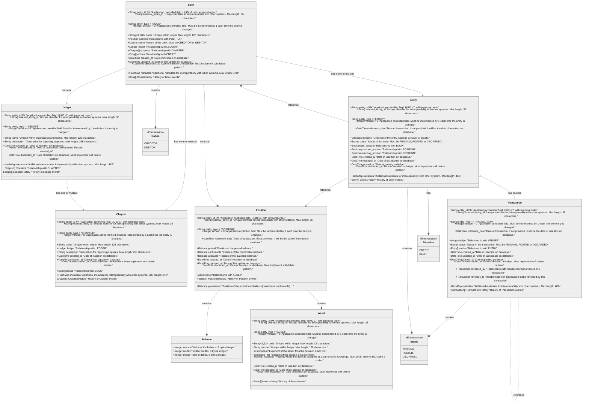

import MermaidDiagram from '@site/src/components/MermaidDiagram';

# Class Diagram

<MermaidDiagram>

```mermaid
classDiagram

%%{init: {'theme': 'neutral'}}%%
classDef default fill:#e9ecef,stroke:#dee2e6,stroke-width:2px,color:#212529;
classDef special fill:#f8f9fa,stroke:#dee2e6,stroke-width:2px,color:#212529;

    class Ledger {
        +String<uuid> entity_id PK "Application controlled field. UUID v7, with temporal order."
        +String<uuid> external_entity_id "Unique identifier for interoperability with other systems. Max length: 36 characters."
        +String entity_type = "LEDGER"
        +Integer version = 0 "Application controlled field. Must be incremented by 1 each time the entity is changed."
        +String name "Unique within organization and tenant. Max length: 128 characters."
        +String description "Description for reporting purposes. Max length: 256 characters."
        +DateTime created_at "Date of insertion on database."
        +DateTime updated_at "Date of last update on database. Default: created_at"
        +DateTime discarded_at "Date of deletion on database. Must implement soft delete pattern."
        +HashMap<String, String> metadata "Additional metadata for interoperability with other systems. Max length: 4KB"
        +Chapter[] Chapters "Relationship with CHAPTER"
        Ledger[] LedgersHistory "History of Ledger events"
    }

    class Chapter {
        +String<uuid> entity_id PK "Application controlled field. UUID v7, with temporal order."
        +String<uuid> external_entity_id "Unique identifier for interoperability with other systems. Max length: 36 characters."
        +String entity_type = "CHAPTER"
        +Integer version = 0 "Application controlled field. Must be incremented by 1 each time the entity is changed."
        +String name "Unique within ledger. Max length: 128 characters."
        +Ledger ledger "Relationship with LEDGER"
        +String description "Description for reporting purposes. Max length: 256 characters."
        +DateTime created_at "Date of insertion on database."
        +DateTime updated_at "Date of last update on database."
        +DateTime discarded_at "Date of deletion on database. Must implement soft delete pattern."
        +Book[] books "Relationship with BOOK"
        +HashMap<String, String> metadata "Additional metadata for interoperability with other systems. Max length: 4KB"
        Chapter[] ChaptersHistory "History of Chapter events"
    }

    class Position {
        +String<uuid> entity_id PK "Application controlled field. UUID v7, with temporal order."
        +String<uuid> external_entity_id "Unique identifier for interoperability with other systems. Max length: 36 characters."
        +String entity_type = "POSITION"
        +Integer version = 0 "Application controlled field. Must be incremented by 1 each time the entity is changed."
        +DateTime reference_date "Date of transaction. If not provided, it will be the date of insertion on database."
        +Balance posted "Position of the posted balance."
        +Balance confirmable "Position of the confirmable balance."
        +Balance provisioned "Position of the provisioned balance (posted and confirmable)."
        +Balance available "Position of the available balance."
        +DateTime created_at "Date of insertion on database."
        +DateTime updated_at "Date of last update on database."
        +DateTime discarded_at "Date of deletion on database. Must implement soft delete pattern."
        +Asset Asset "Relationship with ASSET"
        Position[] PositionsHistory "History of Position events"
    }

    class Balance {
        +Integer amount "Value of the balance. 8 bytes integer."
        +Integer credits "Total of credits. 8 bytes integer."
        +Integer debits "Total of debits. 8 bytes integer."
    }

    class Asset {
        +String<uuid> entity_id PK "Application controlled field. UUID v7, with temporal order."
        +String<uuid> external_entity_id "Unique identifier for interoperability with other systems. Max length: 36 characters."
        +String entity_type = "ASSET"
        +Integer version = 0 "Application controlled field. Must be incremented by 1 each time the entity is changed."
        +String<3,12> code "Unique within ledger. Max length: 12 characters."
        +String number "Unique within ledger. Max length: 128 characters."
        +int exponent "Exponent of the asset. Must be between 0 and 18."
        +boolean is_fiat "Indicates if the asset is a fiat currency."
        +String[] locations "Regions where the asset is accepted as a currency for exchange. Must be an array of ISO 3166-2 codes."
        +DateTime created_at "Date of insertion on database."
        +DateTime updated_at "Date of last update on database."
        +DateTime discarded_at "Date of deletion on database. Must implement soft delete pattern."
        +Asset[] AssetsHistory "History of Asset events"
    }

    class Book {
        +String<uuid> entity_id PK "Application controlled field. UUID v7, with temporal order."
        +String<uuid> external_entity_id "Unique identifier for interoperability with other systems. Max length: 36 characters."
        +String entity_type = "BOOK"
        +Integer version = 0 "Application controlled field. Must be incremented by 1 each time the entity is changed."
        +String<3,128> name "Unique within ledger. Max length: 128 characters."
        +Position position "Relationship with POSITION"
        +Nature nature "Nature of the book. Must be CREDITOR or DEBITOR."
        +Ledger ledger "Relationship with LEDGER"
        +Chapter[] chapters "Relationship with CHAPTER"
        +Entry[] entries "Relationship with ENTRY"
        +DateTime created_at "Date of insertion on database."
        +DateTime updated_at "Date of last update on database."
        +DateTime discarded_at "Date of deletion on database. Must implement soft delete pattern."
        +HashMap<String, String> metadata "Additional metadata for interoperability with other systems. Max length: 4KB"
        +Book[] BooksHistory "History of Book events"
    }

    class Nature {
        <<Enumeration>>
        CREDITOR,
        DEBITOR
    }

    class Entry {
        +String<uuid> entity_id PK "Application controlled field. UUID v7, with temporal order."
        +String<uuid> external_entity_id "Unique identifier for interoperability with other systems. Max length: 36 characters."
        +String entity_type = "ENTRY"
        +Integer version = 0 "Application controlled field. Must be incremented by 1 each time the entity is changed."
        +DateTime reference_date "Date of transaction. If not provided, it will be the date of insertion on database."
        +Direction direction "Direction of the entry. Must be CREDIT or DEBIT."
        +Status status "Status of the entry. Must be PENDING, POSTED or DISCARDED."
        +Book detail_account "Relationship with BOOK"
        +Position previous_position "Relationship with POSITION"
        +Position resulting_position "Relationship with POSITION"
        +DateTime created_at "Date of insertion on database."
        +DateTime updated_at "Date of last update on database."
        +DateTime posted_at "Date of posting on ledger."
        +DateTime discarded_at "Date of deletion on ledger. Must implement soft delete pattern."
        +HashMap<String, String> metadata "Additional metadata for interoperability with other systems. Max length: 4KB"
        +Entry[] EntriesHistory "History of Entry events"
    }

    class Transaction {
        +String<uuid> entity_id PK "Application controlled field. UUID v7, with temporal order."
        +String<uuid> external_entity_id "Unique identifier for interoperability with other systems. Max length: 36 characters."
        +String entity_type = "TRANSACTION"
        +Integer version = 0 "Application controlled field. Must be incremented by 1 each time the entity is changed."
        +DateTime reference_date "Date of transaction. If not provided, it will be the date of insertion on database."
        +Ledger ledger "Relationship with LEDGER"
        +Status status "Status of the transaction. Must be PENDING, POSTED or DISCARDED."
        +Entry[] entries "Relationship with ENTRY"
        +DateTime created_at "Date of insertion on database."
        +DateTime updated_at "Date of last update on database."
        +DateTime posted_at "Date of posting on ledger."
        +DateTime discarded_at "Date of deletion on ledger. Must implement soft delete pattern."
        +Transaction reversed_by "Relationship with Transaction that reverses this transaction"
        +Transaction reverses_to "Relationship with Transaction that is reversed by this transaction"
        +HashMap<String, String> metadata "Additional metadata for interoperability with other systems. Max length: 4KB"
        +Transaction[] TransactionsHistory "History of Transaction events"
    }

    class Direction {
        <<Enumeration>>
        CREDIT,
        DEBIT
    }

    class Status {
        <<Enumeration>>
        PENDING,
        POSTED,
        DISCARDED
    }

    Position --* Balance : contains
    Position --* Asset : contains

    Book --* Nature: contains
    Book --> Entry: has none or multiple
    Book --> Chapter: has none or multiple
    Book --> Ledger: has one
    Ledger --> Chapter: has one or multiple

    Entry --* Direction: has
    Entry --* Book: reference
    Entry o-- Transaction: has multiple

    Entry --> Position: reference
    Book --* Position : contains

    Transaction --* Status: contains
    Entry --* Status: contains

    Transaction .. Transaction: reference
```
</MermaidDiagram>
