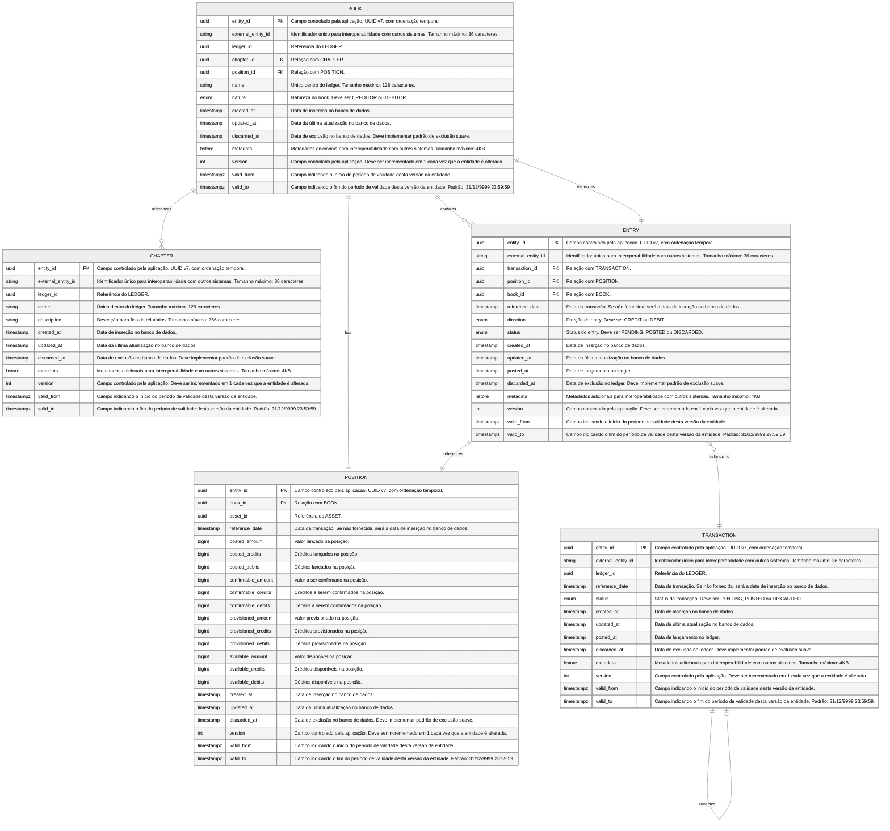

import MermaidDiagram from '@site/src/components/MermaidDiagram';

# Entities and Relationships

## Control Schema

The control schema is the schema that contains the references of all other schemas.

```mermaid
erDiagram
    %%{init: {'theme': 'neutral'}}%%

    LEDGER ||--o{ LEDGER_HISTORY : tracks

    LEDGER {
        uuid entity_id PK "Field controlled by the application. UUID v7, with temporal ordering."
        string external_entity_id "Unique identifier for interoperability with other systems. Maximum length: 36 characters."
        string name "Unique within the organization and tenant. Maximum length: 128 characters."
        string description "Description for reporting purposes. Maximum length: 256 characters."
        timestamp created_at "Date of insertion into the database."
        timestamp updated_at "Date of last update in the database."
        timestamp discarded_at "Date of deletion in the database. MUST implement soft delete standard."
        hstore metadata "Additional metadata for interoperability with other systems. Maximum size: 4KB."
        int version "Field controlled by the application. MUST be incremented by 1 each time the entity is changed."
        timestampz valid_from "Field indicating the start of the validity period of this entity version."
        timestampz valid_to "Field indicating the end of the validity period of this entity version. Default: 12/31/9999 23:59:59."
    }

    LEDGER_HISTORY {
        uuid entity_id PK "Campo controlado pela aplicação. UUID v7, com ordenação temporal."
        string external_entity_id "Identificador único para interoperabilidade com outros sistemas. Tamanho máximo: 36 caracteres."
        string name "Único dentro da organização e tenant. Tamanho máximo: 128 caracteres."
        string description "Descrição para fins de relatórios. Tamanho máximo: 256 caracteres."
        timestamp created_at "Data de inserção no banco de dados."
        timestamp updated_at "Data da última atualização no banco de dados."
        timestamp discarded_at "Data de exclusão no banco de dados. Deve implementar padrão de exclusão suave."
        hstore metadata "Metadados adicionais para interoperabilidade com outros sistemas. Tamanho máximo: 4KB"
        int version "Campo controlado pela aplicação. Deve ser incrementado em 1 cada vez que a entidade é alterada."
        timestampz valid_from "Campo indicando o início do período de validade desta versão da entidade."
        timestampz valid_to "Campo indicando o fim do período de validade desta versão da entidade."
    }

    ASSET ||--o{ ASSET_HISTORY : tracks
    ASSET {
        uuid entity_id PK "Campo controlado pela aplicação. UUID v7, com ordenação temporal."
        string external_entity_id "Identificador único para interoperabilidade com outros sistemas. Tamanho máximo: 36 caracteres."
        boolean is_fiat "Indica se o asset é uma moeda fiduciária."
        array locations "Regiões onde o asset é aceito como moeda de troca. Deve ser um array de códigos ISO 3166-2."
        timestamp created_at "Data de inserção no banco de dados."
        timestamp updated_at "Data da última atualização no banco de dados."
        timestamp discarded_at "Data de exclusão no banco de dados. Deve implementar padrão de exclusão suave."
        int version "Campo controlado pela aplicação. Deve ser incrementado em 1 cada vez que a entidade é alterada."
        timestampz valid_from "Campo indicando o início do período de validade desta versão da entidade."
        timestampz valid_to "Campo indicando o fim do período de validade desta versão da entidade. Padrão: 31/12/9999 23:59:59."
    }

    ASSET_HISTORY {
        uuid entity_id PK "Campo controlado pela aplicação. UUID v7, com ordenação temporal."
        string external_entity_id "Identificador único para interoperabilidade com outros sistemas. Tamanho máximo: 36 caracteres."
        uuid ledger_id "Referência do LEDGER."
        boolean is_fiat "Indica se o asset é uma moeda fiduciária."
        array locations "Regiões onde o asset é aceito como moeda de troca. Deve ser um array de códigos ISO 3166-2."
        timestamp created_at "Data de inserção no banco de dados."
        timestamp updated_at "Data da última atualização no banco de dados."
        timestamp discarded_at "Data de exclusão no banco de dados. Deve implementar padrão de exclusão suave."
        int version "Campo controlado pela aplicação. Deve ser incrementado em 1 cada vez que a entidade é alterada."
        timestampz valid_from "Campo indicando o início do período de validade desta versão da entidade."
        timestampz valid_to "Campo indicando o fim do período de validade desta versão da entidade."
    }

    LEDGER ||--o{ LEDGER_ASSET : has
    ASSET ||--o{ LEDGER_ASSET : has
    LEDGER_ASSET ||--o{ LEDGER_ASSET_HISTORY : tracks
    LEDGER_ASSET {
        uuid ledger_id FK "Referência do LEDGER."
        uuid asset_id FK "Relação com ASSET."
        string code "Único dentro do ledger. Tamanho máximo: 12 caracteres."
        string number "Único dentro do ledger. Tamanho máximo: 128 caracteres."
        int exponent "Expoente do asset. Deve estar entre 0 e 18."
        timestamp created_at "Data de inserção no banco de dados."
        timestamp updated_at "Data da última atualização no banco de dados."
        timestampz valid_from "Campo indicando o início do período de validade desta versão da entidade."
        timestampz valid_to "Campo indicando o fim do período de validade desta versão da entidade."
    }

    LEDGER_ASSET_HISTORY {
        uuid ledger_id FK "Referência do LEDGER."
        uuid asset_id FK "Relação com ASSET."
        string code "Único dentro do ledger. Tamanho máximo: 12 caracteres."
        string number "Único dentro do ledger. Tamanho máximo: 128 caracteres."
        int exponent "Expoente do asset. Deve estar entre 0 e 18."
        timestamp created_at "Data de inserção no banco de dados."
        timestamp updated_at "Data da última atualização no banco de dados."
        timestampz valid_from "Campo indicando o início do período de validade desta versão da entidade."
        timestampz valid_to "Campo indicando o fim do período de validade desta versão da entidade."
    }

```

<MermaidDiagram>

</MermaidDiagram>

## Schema General

El esquema general es el esquema del ledger central usado en el sistema de partidas triplas. En este esquema se registran, formato de partida triple, el registro temporal de las transacciones, entradas y posiciones.

<MermaidDiagram>

</MermaidDiagram>

## Schema Transactional

Cada ledger esta asociado a un schema transactional. Además del registro temporal de cada entidad, el schema transactional registra el historial de cada entidad.

```mermaid
erDiagram
    %%{init: {'theme': 'neutral'}}%%

    CHAPTER ||--o{ CHAPTER_HISTORY : tracks
    CHAPTER {
        uuid entity_id PK "Campo controlado pela aplicação. UUID v7, com ordenação temporal."
        string external_entity_id "Identificador único para interoperabilidade com outros sistemas. Tamanho máximo: 36 caracteres."
        uuid ledger_id "Referência do LEDGER."
        string name "Único dentro do ledger. Tamanho máximo: 128 caracteres."
        string description "Descrição para fins de relatórios. Tamanho máximo: 256 caracteres."
        timestamp created_at "Data de inserção no banco de dados."
        timestamp updated_at "Data da última atualização no banco de dados."
        timestamp discarded_at "Data de exclusão no banco de dados. Deve implementar padrão de exclusão suave."
        hstore metadata "Metadados adicionais para interoperabilidade com outros sistemas. Tamanho máximo: 4KB"
        int version "Campo controlado pela aplicação. Deve ser incrementado em 1 cada vez que a entidade é alterada."
        timestampz valid_from "Campo indicando o início do período de validade desta versão da entidade."
        timestampz valid_to "Campo indicando o fim do período de validade desta versão da entidade. Padrão: 31/12/9999 23:59:59."
    }

    CHAPTER_HISTORY {
        uuid entity_id PK "Campo controlado pela aplicação. UUID v7, com ordenação temporal."
        string external_entity_id "Identificador único para interoperabilidade com outros sistemas. Tamanho máximo: 36 caracteres."
        uuid ledger_id "Referência do LEDGER."
        string name "Único dentro do ledger. Tamanho máximo: 128 caracteres."
        string description "Descrição para fins de relatórios. Tamanho máximo: 256 caracteres."
        timestamp created_at "Data de inserção no banco de dados."
        timestamp updated_at "Data da última atualização no banco de dados."
        timestamp discarded_at "Data de exclusão no banco de dados. Deve implementar padrão de exclusão suave."
        hstore metadata "Metadados adicionais para interoperabilidade com outros sistemas. Tamanho máximo: 4KB"
        int version "Campo controlado pela aplicação. Deve ser incrementado em 1 cada vez que a entidade é alterada."
        timestampz valid_from "Campo indicando o início do período de validade desta versão da entidade."
        timestampz valid_to "Campo indicando o fim do período de validade desta versão da entidade."
    }

    BOOK ||--o{ ENTRY : contains
    BOOK ||--|| POSITION : has
    BOOK ||--o{ CHAPTER : references
    BOOK ||--o{ BOOK_HISTORY : tracks
    BOOK {
        uuid entity_id PK "Campo controlado pela aplicação. UUID v7, com ordenação temporal."
        string external_entity_id "Identificador único para interoperabilidade com outros sistemas. Tamanho máximo: 36 caracteres."
        uuid ledger_id "Referência do LEDGER."
        uuid chapter_id FK "Relação com CHAPTER."
        uuid position_id FK "Relação com POSITION."
        string name "Único dentro do ledger. Tamanho máximo: 128 caracteres."
        enum nature "Natureza do book. Deve ser CREDITOR ou DEBITOR."
        timestamp created_at "Data de inserção no banco de dados."
        timestamp updated_at "Data da última atualização no banco de dados."
        timestamp discarded_at "Data de exclusão no banco de dados. Deve implementar padrão de exclusão suave."
        hstore metadata "Metadados adicionais para interoperabilidade com outros sistemas. Tamanho máximo: 4KB"
        int version "Campo controlado pela aplicação. Deve ser incrementado em 1 cada vez que a entidade é alterada."
        timestampz valid_from "Campo indicando o início do período de validade desta versão da entidade."
        timestampz valid_to "Campo indicando o fim do período de validade desta versão da entidade. Padrão: 31/12/9999 23:59:59"
    }

    BOOK_HISTORY {
        uuid entity_id PK "Campo controlado pela aplicação. UUID v7, com ordenação temporal."
        string external_entity_id "Identificador único para interoperabilidade com outros sistemas. Tamanho máximo: 36 caracteres."
        uuid ledger_id "Referência do LEDGER."
        uuid chapter_id FK "Relação com CHAPTER."
        uuid position_id FK "Relação com POSITION."
        string name "Único dentro do ledger. Tamanho máximo: 128 caracteres."
        enum nature "Natureza do book. Deve ser CREDITOR ou DEBITOR."
        timestamp created_at "Data de inserção no banco de dados."
        timestamp updated_at "Data da última atualização no banco de dados."
        timestamp discarded_at "Data de exclusão no banco de dados. Deve implementar padrão de exclusão suave."
        hstore metadata "Metadados adicionais para interoperabilidade com outros sistemas. Tamanho máximo: 4KB"
        int version "Campo controlado pela aplicação. Deve ser incrementado em 1 cada vez que a entidade é alterada."
        timestampz valid_from "Campo indicando o início do período de validade desta versão da entidade."
        timestampz valid_to "Campo indicando o fim do período de validade desta versão da entidade."
    }

    POSITION ||--o{ POSITION_HISTORY : tracks
    POSITION {
        uuid entity_id PK "Campo controlado pela aplicação. UUID v7, com ordenação temporal."
        uuid book_id FK "Relação com BOOK."
        uuid asset_id "Referência do ASSET."
        timestamp reference_date "Data da transação. Se não fornecida, será a data de inserção no banco de dados."
        bigint posted_amount "Valor lançado na posição."
        bigint posted_credits "Créditos lançados na posição."
        bigint posted_debits "Débitos lançados na posição."
        bigint confirmable_amount "Valor a ser confirmado na posição."
        bigint confirmable_credits "Créditos a serem confirmados na posição."
        bigint confirmable_debits "Débitos a serem confirmados na posição."
        bigint provisioned_amount "Valor provisionado na posição."
        bigint provisioned_credits "Créditos provisionados na posição."
        bigint provisioned_debits "Débitos provisionados na posição."
        bigint available_amount "Valor disponível na posição."
        bigint available_credits "Créditos disponíveis na posição."
        bigint available_debits "Débitos disponíveis na posição."
        timestamp created_at "Data de inserção no banco de dados."
        timestamp updated_at "Data da última atualização no banco de dados."
        timestamp discarded_at "Data de exclusão no banco de dados. Deve implementar padrão de exclusão suave."
        int version "Campo controlado pela aplicação. Deve ser incrementado em 1 cada vez que a entidade é alterada."
        timestampz valid_from "Campo indicando o início do período de validade desta versão da entidade."
        timestampz valid_to "Campo indicando o fim do período de validade desta versão da entidade. Padrão: 31/12/9999 23:59:59."
    }

    POSITION_HISTORY {
        uuid entity_id PK "Campo controlado pela aplicação. UUID v7, com ordenação temporal."
        string external_entity_id "Identificador único para interoperabilidade com outros sistemas. Tamanho máximo: 36 caracteres."
        uuid book_id FK "Relação com BOOK."
        uuid asset_id FK "Relação com ASSET."
        timestamp reference_date "Data da transação. Se não fornecida, será a data de inserção no banco de dados."
        bigint posted_amount "Valor total lançado na posição."
        bigint posted_credits "Créditos total lançados na posição."
        bigint posted_debits "Débitos total lançados na posição."
        bigint confirmable_amount "Valor total a ser confirmado na posição."
        bigint confirmable_credits "Total de créditos a serem confirmados na posição."
        bigint confirmable_debits "Total de débitos a serem confirmados na posição."
        bigint provisioned_amount "Valor total provisionado (lançado e confirmado) na posição."
        bigint provisioned_credits "Total de créditos provisionados (lançado e confirmado) na posição."
        bigint provisioned_debits "Total de débitos provisionados na posição."
        bigint available_amount "Valor total disponível na posição."
        bigint available_credits "Total de créditos disponíveis na posição."
        bigint available_debits "Total de débitos disponíveis na posição."
        timestamp created_at "Data de inserção no banco de dados."
        timestamp updated_at "Data da última atualização no banco de dados."
        timestamp discarded_at "Data de exclusão no banco de dados. Deve implementar padrão de exclusão suave."
        int version "Campo controlado pela aplicação. Deve ser incrementado em 1 cada vez que a entidade é alterada."
        timestampz valid_from "Campo indicando o início do período de validade desta versão da entidade."
        timestampz valid_to "Campo indicando o fim do período de validade desta versão da entidade."
    }

    ENTRY }o--|| TRANSACTION : belongs_to
    ENTRY ||--|| POSITION : references
    ENTRY ||--|| BOOK : references
    ENTRY ||--o{ ENTRY_HISTORY : tracks
    ENTRY {
        uuid entity_id PK "Campo controlado pela aplicação. UUID v7, com ordenação temporal."
        string external_entity_id "Identificador único para interoperabilidade com outros sistemas. Tamanho máximo: 36 caracteres."
        uuid transaction_id FK "Relação com TRANSACTION."
        uuid position_id FK "Relação com POSITION."
        uuid book_id FK "Relação com BOOK."
        timestamp reference_date "Data da transação. Se não fornecida, será a data de inserção no banco de dados."
        enum direction "Direção do entry. Deve ser CREDIT ou DEBIT."
        enum status "Status do entry. Deve ser PENDING, POSTED ou DISCARDED."
        timestamp created_at "Data de inserção no banco de dados."
        timestamp updated_at "Data da última atualização no banco de dados."
        timestamp posted_at "Data de lançamento no ledger."
        timestamp discarded_at "Data de exclusão no ledger. Deve implementar padrão de exclusão suave."
        hstore metadata "Metadados adicionais para interoperabilidade com outros sistemas. Tamanho máximo: 4KB"
        int version "Campo controlado pela aplicação. Deve ser incrementado em 1 cada vez que a entidade é alterada."
        timestampz valid_from "Campo indicando o início do período de validade desta versão da entidade."
        timestampz valid_to "Campo indicando o fim do período de validade desta versão da entidade. Padrão: 31/12/9999 23:59:59."
    }

    ENTRY_HISTORY {
        uuid entity_id PK "Campo controlado pela aplicação. UUID v7, com ordenação temporal."
        string external_entity_id "Identificador único para interoperabilidade com outros sistemas. Tamanho máximo: 36 caracteres."
        uuid transaction_id FK "Relação com TRANSACTION."
        uuid position_id FK "Relação com POSITION."
        uuid book_id FK "Relação com BOOK."
        timestamp reference_date "Data da transação. Se não fornecida, será a data de inserção no banco de dados."
        enum direction "Direção do entry. Deve ser CREDIT ou DEBIT."
        enum status "Status do entry. Deve ser PENDING, POSTED ou DISCARDED."
        timestamp created_at "Data de inserção no banco de dados."
        timestamp updated_at "Data da última atualização no banco de dados."
        timestamp posted_at "Data de lançamento no ledger."
        timestamp discarded_at "Data de exclusão no ledger. Deve implementar padrão de exclusão suave."
        hstore metadata "Metadados adicionais para interoperabilidade com outros sistemas. Tamanho máximo: 4KB"
        int version "Campo controlado pela aplicação. Deve ser incrementado em 1 cada vez que a entidade é alterada."
        timestampz valid_from "Campo indicando o início do período de validade desta versão da entidade."
        timestampz valid_to "Campo indicando o fim do período de validade desta versão da entidade."
    }

    TRANSACTION ||--o| TRANSACTION : reverses
    TRANSACTION ||--o{ TRANSACTION_HISTORY : tracks
    TRANSACTION {
        uuid entity_id PK "Campo controlado pela aplicação. UUID v7, com ordenação temporal."
        string external_entity_id "Identificador único para interoperabilidade com outros sistemas. Tamanho máximo: 36 caracteres."
        uuid ledger_id "Referência do LEDGER."
        timestamp reference_date "Data da transação. Se não fornecida, será a data de inserção no banco de dados."
        enum status "Status da transação. Deve ser PENDING, POSTED ou DISCARDED."
        timestamp created_at "Data de inserção no banco de dados."
        timestamp updated_at "Data da última atualização no banco de dados."
        timestamp posted_at "Data de lançamento no ledger."
        timestamp discarded_at "Data de exclusão no ledger. Deve implementar padrão de exclusão suave."
        hstore metadata "Metadados adicionais para interoperabilidade com outros sistemas. Tamanho máximo: 4KB"
        int version "Campo controlado pela aplicação. Deve ser incrementado em 1 cada vez que a entidade é alterada."
        timestampz valid_from "Campo indicando o início do período de validade desta versão da entidade."
        timestampz valid_to "Campo indicando o fim do período de validade desta versão da entidade. Padrão: 31/12/9999 23:59:59."
    }

    TRANSACTION_HISTORY {
        uuid entity_id PK "Campo controlado pela aplicação. UUID v7, com ordenação temporal."
        string external_entity_id "Identificador único para interoperabilidade com outros sistemas. Tamanho máximo: 36 caracteres."
        uuid ledger_id "Referência do LEDGER."
        timestamp reference_date "Data da transação. Se não fornecida, será a data de inserção no banco de dados."
        enum status "Status da transação. Deve ser PENDING, POSTED ou DISCARDED."
        timestamp created_at "Data de inserção no banco de dados."
        timestamp updated_at "Data da última atualização no banco de dados."
        timestamp posted_at "Data de lançamento no ledger."
        timestamp discarded_at "Data de exclusão no ledger. Deve implementar padrão de exclusão suave."
        hstore metadata "Metadados adicionais para interoperabilidade com outros sistemas. Tamanho máximo: 4KB"
        int version "Campo controlado pela aplicação. Deve ser incrementado em 1 cada vez que a entidade é alterada."
        timestampz valid_from "Campo indicando o início do período de validade desta versão da entidade."
        timestampz valid_to "Campo indicando o fim do período de validade desta versão da entidade."
    }
```

<MermaidDiagram>

</MermaidDiagram>
