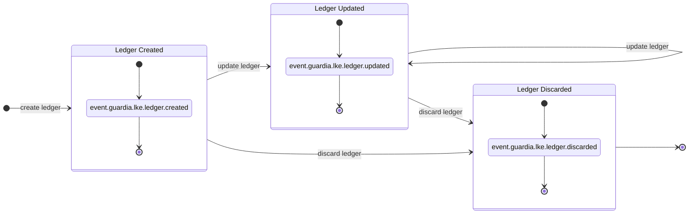
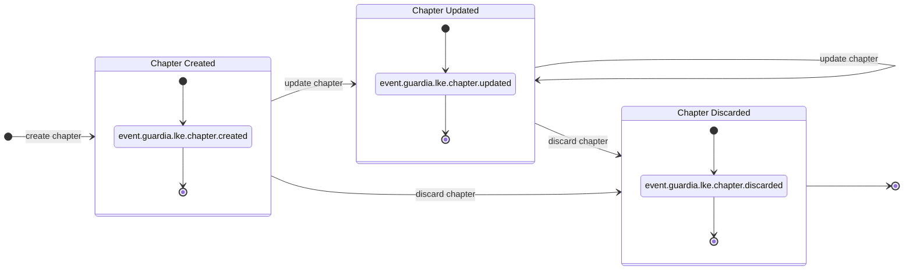
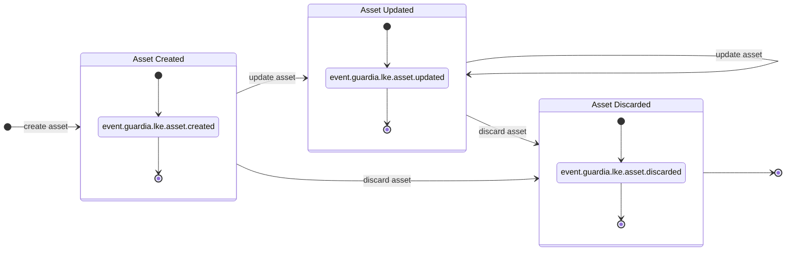
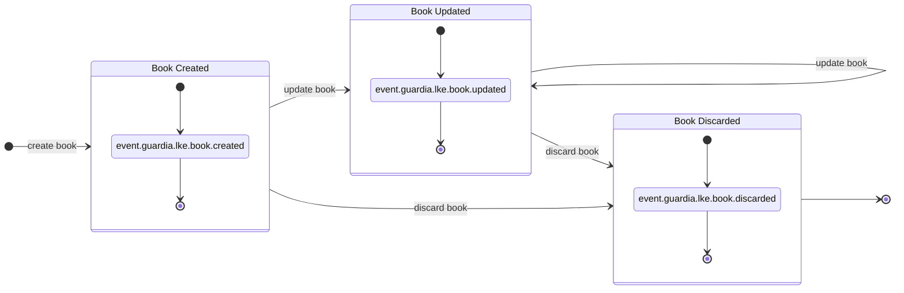
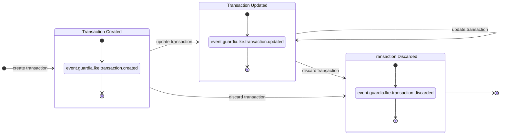

import MermaidDiagram from '@site/src/components/MermaidDiagram';

# Domain Model

## Entities

### Ledger

| Attribute | Type | Size | Values | Default | Direction | Description |
|----------|------|---------|---------|--------|---------|-----------|
| `entity_id` | `UUID v7` | `32` | - | - | Response | Unique entity identifier with temporal ordering. |
| `external_entity_id` | `string` | `up to 36 characters` | - | - | Request/Response | External entity identifier for interoperability with other systems. |
| `entity_type` | `string` | - | `LEDGER` | `LEDGER` | Response | Entity type. |
| `version` | `integer` | `1 byte` | - | `1` | Response | Entity version (incremented with each update). |
| `name` | `string` | `3 to 128 characters` | - | - | Request/Response | Ledger name (unique within organization and tenant). |
| `description` | `string` | `3 to 256 characters` | - | - | Request/Response | Ledger description for use in reports. |
| `created_at` | `datetime` | - | - | - | Response | Ledger creation date. |
| `updated_at` | `datetime` | - | - | `created_at` | Response | Last ledger update date. |
| `discarded_at` | `datetime` | - | - | `null` | Response | Discard date. |
| `chapters` | [`Chapter[]`](#chapter) | - | - | - | Response | Relationship with CHAPTER. |
| `metadata` | `Json Object` | `4 KB` | - | - | Request/Response | Additional metadata for ledger interoperability with other systems. |

### Chapter

| Attribute | Type | Size | Values | Default | Direction | Description |
|----------|------|---------|---------|--------|---------|-----------|
| `entity_id` | `UUID v7` | `32` | - | - | Response | Unique entity identifier with temporal ordering. |
| `external_entity_id` | `string` | `up to 36 characters` | - | - | Request/Response | External entity identifier for interoperability with other systems. |
| `entity_type` | `string` | `10` | `CHAPTER` | `CHAPTER` | Response | Entity type. |
| `version` | `integer` | `10` | - | `1` | Response | Entity version (incremented with each update) |
| `name` | `string` | `3 to 128 characters` | - | - | Request/Response | Chapter name (unique within ledger) |
| `description` | `string` | `3 to 256 characters` | - | - | Request/Response | Chapter description for use in reports. |
| `ledger` | [`Ledger`](#ledger) | - | - | - | Response | Relationship with ledger. |
| `created_at` | `datetime` | - | - | - | Response | Chapter creation date. |
| `updated_at` | `datetime` | - | - | - | Response | Last chapter update date. |
| `discarded_at` | `datetime` | - | - | - | Response | Chapter discard date. |
| `books` | [`Book[]`](#book) | - | - | - | Response | Relationship with BOOK. |
| `metadata` | `Json Object` | `4 KB` | - | - | Request/Response | Additional metadata for chapter interoperability with other systems. |

### Asset

| Attribute | Type | Size | Values | Default | Direction | Description |
|----------|------|---------|---------|--------|---------|-----------|
| `entity_id` | `UUID v7` | `32` | - | - | Response | Unique entity identifier with temporal ordering. |
| `external_entity_id` | `string` | `up to 36 characters` | - | - | Request/Response | External entity identifier for interoperability with other systems. |
| `entity_type` | `string` | - | `ASSET` | `ASSET` | Response | Entity type. |
| `version` | `integer` | `1 byte` | - | `1` | Response | Entity version (incremented with each update). |
| `code` | `string` | `3 to 12 characters` | - | - | Request/Response | Asset code (unique within ledger). |
| `number` | `string` | `1 to 128 characters` | - | - | Request/Response | Asset number (unique within ledger). |
| `exponent` | `integer` | `1 byte` | `0 to 18` | `0` | Request/Response | Asset exponent. |
| `is_fiat` | `boolean` | `1 byte` | `true, false` | `false` | Request/Response | Indicates if it is fiat currency. |
| `locations` | `string[]` | - | - | - | Request/Response | Regions where the asset is accepted as exchange currency in [ISO 3166-2](https://en.wikipedia.org/wiki/ISO_3166-2) format. |
| `created_at` | `datetime` | - | - | - | Response | Asset creation date. |
| `updated_at` | `datetime` | - | - | - | Response | Last asset update date. |
| `discarded_at` | `datetime` | - | - | - | Response | Asset discard date. |

### Book

| Attribute | Type | Size | Values | Default | Direction | Description |
|----------|------|---------|---------|--------|---------|-----------|
| `entity_id` | `UUID v7` | `32` | - | - | Response | Unique entity identifier with temporal ordering. |
| `external_entity_id` | `string` | `up to 36 characters` | - | - | Request/Response | External entity identifier for interoperability with other systems. |
| `entity_type` | `string` | - | `BOOK` | `BOOK` | Response | Entity type. |
| `version` | `integer` | `1 byte` | - | `1` | Response | Entity version (incremented with each update). |
| `name` | `string` | `3 to 128 characters` | - | - | Request/Response | Book name (unique within ledger). |
| `position` | [`Position`](#position) | - | - | - | Response | Relationship with POSITION. |
| `nature` | `string` | - | `CREDITOR, DEBITOR` | - | Request/Response | Book nature. |
| `ledger` | [`Ledger`](#ledger) | - | - | - | Response | Relationship with ledger. |
| `chapters` | [`Chapter[]`](#chapter) | - | - | - | Response | Relationship with chapters. |
| `entries` | [`Entry[]`](#entry) | - | - | - | Response | Relationship with entries. |
| `created_at` | `datetime` | - | - | - | Response | Creation date. |
| `updated_at` | `datetime` | - | - | - | Response | Last update date. |
| `discarded_at` | `datetime` | - | - | - | Response | Discard date. |
| `metadata` | `Json Object` | `4 KB` | - | - | Request/Response | Additional metadata for book interoperability with other systems. |

### Entry

| Attribute | Type | Size | Values | Default | Direction | Description |
|----------|------|---------|---------|--------|---------|-----------|
| `entity_id` | `UUID v7` | `32` | - | - | Response | Unique entity identifier with temporal ordering. |
| `external_entity_id` | `string` | `up to 36 characters` | - | - | Request/Response | External entity identifier for interoperability with other systems. |
| `entity_type` | `string` | - | `ENTRY` | `ENTRY` | Response | Entity type. |
| `version` | `integer` | `1 byte` | - | `1` | Response | Entity version (incremented with each update) |
| `reference_date` | `datetime` | - | - | `created_at` | Request/Response | Reference date (transaction date) |
| `direction` | `string` | - | `CREDIT, DEBIT` | - | Request/Response | Entry direction. |
| `status` | `string` | - | `PENDING, POSTED, DISCARDED` | `PENDING` | Response | Entry status. |
| `detail_account` | [`Book`](#book) | - | - | - | Response | Detail account. |
| `previous_position` | [`Position`](#position) | - | - | - | Response | Previous position. |
| `resulting_position` | [`Position`](#position) | - | - | - | Response | Resulting position. |
| `created_at` | `datetime` | - | - | - | Response | Entry creation date. |
| `updated_at` | `datetime` | - | - | - | Response | Last entry update date. |
| `posted_at` | `datetime` | - | - | - | Response | Entry posting date. |
| `discarded_at` | `datetime` | - | - | - | Response | Entry discard date. |
| `metadata` | `Json Object` | `4 KB` | - | - | Request/Response | Additional metadata for entry interoperability with other systems. |

### Transaction

| Attribute | Type | Size | Values | Default | Direction | Description |
|----------|------|---------|---------|--------|---------|-----------|
| `entity_id` | `UUID v7` | `32` | - | - | Response | Unique entity identifier with temporal ordering. |
| `external_entity_id` | `string` | `up to 36 characters` | - | - | Request/Response | External entity identifier for interoperability with other systems. |
| `entity_type` | `string` | - | `TRANSACTION` | `TRANSACTION` | Response | Entity type. |
| `version` | `integer` | `1 byte` | - | `1` | Response | Entity version (incremented with each update). |
| `reference_date` | `datetime` | - | - | `created_at` | Request/Response | Reference date (transaction date). |
| `ledger` | [`Ledger`](#ledger) | - | - | - | Response | Relationship with ledger. |
| `status` | `string` | - | `PENDING, POSTED, DISCARDED` | `PENDING` | Response | Transaction status. |
| `entries` | [`Entry[]`](#entry) | - | - | - | Request/Response | Relationship with entries. |
| `created_at` | `datetime` | - | - | - | Response | Transaction creation date. |
| `updated_at` | `datetime` | - | - | - | Response | Last transaction update date. |
| `posted_at` | `datetime` | - | - | - | Response | Transaction posting date. |
| `discarded_at` | `datetime` | - | - | - | Response | Transaction discard date. |
| `reversed_by` | [`Transaction`](#transaction) | - | - | - | Response | Transaction that reverses this transaction. |
| `reverses_to` | [`Transaction`](#transaction) | - | - | - | Response | Transaction that is reversed by this transaction. |
| `metadata` | `Json Object` | `4 KB` | - | - | Request/Response | Additional metadata for transaction interoperability with other systems. |

### Position

| Attribute | Type | Size | Values | Default | Direction | Description |
|----------|------|---------|---------|--------|---------|-----------|
| `entity_id` | `UUID v7` | `32` | - | - | Response | Unique entity identifier with temporal ordering. |
| `external_entity_id` | `string` | `up to 36 characters` | - | - | Request/Response | External entity identifier for interoperability with other systems. |
| `entity_type` | `string` | - | `POSITION` | `POSITION` | Response | Entity type. |
| `version` | `integer` | `1 byte` | - | `1` | Response | Entity version (incremented with each update). |
| `reference_date` | `datetime` | - | - | `created_at` | Request/Response | Reference date (transaction date). |
| `asset` | [`Asset`](#asset) | - | - | - | Response | Relationship with ASSET. |
| `posted` | [`Balance`](#balance) | - | - | - | Response | Position of the posted balance. |
| `confirmable` | [`Balance`](#balance) | - | - | - | Response | Position of the confirmable balance. |
| `provisioned` | [`Balance`](#balance) | - | - | - | Response | Position of the provisioned balance (posted and confirmable). |
| `available` | [`Balance`](#balance) | - | - | - | Response | Position of the available balance. |
| `created_at` | `datetime` | - | - | - | Response | Creation date. |
| `updated_at` | `datetime` | - | - | - | Response | Update date. |
| `discarded_at` | `datetime` | - | - | - | Response | Discard date. |

### Balance

| Attribute | Type | Size | Values | Default | Direction | Description |
|----------|------|---------|---------|--------|---------|-----------|
| `amount` | `integer` | `8 bytes` | - | `0` | Response | Current balance position amount. |
| `credits` | `integer` | `8 bytes` | - | `0` | Response | Total credits of the balance position. |
| `debits` | `integer` | `8 bytes` | - | `0` | Response | Total debits of the balance position. |

## Events

### Ledger Events

| Event | Topic | Description |
|--------|-----------|-----------|
| `LEDGER_CREATED` | `event.guardia.lke.ledger.created`  | Event triggered when a new ledger is created |
| `LEDGER_UPDATED` | `event.guardia.lke.ledger.updated` | Event triggered when a ledger is updated |
| `LEDGER_DISCARDED` | `event.guardia.lke.ledger.discarded` | Event triggered when a ledger is discarded |

<MermaidDiagram>

</MermaidDiagram>

---

### Chapter Events

| Event | Topic | Description |
|--------|-----------|-----------|
| `CHAPTER_CREATED` | `event.guardia.lke.chapter.created`  | Event triggered when a new chapter is created |
| `CHAPTER_UPDATED` | `event.guardia.lke.chapter.updated` | Event triggered when a chapter is updated |
| `CHAPTER_DISCARDED` | `event.guardia.lke.chapter.discarded` | Event triggered when a chapter is discarded |

<MermaidDiagram>

</MermaidDiagram>

---

### Asset Events

| Event | Topic | Description |
|--------|-----------|-----------|
| `ASSET_CREATED` | `event.guardia.lke.asset.created`  | Event triggered when a new asset is created |
| `ASSET_UPDATED` | `event.guardia.lke.asset.updated` | Event triggered when an asset is updated |
| `ASSET_DISCARDED` | `event.guardia.lke.asset.discarded` | Event triggered when an asset is discarded |

<MermaidDiagram>

</MermaidDiagram>

---

### Book Events

| Event | Topic | Description |
|--------|-----------|-----------|
| `BOOK_CREATED` | `event.guardia.lke.book.created`  | Event triggered when a new book is created |
| `BOOK_UPDATED` | `event.guardia.lke.book.updated` | Event triggered when a book is updated |
| `BOOK_DISCARDED` | `event.guardia.lke.book.discarded` | Event triggered when a book is discarded |

<MermaidDiagram>

</MermaidDiagram>

---

### Entry Events

| Event | Topic | Description |
|--------|-----------|-----------|
| `ENTRY_CREATED` | `event.guardia.lke.entry.created`  | Event triggered when a new entry is created |
| `ENTRY_UPDATED` | `event.guardia.lke.entry.updated` | Event triggered when an entry is updated |
| `ENTRY_DISCARDED` | `event.guardia.lke.entry.discarded` | Event triggered when an entry is discarded |

<MermaidDiagram>

</MermaidDiagram>

---

### Transaction Events

| Event | Topic | Description |
|--------|-----------|-----------|
| `TRANSACTION_CREATED` | `event.guardia.lke.transaction.created`  | Event triggered when a new transaction is created |
| `TRANSACTION_UPDATED` | `event.guardia.lke.transaction.updated` | Event triggered when a transaction is updated |
| `TRANSACTION_DISCARDED` | `event.guardia.lke.transaction.discarded` | Event triggered when a transaction is discarded |

<MermaidDiagram>

</MermaidDiagram>

## References

- [ISO 3166-2](https://en.wikipedia.org/wiki/ISO_3166-2)
- [std::primitive - Rust](https://doc.rust-lang.org/stable/std/primitive)
- [PostgreSQL - Datatype Numeric](https://www.postgresql.org/docs/current/datatype-numeric.html)
