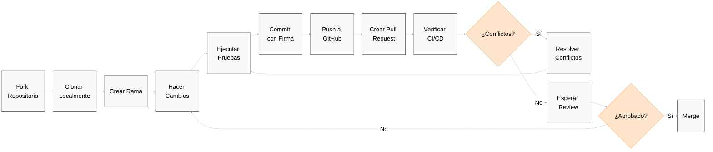

# Contribuyendo a Guardia

Nos complace recibir contribuciones de la comunidad en nuestro proyecto. Ya sea con código, sugerencias, documentación o pruebas, toda ayuda es bienvenida — y marca la diferencia.

Este documento reúne todo lo que necesitas para comenzar: buenas prácticas, directrices y el flujo que seguimos para mantener la calidad y la consistencia de lo que construimos juntos.

Si quieres involucrarte, este es el mejor lugar para empezar.

## ¿Por qué deberías contribuir?

* **Impacto**: Tu trabajo impactará directamente y mejorará un proyecto utilizado por organizaciones alrededor del mundo, haciendo sus operaciones más fluidas y eficientes.
* **Aprender y Crecer**: Contribuir a Guardia ofrece una oportunidad única de aprender de una comunidad de desarrolladores talentosos, mejorando tus habilidades y conocimientos en diseño de arquitectura, CQRS, Ports & Adapters, y más.
* **Comunidad**: Únete a una comunidad acogedora y solidaria de desarrolladores que comparten tu pasión por crear software de código abierto de alta calidad.

## ¿Cómo puedes contribuir?

* **Contribuciones de Código**: Desde pequeñas correcciones hasta grandes funcionalidades, tus contribuciones de código son siempre bienvenidas. Nuestra arquitectura y dependencias mínimas facilitan la comprensión y mejora de Guardia.
* **Documentación**: Ayúdanos a mejorar nuestra documentación para hacer Guardia más accesible y comprensible para todos.
* **Feedback e Ideas**: Comparte tus insights, sugerencias e ideas innovadoras para ayudarnos a moldear el futuro de Guardia.
* **Pruebas**: Ayuda en las pruebas de nuevos lanzamientos o funcionalidades, proporcionando feedback valioso para garantizar estabilidad y usabilidad.

## Flujo de Trabajo

Antes de contribuir, recomendamos abrir una [discusión](https://github.com/orgs/guardiafinance/discussions/new?category=ideas) describiendo tu propuesta. Siempre que sea posible, sigue el principio del Golden Circle: explica con claridad **qué** pretendes hacer, **por qué** es relevante y **cómo** pretendes ejecutarlo — con enfoque en la objetividad. Deja el código para el momento de codificar.

**Nuestro flujo recomendado es:**

1. Abre una discusión con tu propuesta.
2. Si es aceptada, será convertida en un issue.
3. Con el issue abierto, avanza con la implementación y envía tu pull request.

<br />

> **IMPORTANTE:** Todos los contribuyentes deben firmar el [Contributor License Agreement (CLA)](./governance/CLA.md), como se describe en el documento oficial.

<br />

Este enfoque ayuda a alinear expectativas, promueve discusiones constructivas y asegura que cada contribución esté conectada con las prioridades del proyecto.

Queremos mantener un buen historial de decisiones — por eso, incluso cambios menores deben estar asociados a un issue. La única excepción son correcciones triviales, como ajustes de tipografía, que pueden ser enviadas directamente como pull request.

Considera participar en nuestra comunidad en [Whatsapp](#) para compartir ideas, aclarar dudas y seguir discusiones en curso.

**Con el issue aprobado, puedes proceder con:**

- Haz un fork del repositorio en GitHub, clónalo en tu computadora.
- Crea una rama con tus cambios.
- Asegúrate de estar trabajando con la última versión de la rama `main`.
- Modifica el código fuente; **Por favor, concéntrate solo en el cambio específico al que estás contribuyendo**.
- Asegúrate de que las pruebas locales pasen.
- Haz commit en tu fork usando mensajes de commit **pequeños y claros**.
- Envíanos un pull request, respondiendo a cualquier pregunta estándar en la interfaz del pull request.
- Presta atención a cualquier fallo de CI automatizado reportado en el pull request y mantente involucrado en la conversación.
- Después de enviar tus commits a GitHub, asegúrate de que tu rama pueda ser fusionada automáticamente (no hay conflictos de merge). Si no, en tu computadora, fusiona la rama main en tu rama, resuelve cualquier conflicto de merge, asegúrate de que todo sigue funcionando correctamente y pasa todas las pruebas, y luego envía esos cambios.
- Una vez que el cambio haya sido aprobado y fusionado, te informaremos en un comentario.



Si estás trabajando en un flujo de pair programming, consulta también el [Flujo de Trabajo para Pair Programming con Forks Individuales](../tutorials/pair-program-workflow.md) para más información.

## Directrices para Mensajes de Commit

### Utiliza "Small Commits"

Al contribuir con Guardia, recomendamos fuertemente la adopción de la práctica de *Small Commits* (Commits Pequeños). Este enfoque trae diversos beneficios para el desarrollo y revisión de código, garantizando un proceso más eficiente y colaborativo.

#### Beneficios de Small Commits

1. **Facilidad de Revisión**: Los commits más pequeños son más fáciles de entender y revisar, reduciendo el tiempo necesario para aprobación e integración del código.
2. **Menor Riesgo de Errores**: Los pequeños commits hacen más simple la identificación y corrección de bugs, en caso de que algo salga mal.
3. **Historial Claro y Organizado**: Un historial de commits granular y bien descrito facilita la depuración y comprensión de la evolución del código.
4. **Facilidad en la Resolución de Conflictos**: Los cambios menores son menos propensos a generar conflictos complejos de merge.
5. **Reversión Segura**: Si se identifica un problema, los pequeños commits permiten revertir cambios sin impactar partes significativas del código.

#### Buenas Prácticas

- **Un commit por cambio lógico**: Evita commits que mezclen múltiples cambios no relacionados.
- **Mensajes de commit descriptivos**: Utiliza mensajes claros y objetivos que expliquen el cambio realizado.
- **Evita commits gigantescos**: Si percibes que tu commit está muy grande, divídelo en partes más pequeñas.
- **Commits atómicos**: Cada commit debe representar una unidad de trabajo que puede ser integrada sin depender de futuros cambios.
- **Pruebas y validaciones**: Siempre que sea posible, asegura que el código en cada commit esté funcional y no rompa la aplicación.

### Formatos de Mensajes de Commit

Utiliza el formato [Conventional Commit](https://www.conventionalcommits.org/en/v1.0.0/) para asegurar que nuestro historial de commits sea legible y fácil de seguir. Este formato forma parte de un conjunto más amplio de directrices diseñadas para facilitar el versionado automático y la generación de changelogs:

```
<tipo>[ámbito opcional]: <descripción>

[cuerpo opcional]

[pie(s) opcional(es)]
```

El commit contiene los siguientes elementos estructurales, para comunicar la intención a los consumidores de tu biblioteca:

1. **fix:** un commit del _tipo_ `fix` corrige un bug en tu código (esto se correlaciona con [`PATCH`](http://semver.org/#summary) en Versionado Semántico).

2. **feat:** un commit del _tipo_ `feat` introduce una nueva funcionalidad en el código (esto se correlaciona con [`MINOR`](http://semver.org/#summary) en Versionado Semántico).

3. **BREAKING CHANGE:** un commit que tiene un pie `BREAKING CHANGE:`, o añade un `!` después del tipo/ámbito, introduce un cambio de API que rompe la compatibilidad (correlacionándose con [`MAJOR`](http://semver.org/#summary) en Versionado Semántico).
   Un BREAKING CHANGE puede formar parte de commits de cualquier _tipo_.

4. _tipos_ además de `fix:` y `feat:` están permitidos, por ejemplo [@commitlint/config-conventional](https://github.com/conventional-changelog/commitlint/tree/master/%40commitlint/config-conventional) (basado en la [convención Angular](https://github.com/angular/angular/blob/22b96b9/CONTRIBUTING.md#-commit-message-guidelines)) recomienda `build:`, `chore:`,
   `ci:`, `docs:`, `style:`, `refactor:`, `perf:`, `test:`, y otros.

5. _pies_ además de `BREAKING CHANGE: <descripción>` pueden ser proporcionados y siguen una convención similar al
   [formato de trailer de git](https://git-scm.com/docs/git-interpret-trailers).

### Commits Firmados

Debes firmar commits y tags localmente para dar a otras personas confianza sobre el origen de un cambio que has realizado. Debes utilizar una clave GPG para firmar commits y tags.

Cuando un commit o una tag contiene una firma GPG que puede ser verificada criptográficamente, será marcado como "Verificado" al enviar un Pull Request.

| Aceptado | Estado | Descripción |
|----------|---------|-------------|
| Sí | Verificado | El commit fue firmado, la firma fue verificada con éxito y el committer es el único autor que habilitó el modo vigilante. |
| No | Parcialmente verificado | El commit fue firmado y la firma fue verificada con éxito, pero el commit tiene un autor que: a) no es el committer y b) habilitó el modo vigilante. En este caso, la firma de commit no garantiza el consentimiento del autor. Por lo tanto, el commit está verificado solo parcialmente. |
| No | No verificado | Cualquiera de las siguientes opciones es verdadera: <br /> – El commit fue firmado, pero no fue posible verificar la firma. <br /> – El commit no fue firmado, y el usuario que lo hizo habilitó el modo vigilante. <br /> – El commit no fue firmado, y un autor habilitó el modo vigilante. |
| No | Sin estado de verificación | El commit no fue firmado. |

<br />

>**IMPORTANTE:** Solo se aceptarán Pull Requests con todos los commits firmados y marcados como "Verificado". Consulta cómo configurar Git para firmar commits automáticamente en [Firmando commits](../../tutorials/es/signing-commits.md).

## Idiomas

Estamos comprometidos a mantener nuestras comunicaciones en portugués, inglés y español. Sin embargo, aceptamos que los issues sean publicados en cualquier idioma. No obstante, optamos por mantener nuestra comunicación oficial en inglés por algunas razones:

- El portugués brasileño es una lengua muy rica - y nos enorgullecemos de ello - pero también es una lengua muy compleja, lo que dificulta la comprensión de issues y pull requests por parte de la comunidad.
- El inglés ya forma parte de la cultura de la Ingeniería de Software, y es una lengua más simple y fácil de entender, lo que facilita la comprensión de issues y pull requests por parte de la comunidad.

### Commits

El mensaje principal del commit debe estar escrito en inglés. Si sientes la necesidad de describir en tu idioma local, puedes utilizarlo incluyendo la etiqueta `[idioma]` en la descripción del commit. Actualmente, con la ayuda de herramientas como [DeepL](https://www.deepl.com/) y [Google Traductor](https://translate.google.com/), cualquier persona puede tener su texto traducido al inglés u otros idiomas. Sin embargo, tener el texto original _junto con_ la traducción puede ayudar a mitigar errores de traducción.

Puedes abrir issues y pull requests en cualquier idioma. Si el issue o pull request se publica en un idioma diferente al inglés, te animamos a incluir una copia en inglés en el cuerpo del issue o pull request o como respuesta conteniendo la etiqueta `[en]`.

> **IMPORTANTE:** **Por favor, ten en cuenta** que el uso de cualquier idioma con la intención de eludir el [Código de Conducta](#) resultará en la expulsión inmediata — y posiblemente indefinida — del proyecto.

**Ejemplo:**

```
feat(auth): implementar autenticación via OAuth2

[en]
Implement OAuth2 authentication flow with support for multiple providers:
- Add OAuth2 client configuration
- Create authentication handlers for Google and GitHub
- Implement token validation and refresh logic
- Add unit tests for auth flow

[es]
Implementa flujo de autenticación OAuth2 con soporte para múltiples proveedores:
- Añade configuración del cliente OAuth2
- Crea handlers de autenticación para Google y GitHub
- Implementa lógica de validación y refresh de tokens
- Añade pruebas unitarias para el flujo de auth

Closes #123
```

## Código de Conducta

Este proyecto adopta el [Código de Conducta](#) para garantizar que la comunidad sea acogedora y respetuosa para todos los participantes.

## Licencia

Guardia adopta el modelo de negocio **Open Core**, que combina lo mejor del código abierto con la sostenibilidad de un negocio. Este enfoque permite que el proyecto evolucione con el apoyo de la comunidad, al mismo tiempo que posibilita la oferta de recursos y servicios adicionales para empresas que desean escalar con seguridad y eficiencia.

Guardia adopta el modelo de negocio Open Core, que combina lo mejor del código abierto con la sostenibilidad de un negocio. Este enfoque permite que el proyecto crezca con el apoyo de la comunidad, mientras ofrece recursos avanzados para empresas que necesitan escala, soporte y gobernanza.

Para esto, los Core Modules son desarrollados y distribuidos bajo la licencia [Apache 2.0](#), permitiendo libertad de uso, modificación y distribución con seguridad jurídica y compatibilidad comercial.

Puedes entender mejor cómo funciona el [licenciamiento del proyecto](#).

## Guía del Desarrollador

Consulta el [Guía del Desarrollador](#) para más información sobre el proyecto — incluyendo especificaciones, directrices de contribución, arquitectura, patrones adoptados y otros detalles técnicos relevantes.
