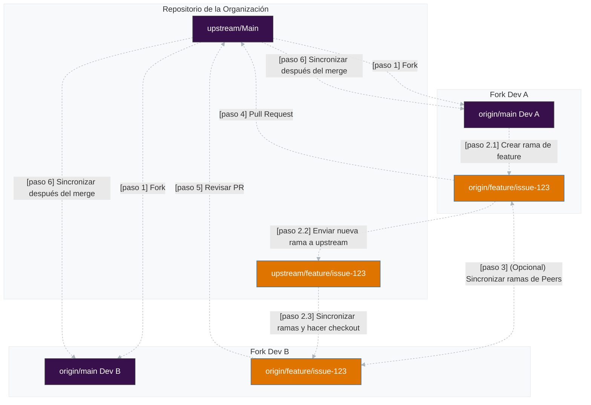

# Programación en Pareja

Trabajar en programación en pareja es una excelente manera de aprender y mejorar tus habilidades de desarrollo. Sabemos que no siempre es posible trabajar en programación en pareja, pero siempre que sea posible, animamos a todos los desarrolladores a participar en programación en pareja.

## **Recomendaciones**

- Cada desarrollador tiene su propio fork.
- Se crea una rama compartida y se sincroniza entre los forks.
- Ambos trabajan en su propia rama, sincronizando cambios con la rama compartida.
- Opcionalmente, ambos pueden sincronizar sus ramas entre sí.
- Extraen y fusionan cambios frecuentemente para evitar conflictos.
- El PR final se envía al repositorio de la organización (`upstream`).

---

## Flujo de Trabajo

### Configuración Inicial
Cada desarrollador necesita configurar su entorno correctamente.

#### Dev A y Dev B hacen fork del repositorio de la organización (`upstream`)

Cada desarrollador crea su propio fork en GitHub.

Ambos clonan **su propio fork** en sus máquinas:

```bash
git clone https://github.com/dev-a/forked-repo.git
cd forked-repo
```

#### Agregar los remotes correctamente

El repositorio de la organización se agrega como `upstream`:

```bash
git remote add upstream https://github.com/org/repo.git
```
(opcional) El fork del otro desarrollador puede agregarse como un tercer remote (`peer`), facilitando la sincronización directa:

```bash
git remote add peer https://github.com/dev-b/forked-repo.git
```

Tu propio fork se configura automáticamente como origin al clonar:

```bash
git clone https://github.com/dev-a/forked-repo.git
```

Ahora, los remotes deberían verse así:

```bash
git remote -v
origin   https://github.com/dev-a/forked-repo.git (fetch)
origin   https://github.com/dev-a/forked-repo.git (push)
upstream https://github.com/org/repo.git (fetch)
upstream https://github.com/org/repo.git (push)

// opcional
peer     https://github.com/dev-b/forked-repo.git (fetch)
peer     https://github.com/dev-b/forked-repo.git (push)
```

---

### Crear una Rama Compartida para la Issue

Dev A crea la rama desde el `main` de upstream y la envía a upstream:

```bash
git fetch upstream
git checkout -b feature/issue-123 upstream/main
git push upstream feature/issue-123
```

Dev B sincroniza la rama directamente desde upstream:

```bash
git fetch upstream
git checkout -b feature/issue-123 upstream/feature/issue-123
```

Ahora, ambos están en la misma rama y pueden trabajar juntos.

---

### Desarrollo Colaborativo

Para evitar conflictos:

Siempre extrae los cambios del otro antes de comenzar a codificar:

```bash
git pull peer feature/issue-123
```

Realiza commits regularmente:

```bash
git add .
git commit -m "Implementación inicial de la feature X"
```

Envía a tu propio fork:

```bash
git push origin feature/issue-123
```

---

### Sincronización con el Repositorio de la Organización
Como cada desarrollador tiene su propio fork, es esencial sincronizar con upstream regularmente:
```bash
git fetch upstream
git rebase upstream/main
git push origin feature/issue-123 --force-with-lease
```

> **Importante**: Evita usar `--force` ya que reescribe el historial de upstream desde la rama local. Asegúrate de comunicarte con el equipo cuando hagas un force push. El `--force-with-lease` es una opción más segura que no sobrescribirá ningún trabajo en la rama remota si se han agregado más commits a la rama remota (por otro miembro del equipo o compañero de trabajo o algo así). Asegura que no sobrescribas el trabajo de otra persona al hacer un force push.

---

### Revisión y Pull Request
Cuando la feature esté lista:
1. Dev A (o Dev B) abre un **Pull Request (PR) al repositorio de la organización (`upstream`)**.
2. El otro desarrollador revisa el PR antes del merge.
3. El PR es revisado por dos miembros más de la organización.
4. Si es necesario, se realizan nuevos cambios antes del merge.
5. El PR se fusiona.
---

### Actualización de la Rama Local
Después de que el PR se fusiona, la rama local debe actualizarse:
```bash
git fetch upstream
git rebase upstream/main
```



