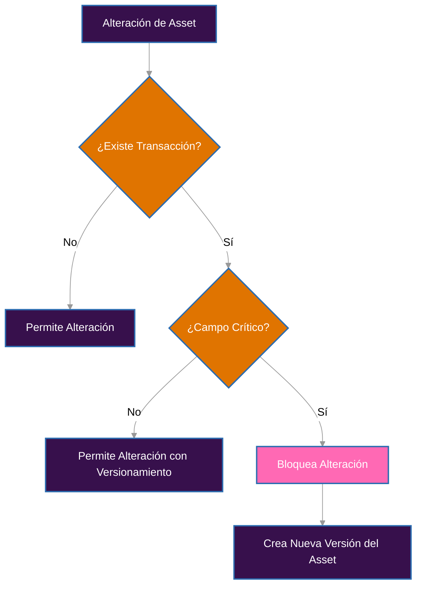

# Actualización de Assets

Gestionar Assets en un sistema contable requiere un equilibrio entre flexibilidad operativa y integridad histórica. Este documento define las reglas aplicables a las actualizaciones de Assets, considerando los requisitos contables (IAS/IFRS), los impactos técnicos y la trazabilidad regulatoria.

## Actualizaciones e Integridad Contable

En el contexto de Guardia, un Asset representa una unidad monetaria o no monetaria utilizada en asientos contables dentro de un Ledger. Por esta razón, algunas de sus propiedades asumen un papel estructural en el significado de los asientos registrados. Alterarlas después del uso comprometería la confiabilidad del sistema. Las actualizaciones se clasifican, por lo tanto, en:

- **Campos críticos (inmutables después del uso)**
- **Campos no críticos (editables con control histórico)**

---

## Campos Críticos

Son campos cuya alteración puede distorsionar el valor contable, desalinear informes y romper integraciones:

- `code`: Código del Asset (ej: "USD", "BTC")
- `number`: Número de referencia (ej: "840" para USD según ISO 4217)
- `exponent`: Define la escala decimal (ej: 2 para centavos)
- `is_fiat`: Define si es fiduciario o no

### Regla
Después de cualquier uso del Asset en transacciones confirmadas, estos campos se vuelven inmutables.

#### Comportamiento esperado
- **Estado HTTP**: `422 Unprocessable Entity`
- **Código de error**: `ERR422_BUSINESS_ERROR`
- **Razón**: `ASSET_HAS_TRANSACTIONS`

**Ejemplo de bloqueo**
```json
PATCH /v1/assets/{entity_id}
{
  "exponent": 6
}
```

#### Cómo tratar cambios legítimos
Si hay necesidad de alterar un campo crítico:
1. Cree un nuevo Asset con nuevo `entity_id`
2. Marque la versión antigua como `deprecated`
3. Utilice el nuevo asset en asientos futuros

---

## Campos No Críticos

Son campos que no afectan directamente la integridad de los valores registrados, pero pueden influir en interpretaciones analíticas o reglas de negocio:

- `metadata`: Información adicional
- `locations`: Lista de países donde el Asset es aceptado

### Regla
Estos campos pueden ser actualizados incluso después del uso en transacciones.

#### Control adicional
- Toda alteración se registra en el historial de la entidad (`ASSET_HISTORY`)
- Pueden activar revalidaciones en pipelines que dependan de estos datos

**Ejemplo permitido**
```json
PATCH /v1/assets/{entity_id}
{
  "metadata": {
    "category": "reserves",
    "risk_level": "low"
  }
}
```

---

## Vínculo con Ledgers

La relación entre Assets y Ledgers también está controlada para mantener la trazabilidad contable.

### Permisos

- **Agregar nuevos ledgers**: permitido en cualquier momento
- **Eliminar ledgers**: prohibido si hay transacciones asociadas

**Comportamiento en intentos inválidos**
- **Estado HTTP**: `422 Unprocessable Entity`
- **Código de error**: `ERR422_BUSINESS_ERROR`
- **Razón**: `LEDGER_HAS_TRANSACTIONS`

**Ejemplo de restricción**
```json
PATCH /v1/assets/{entity_id}
{
  "ledgers": ["ledger-2"]  // Eliminación bloqueada si ledger-1 tiene transacciones
}
```

## Descarte de Assets (`discard`)

El descarte de un Asset significa hacerlo inactivo para nuevos asientos. Esta acción no debe borrar o modificar datos históricos, sino evitar el uso futuro.

### Comportamiento esperado

* **Puede ser descartado**: si el asset **no ha sido utilizado** en transacciones.
* **No puede ser descartado**: si el asset **ya está asociado** a cualquier transacción.

#### Restricciones

* **Estado HTTP**: `422 Unprocessable Entity`
* **Código de error**: `ERR422_BUSINESS_ERROR`
* **Razón**: `ASSET_HAS_TRANSACTIONS`

#### Justificación

El intento de descartar un asset ya utilizado comprometería la trazabilidad contable y el historial temporal de asientos. Además, en conformidad con los principios de **IAS 10** e **IAS 1**, los activos utilizados en estados financieros pasados deben permanecer accesibles y auditables.

#### Ejemplo de intento inválido

```json
DELETE /v1/assets/{entity_id}
// Resultado: 422 Unprocessable Entity
// Error: ASSET_HAS_TRANSACTIONS
```

## Estrategia de Implementación

Para garantizar que el sistema permanezca auditable e íntegro:

- **Inmutabilidad Estructural**: todo intento de alteración en campos sensibles verifica historial de uso, es decir, si el asset ya ha sido utilizado en transacciones.
- **Audit Trail**: cada cambio se registra con timestamp, autor y valores anteriores
- **Versionamiento**: los cambios críticos deben tratarse como nuevas entidades, generando un nuevo `entity_id` y manteniendo referencia a la versión anterior.
- **Referencia Temporal**: informes y análisis utilizan el Asset vigente en el momento de cada asiento

## Conformidad con Normas Contables

El modelo implementado sigue las directrices IAS/IFRS:

- **IAS 1 – Presentación de Estados Financieros**: requiere consistencia y representación fidedigna de la información
- **IAS 8 – Políticas Contables, Cambios en Estimaciones Contables y Errores**: trata cambios en criterios contables como cambios estructurales, requiriendo nueva versión y no alteración retroactiva

Permitir la alteración de campos como `exponent`, `code` o `number` comprometería informes financieros, conciliaciones regulatorias y la confianza en auditorías. El modelo de versionamiento aplicado evita estos riesgos y garantiza trazabilidad jurídica, técnica y fiscal.

## Flujo de Decisión



## Ejemplos Prácticos

### Alterar código (campo crítico)
```json
PATCH /v1/assets/{entity_id}
{
  "code": "USDT"
}
// Resultado: 422 Unprocessable Entity si ya hay transacciones
```

#### Actualizar metadatos (campo no crítico)
```json
PATCH /v1/assets/{entity_id}
{
  "metadata": {
    "category": "stablecoin"
  }
}
// Resultado: 200 OK, alteración registrada en el historial
```

#### Agregar nuevo ledger
```json
PATCH /v1/assets/{entity_id}
{
  "ledgers": ["ledger-a", "ledger-b"]
}
// Resultado: 200 OK
```

#### Eliminar ledger con transacciones
```json
PATCH /v1/assets/{entity_id}
{
  "ledgers": ["ledger-b"]
}
// Resultado: 422 Unprocessable Entity si "ledger-a" tiene transacciones
```

## Referencias

- [IAS 1 – Presentación de Estados Financieros](https://www.ifrs.org/content/dam/ifrs/publications/pdf-standards/english/2024/issued/part-a/ias-1-presentation-of-financial-statements.pdf?bypass=on)
- [IAS 8 – Políticas Contables, Cambios en Estimaciones Contables y Errores](https://www.ifrs.org/content/dam/ifrs/publications/pdf-standards/english/2024/issued/part-a/ias-8-accounting-policies-changes-in-accounting-estimates-and-errors.pdf?bypass=on)