import MermaidDiagram from '@site/src/components/MermaidDiagram';

# Diagrama de Clases

Este diagrama de clases ilustra los Aggregates, Entities, Value Objects y sus relaciones en el Bounded Context del Ledger Kernel Engine (LKe).

```mermaid
classDiagram

%%{init: {'theme': 'neutral'}}%%
classDef default fill:#e9ecef,stroke:#dee2e6,stroke-width:2px,color:#212529;
classDef special fill:#f8f9fa,stroke:#dee2e6,stroke-width:2px,color:#212529;

    class Ledger {
        +String<uuid> entity_id PK "Campo controlado por la aplicación. UUID v7, con ordenación temporal."
        +String<uuid> external_entity_id "Identificador único para interoperabilidad con otros sistemas. Tamaño máximo: 36 caracteres."
        +String entity_type = "LEDGER"
        +Integer version = 0 "Campo controlado por la aplicación. Debe incrementarse en 1 cada vez que la entidad sea modificada."
        +String name "Único dentro de la organización y tenant. Tamaño máximo: 128 caracteres."
        +String description "Descripción para fines de reportes. Tamaño máximo: 256 caracteres."
        +DateTime created_at "Fecha de inserción en la base de datos."
        +DateTime updated_at "Fecha de la última actualización en la base de datos. Por defecto: created_at"
        +DateTime discarded_at "Fecha de exclusión en la base de datos. Debe implementar el estándar de exclusión suave."
        +HashMap<String, String> metadata "Metadatos adicionales para interoperabilidad con otros sistemas. Tamaño máximo: 4KB"
        +Chapter[] Chapters "Relación con CHAPTER"
        Ledger[] LedgersHistory "Historial de eventos del Ledger"
    }

    class Chapter {
        +String<uuid> entity_id PK "Campo controlado por la aplicación. UUID v7, con ordenación temporal."
        +String<uuid> external_entity_id "Identificador único para interoperabilidad con otros sistemas. Tamaño máximo: 36 caracteres."
        +String entity_type = "CHAPTER"
        +Integer version = 0 "Campo controlado por la aplicación. Debe incrementarse en 1 cada vez que la entidad sea modificada."
        +String name "Único dentro del ledger. Tamaño máximo: 128 caracteres."
        +Ledger ledger "Relación con LEDGER"
        +String description "Descripción para fines de reportes. Tamaño máximo: 256 caracteres."
        +DateTime created_at "Fecha de inserción en la base de datos."
        +DateTime updated_at "Fecha de la última actualización en la base de datos."
        +DateTime discarded_at "Fecha de exclusión en la base de datos. Debe implementar el estándar de exclusión suave."
        +Book[] books "Relación con BOOK"
        +HashMap<String, String> metadata "Metadatos adicionales para interoperabilidad con otros sistemas. Tamaño máximo: 4KB"
        Chapter[] ChaptersHistory "Historial de eventos del Chapter"
    }

    class Position {
        +String<uuid> entity_id PK "Campo controlado por la aplicación. UUID v7, con ordenación temporal."
        +String<uuid> external_entity_id "Identificador único para interoperabilidad con otros sistemas. Tamaño máximo: 36 caracteres."
        +String entity_type = "POSITION"
        +Integer version = 0 "Campo controlado por la aplicación. Debe incrementarse en 1 cada vez que la entidad sea modificada."
        +DateTime reference_date "Fecha de la transacción. Si no se proporciona, será la fecha de inserción en la base de datos."
        +Balance posted "Posición del saldo registrado."
        +Balance confirmable "Posición del saldo a confirmar."
        +Balance provisioned "Posición del saldo provisionado (registrado y a confirmar)."
        +Balance available "Posición del saldo disponible."
        +DateTime created_at "Fecha de inserción en la base de datos."
        +DateTime updated_at "Fecha de la última actualización en la base de datos."
        +DateTime discarded_at "Fecha de exclusión en la base de datos. Debe implementar el estándar de exclusión suave."
        +Asset Asset "Relación con ASSET"
        Position[] PositionsHistory "Historial de eventos de la Position"
    }

    class Balance {
        +Integer amount "Valor de la posición de saldo. Entero de 8 bytes."
        +Integer credits "Total de créditos de la posición de saldo. Entero de 8 bytes."
        +Integer debits "Total de débitos de la posición de saldo. Entero de 8 bytes."
    }

    class Asset {
        +String<uuid> entity_id PK "Campo controlado por la aplicación. UUID v7, con ordenación temporal."
        +String<uuid> external_entity_id "Identificador único para interoperabilidad con otros sistemas. Tamaño máximo: 36 caracteres."
        +String entity_type = "ASSET"
        +Integer version = 0 "Campo controlado por la aplicación. Debe incrementarse en 1 cada vez que la entidad sea modificada."
        +String<3,12> code "Único dentro del ledger. Tamaño máximo: 12 caracteres."
        +String number "Único dentro del ledger. Tamaño máximo: 128 caracteres."
        +int exponent "Exponente del asset. Debe estar entre 0 y 18."
        +boolean is_fiat "Indica si el asset es una moneda fiduciaria."
        +String[] locations "Regiones donde el asset es aceptado como moneda de cambio. Debe ser un array de códigos ISO 3166-2."
        +DateTime created_at "Fecha de inserción en la base de datos."
        +DateTime updated_at "Fecha de la última actualización en la base de datos."
        +DateTime discarded_at "Fecha de exclusión en la base de datos. Debe implementar el estándar de exclusión suave."
        +Asset[] AssetsHistory "Historial de eventos del Asset"
    }

    class Book {
        +String<uuid> entity_id PK "Campo controlado por la aplicación. UUID v7, con ordenación temporal."
        +String<uuid> external_entity_id "Identificador único para interoperabilidad con otros sistemas. Tamaño máximo: 36 caracteres."
        +String entity_type = "BOOK"
        +Integer version = 0 "Campo controlado por la aplicación. Debe incrementarse en 1 cada vez que la entidad sea modificada."
        +String<3,128> name "Único dentro del ledger. Tamaño máximo: 128 caracteres."
        +Position position "Relación con POSITION"
        +Nature nature "Naturaleza del book. Debe ser CREDITOR o DEBITOR."
        +Ledger ledger "Relación con LEDGER"
        +Chapter[] chapters "Relación con CHAPTER"
        +Entry[] entries "Relación con ENTRY"
        +DateTime created_at "Fecha de inserción en la base de datos."
        +DateTime updated_at "Fecha de la última actualización en la base de datos."
        +DateTime discarded_at "Fecha de exclusión en la base de datos. Debe implementar el estándar de exclusión suave."
        +HashMap<String, String> metadata "Metadatos adicionales para interoperabilidad con otros sistemas. Tamaño máximo: 4KB"
        +Book[] BooksHistory "Historial de eventos del Book"
    }

    class Nature {
        <<Enumeration>>
        CREDITOR,
        DEBITOR
    }

    class Entry {
        +String<uuid> entity_id PK "Campo controlado por la aplicación. UUID v7, con ordenación temporal."
        +String<uuid> external_entity_id "Identificador único para interoperabilidad con otros sistemas. Tamaño máximo: 36 caracteres."
        +String entity_type = "ENTRY"
        +Integer version = 0 "Campo controlado por la aplicación. Debe incrementarse en 1 cada vez que la entidad sea modificada."
        +DateTime reference_date "Fecha de la transacción. Si no se proporciona, será la fecha de inserción en la base de datos."
        +Direction direction "Dirección del entry. Debe ser CREDIT o DEBIT."
        +Status status "Estado del entry. Debe ser PENDING, POSTED o DISCARDED."
        +Book detail_account "Relación con BOOK"
        +Position previous_position "Relación con POSITION"
        +Position resulting_position "Relación con POSITION"
        +DateTime created_at "Fecha de inserción en la base de datos."
        +DateTime updated_at "Fecha de la última actualización en la base de datos."
        +DateTime posted_at "Fecha de registro en el ledger."
        +DateTime discarded_at "Fecha de exclusión en el ledger. Debe implementar el estándar de exclusión suave."
        +HashMap<String, String> metadata "Metadatos adicionales para interoperabilidad con otros sistemas. Tamaño máximo: 4KB"
        +Entry[] EntriesHistory "Historial de eventos del Entry"
    }

    class Transaction {
        +String<uuid> entity_id PK "Campo controlado por la aplicación. UUID v7, con ordenación temporal."
        +String<uuid> external_entity_id "Identificador único para interoperabilidad con otros sistemas. Tamaño máximo: 36 caracteres."
        +String entity_type = "TRANSACTION"
        +Integer version = 0 "Campo controlado por la aplicación. Debe incrementarse en 1 cada vez que la entidad sea modificada."
        +DateTime reference_date "Fecha de la transacción. Si no se proporciona, será la fecha de inserción en la base de datos."
        +Ledger ledger "Relación con LEDGER"
        +Status status "Estado de la transacción. Debe ser PENDING, POSTED o DISCARDED."
        +Entry[] entries "Relación con ENTRY"
        +DateTime created_at "Fecha de inserción en la base de datos."
        +DateTime updated_at "Fecha de la última actualización en la base de datos."
        +DateTime posted_at "Fecha de registro en el ledger."
        +DateTime discarded_at "Fecha de exclusión en el ledger. Debe implementar el estándar de exclusión suave."
        +Transaction reversed_by "Relación con Transaction que revierte esta transacción"
        +Transaction reverses_to "Relación con Transaction que es revertida por esta transacción"
        +HashMap<String, String> metadata "Metadatos adicionales para interoperabilidad con otros sistemas. Tamaño máximo: 4KB"
        +Transaction[] TransactionsHistory "Historial de eventos de la Transaction"
    }

    class Direction {
        <<Enumeration>>
        CREDIT,
        DEBIT
    }

    class Status {
        <<Enumeration>>
        PENDING,
        POSTED,
        DISCARDED
    }

    Position --* Balance : contains
    Position --* Asset : contains

    Book --* Nature: contains
    Book --> Entry: has none or multiple
    Book --> Chapter: has none or multiple
    Book --> Ledger: has one
    Ledger --> Chapter: has one or multiple

    Entry --* Direction: has
    Entry --* Book: reference
    Entry o-- Transaction: has multiple

    Entry --> Position: reference
    Book --* Position : contains

    Transaction --* Status: contains
    Entry --* Status: contains

    Transaction .. Transaction: reference
```

<MermaidDiagram>

</MermaidDiagram>
