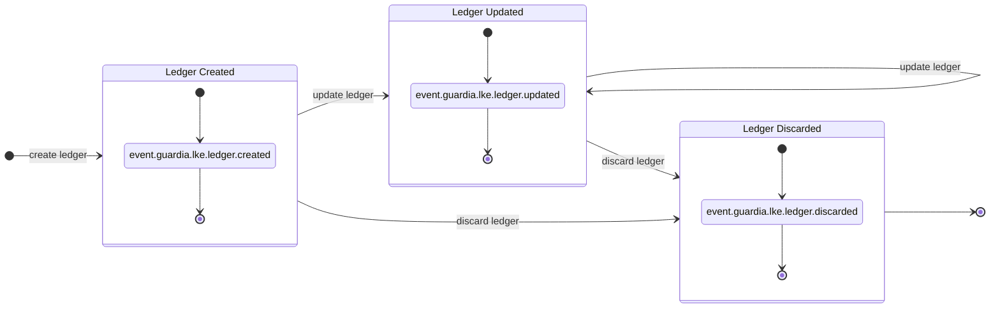
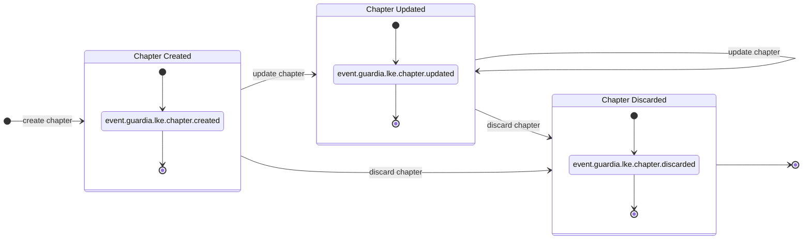
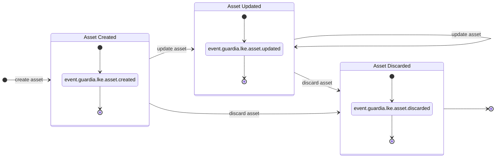
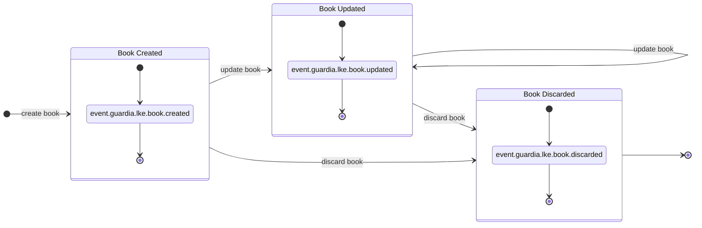
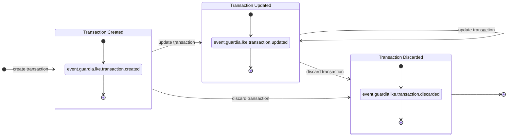

import MermaidDiagram from '@site/src/components/MermaidDiagram';

# Modelo de Dominio

## Entidades

### Ledger

| Atributo | Tipo | Tamaño | Valores | Predeterminado | Dirección | Descripción |
|----------|------|---------|---------|--------|---------|-----------|
| `entity_id` | `UUID v7` | `32` | - | - | Response | Identificador único de la entidad, con ordenación temporal. |
| `external_entity_id` | `string` | `hasta 36 caracteres` | - | - | Request/Response | Identificador externo de la entidad para interoperabilidad con otros sistemas. |
| `entity_type` | `string` | - | `LEDGER` | `LEDGER` | Response | Tipo de la entidad. |
| `version` | `integer` | `1 byte` | - | `1` | Response | Versión de la entidad (incrementada en cada actualización). |
| `name` | `string` | `3 a 128 caracteres` | - | - | Request/Response | Nombre del ledger (único dentro de la organización y tenant). |
| `description` | `string` | `3 a 255 caracteres` | - | - | Request/Response | Descripción del ledger para uso en informes. |
| `created_at` | `datetime` | - | - | - | Response | Fecha de creación del ledger. |
| `updated_at` | `datetime` | - | - | `created_at` | Response | Fecha de la última actualización del ledger. |
| `discarded_at` | `datetime` | - | - | `null` | Response | Fecha de descarte. |
| `chapters` | [`Chapter[]`](#chapter) | - | - | - | Response | Relación con CHAPTER. |
| `metadata` | `Json Object` | `4 KB` | - | - | Request/Response | Metadatos adicionales para interoperabilidad del ledger con otros sistemas. |

### Chapter

| Atributo | Tipo | Tamaño | Valores | Predeterminado | Dirección | Descripción |
|----------|------|---------|---------|--------|---------|-----------|
| `entity_id` | `UUID v7` | `32` | - | - | Response | Identificador único de la entidad, con ordenación temporal. |
| `external_entity_id` | `string` | `hasta 36 caracteres` | - | - | Request/Response | Identificador externo de la entidad para interoperabilidad con otros sistemas. |
| `entity_type` | `string` | `10` | `CHAPTER` | `CHAPTER` | Response | Tipo de la entidad. |
| `version` | `integer` | `10` | - | `1` | Response | Versión de la entidad (incrementada en cada actualización) |
| `name` | `string` | `3 a 128 caracteres` | - | - | Request/Response | Nombre del chapter (único dentro del ledger) |
| `description` | `string` | `3 a 255 caracteres` | - | - | Request/Response | Descripción del chapter para uso en informes. |
| `ledger` | [`Ledger`](#ledger) | - | - | - | Response | Relación con el ledger. |
| `created_at` | `datetime` | - | - | - | Response | Fecha de creación del chapter. |
| `updated_at` | `datetime` | - | - | - | Response | Fecha de la última actualización del chapter. |
| `discarded_at` | `datetime` | - | - | - | Response | Fecha de descarte del chapter. |
| `books` | [`Book[]`](#book) | - | - | - | Response | Relación con BOOK. |
| `metadata` | `Json Object` | `4 KB` | - | - | Request/Response | Metadatos adicionales para interoperabilidad del chapter con otros sistemas. |

### Asset

| Atributo | Tipo | Tamaño | Valores | Predeterminado | Dirección | Descripción |
|----------|------|---------|---------|--------|---------|-----------|
| `entity_id` | `UUID v7` | `32` | - | - | Response | Identificador único de la entidad, con ordenación temporal. |
| `external_entity_id` | `string` | `hasta 36 caracteres` | - | - | Request/Response | Identificador externo de la entidad para interoperabilidad con otros sistemas. |
| `entity_type` | `string` | - | `ASSET` | `ASSET` | Response | Tipo de la entidad. |
| `version` | `integer` | `1 byte` | - | `1` | Response | Versión de la entidad (incrementada en cada actualización). |
| `code` | `string` | `3 a 12 caracteres` | - | - | Request/Response | Código del asset (único dentro del ledger). |
| `number` | `string` | `1 a 128 caracteres` | - | - | Request/Response | Número del asset (único dentro del ledger). |
| `exponent` | `integer` | `1 byte` | `0 a 18` | `0` | Request/Response | Exponente del asset. |
| `is_fiat` | `boolean` | `1 byte` | `true, false` | `false` | Request/Response | Indica si es moneda fiduciaria. |
| `locations` | `string[]` | - | - | - | Request/Response | Regiones donde el asset es aceptado como moneda de cambio en formato [ISO 3166-2](https://en.wikipedia.org/wiki/ISO_3166-2). |
| `created_at` | `datetime` | - | - | - | Response | Fecha de creación del asset. |
| `updated_at` | `datetime` | - | - | - | Response | Fecha de la última actualización del asset. |
| `discarded_at` | `datetime` | - | - | - | Response | Fecha de descarte del asset. |

### Book

| Atributo | Tipo | Tamaño | Valores | Predeterminado | Dirección | Descripción |
|----------|------|---------|---------|--------|---------|-----------|
| `entity_id` | `UUID v7` | `32` | - | - | Response | Identificador único de la entidad, con ordenación temporal. |
| `external_entity_id` | `string` | `hasta 36 caracteres` | - | - | Request/Response | Identificador externo de la entidad para interoperabilidad con otros sistemas. |
| `entity_type` | `string` | - | `BOOK` | `BOOK` | Response | Tipo de la entidad. |
| `version` | `integer` | `1 byte` | - | `1` | Response | Versión de la entidad (incrementada en cada actualización). |
| `name` | `string` | `3 a 128 caracteres` | - | - | Request/Response | Nombre del book (único dentro del ledger). |
| `position` | [`Position`](#position) | - | - | - | Response | Relación con POSITION. |
| `nature` | `string` | - | `CREDITOR, DEBITOR` | - | Request/Response | Naturaleza del book. |
| `ledger` | [`Ledger`](#ledger) | - | - | - | Response | Relación con el ledger. |
| `chapters` | [`Chapter[]`](#chapter) | - | - | - | Response | Relación con chapters. |
| `entries` | [`Entry[]`](#entry) | - | - | - | Response | Relación con asientos. |
| `created_at` | `datetime` | - | - | - | Response | Fecha de creación. |
| `updated_at` | `datetime` | - | - | - | Response | Fecha de la última actualización. |
| `discarded_at` | `datetime` | - | - | - | Response | Fecha de descarte. |
| `metadata` | `Json Object` | `4 KB` | - | - | Request/Response | Metadatos adicionales para interoperabilidad del book con otros sistemas. |

### Entry

| Atributo | Tipo | Tamaño | Valores | Predeterminado | Dirección | Descripción |
|----------|------|---------|---------|--------|---------|-----------|
| `entity_id` | `UUID v7` | `32` | - | - | Response | Identificador único de la entidad, con ordenación temporal. |
| `external_entity_id` | `string` | `hasta 36 caracteres` | - | - | Request/Response | Identificador externo de la entidad para interoperabilidad con otros sistemas. |
| `entity_type` | `string` | - | `ENTRY` | `ENTRY` | Response | Tipo de la entidad. |
| `version` | `integer` | `1 byte` | - | `1` | Response | Versión de la entidad (incrementada en cada actualización) |
| `reference_date` | `datetime` | - | - | `created_at` | Request/Response | Fecha de referencia (fecha de la transacción) |
| `direction` | `string` | - | `CREDIT, DEBIT` | - | Request/Response | Dirección del entry. |
| `status` | `string` | - | `PENDING, POSTED, DISCARDED` | `PENDING` | Response | Estado del entry. |
| `detail_account` | [`Book`](#book) | - | - | - | Response | Cuenta detallada. |
| `previous_position` | [`Position`](#position) | - | - | - | Response | Posición anterior. |
| `resulting_position` | [`Position`](#position) | - | - | - | Response | Posición resultante. |
| `created_at` | `datetime` | - | - | - | Response | Fecha de creación del entry. |
| `updated_at` | `datetime` | - | - | - | Response | Fecha de la última actualización del entry. |
| `posted_at` | `datetime` | - | - | - | Response | Fecha de asiento del entry. |
| `discarded_at` | `datetime` | - | - | - | Response | Fecha de descarte del entry. |
| `metadata` | `Json Object` | `4 KB` | - | - | Request/Response | Metadatos adicionales para interoperabilidad del entry con otros sistemas. |

### Transaction

| Atributo | Tipo | Tamaño | Valores | Predeterminado | Dirección | Descripción |
|----------|------|---------|---------|--------|---------|-----------|
| `entity_id` | `UUID v7` | `32` | - | - | Response | Identificador único de la entidad, con ordenación temporal. |
| `external_entity_id` | `string` | `hasta 36 caracteres` | - | - | Request/Response | Identificador externo de la entidad para interoperabilidad con otros sistemas. |
| `entity_type` | `string` | - | `TRANSACTION` | `TRANSACTION` | Response | Tipo de la entidad. |
| `version` | `integer` | `1 byte` | - | `1` | Response | Versión de la entidad (incrementada en cada actualización). |
| `reference_date` | `datetime` | - | - | `created_at` | Request/Response | Fecha de referencia (fecha de la transacción). |
| `ledger` | [`Ledger`](#ledger) | - | - | - | Response | Relación con el ledger. |
| `status` | `string` | - | `PENDING, POSTED, DISCARDED` | `PENDING` | Response | Estado de la transacción. |
| `entries` | [`Entry[]`](#entry) | - | - | - | Request/Response | Relación con asientos. |
| `created_at` | `datetime` | - | - | - | Response | Fecha de creación de la transacción. |
| `updated_at` | `datetime` | - | - | - | Response | Fecha de la última actualización de la transacción. |
| `posted_at` | `datetime` | - | - | - | Response | Fecha de asiento de la transacción. |
| `discarded_at` | `datetime` | - | - | - | Response | Fecha de descarte de la transacción. |
| `reversed_by` | [`Transaction`](#transaction) | - | - | - | Response | Transacción que revierte esta transacción. |
| `reverses_to` | [`Transaction`](#transaction) | - | - | - | Response | Transacción que es revertida por esta transacción. |
| `metadata` | `Json Object` | `4 KB` | - | - | Request/Response | Metadatos adicionales para interoperabilidad de la transacción con otros sistemas. |

### Position

| Atributo | Tipo | Tamaño | Valores | Predeterminado | Dirección | Descripción |
|----------|------|---------|---------|--------|---------|-----------|
| `entity_id` | `UUID v7` | `32` | - | - | Response | Identificador único de la entidad, con ordenación temporal. |
| `external_entity_id` | `string` | `hasta 36 caracteres` | - | - | Request/Response | Identificador externo de la entidad para interoperabilidad con otros sistemas. |
| `entity_type` | `string` | - | `POSITION` | `POSITION` | Response | Tipo de la entidad. |
| `version` | `integer` | `1 byte` | - | `1` | Response | Versión de la entidad (incrementada en cada actualización). |
| `reference_date` | `datetime` | - | - | `created_at` | Request/Response | Fecha de referencia (fecha de la transacción). |
| `asset` | [`Asset`](#asset) | - | - | - | Response | Relación con ASSET. |
| `posted` | [`Balance`](#balance) | - | - | - | Response | Posición del saldo publicado. |
| `confirmable` | [`Balance`](#balance) | - | - | - | Response | Posición del saldo a confirmar. |
| `provisioned` | [`Balance`](#balance) | - | - | - | Response | Posición del saldo provisionado (publicado y confirmable). |
| `available` | [`Balance`](#balance) | - | - | - | Response | Posición del saldo disponible. |
| `created_at` | `datetime` | - | - | - | Response | Fecha de creación. |
| `updated_at` | `datetime` | - | - | - | Response | Fecha de actualización. |
| `discarded_at` | `datetime` | - | - | - | Response | Fecha de descarte. |

### Balance

| Atributo | Tipo | Tamaño | Valores | Predeterminado | Dirección | Descripción |
|----------|------|---------|---------|--------|---------|-----------|
| `amount` | `integer` | `8 bytes` | - | `0` | Response | Valor actual del saldo de la posición. |
| `credits` | `integer` | `8 bytes` | - | `0` | Response | Total de créditos en la posición. |
| `debits` | `integer` | `8 bytes` | - | `0` | Response | Total de débitos en la posición. |

## Eventos

### Eventos de Ledger

| Evento | Tópico | Descripción |
|--------|-----------|-----------|
| `LEDGER_CREATED` | `event.guardia.lke.ledger.created`  | Evento disparado cuando se crea un nuevo ledger |
| `LEDGER_UPDATED` | `event.guardia.lke.ledger.updated` | Evento disparado cuando se actualiza un ledger |
| `LEDGER_DISCARDED` | `event.guardia.lke.ledger.discarded` | Evento disparado cuando se descarta un ledger |

<MermaidDiagram>

</MermaidDiagram>

---

### Eventos de Chapter

| Evento | Tópico | Descripción |
|--------|-----------|-----------|
| `CHAPTER_CREATED` | `event.guardia.lke.chapter.created`  | Evento disparado cuando se crea un nuevo chapter |
| `CHAPTER_UPDATED` | `event.guardia.lke.chapter.updated` | Evento disparado cuando se actualiza un chapter |
| `CHAPTER_DISCARDED` | `event.guardia.lke.chapter.discarded` | Evento disparado cuando se descarta un chapter |

<MermaidDiagram>

</MermaidDiagram>

---

### Eventos de Asset

| Evento | Tópico | Descripción |
|--------|-----------|-----------|
| `ASSET_CREATED` | `event.guardia.lke.asset.created`  | Evento disparado cuando se crea un nuevo asset |
| `ASSET_UPDATED` | `event.guardia.lke.asset.updated` | Evento disparado cuando se actualiza un asset |
| `ASSET_DISCARDED` | `event.guardia.lke.asset.discarded` | Evento disparado cuando se descarta un asset |

<MermaidDiagram>

</MermaidDiagram>

---

### Eventos de Book

| Evento | Tópico | Descripción |
|--------|-----------|-----------|
| `BOOK_CREATED` | `event.guardia.lke.book.created`  | Evento disparado cuando se crea un nuevo book |
| `BOOK_UPDATED` | `event.guardia.lke.book.updated` | Evento disparado cuando se actualiza un book |
| `BOOK_DISCARDED` | `event.guardia.lke.book.discarded` | Evento disparado cuando se descarta un book |

<MermaidDiagram>

</MermaidDiagram>

---

### Eventos de Entry

| Evento | Tópico | Descripción |
|--------|-----------|-----------|
| `ENTRY_CREATED` | `event.guardia.lke.entry.created`  | Evento disparado cuando se crea un nuevo entry |
| `ENTRY_UPDATED` | `event.guardia.lke.entry.updated` | Evento disparado cuando se actualiza un entry |
| `ENTRY_DISCARDED` | `event.guardia.lke.entry.discarded` | Evento disparado cuando se descarta un entry |

<MermaidDiagram>

</MermaidDiagram>

---

### Eventos de Transaction

| Evento | Tópico | Descripción |
|--------|-----------|-----------|
| `TRANSACTION_CREATED` | `event.guardia.lke.transaction.created`  | Evento disparado cuando se crea una nueva transacción |
| `TRANSACTION_UPDATED` | `event.guardia.lke.transaction.updated` | Evento disparado cuando se actualiza una transacción |
| `TRANSACTION_DISCARDED` | `event.guardia.lke.transaction.discarded` | Evento disparado cuando se descarta una transacción |

<MermaidDiagram>

</MermaidDiagram>

## Referencias

- [ISO 3166-2](https://en.wikipedia.org/wiki/ISO_3166-2)
- [std::primitive - Rust](https://doc.rust-lang.org/stable/std/primitive)
- [PostgreSQL - Datatype Numeric](https://www.postgresql.org/docs/current/datatype-numeric.html)
